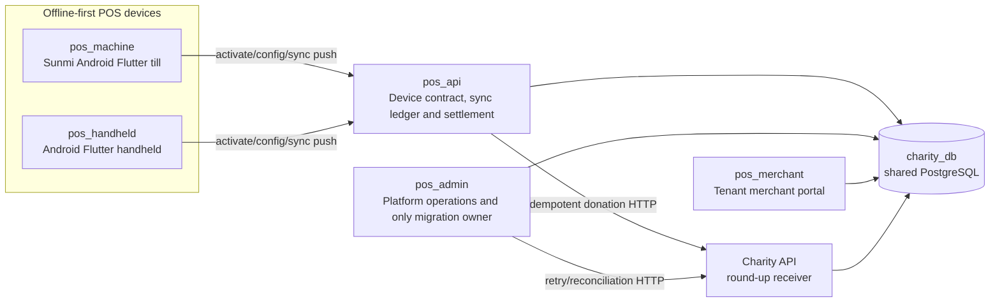

# MITHQAL 2.0 — Phase 0 Handoff and Continuation Guide

- **Prepared:** 2026-08-11
- **Purpose:** Give a new engineer enough context to understand the system, preserve the decisions already made, and continue from the exact current boundary.
- **Current boundary:** All ten Phase 0 implementation items are committed locally. Phase 0 is **not signed off** until the scripted adversarial exit gate and physical-device smoke tests pass.

---

## 1. Read this first

MITHQAL 2.0 is a multi-vendor POS/ERP for restaurants and cafés in Oman. It consists of five POS repositories plus a separate charity system. The Laravel server applications share the PostgreSQL database `charity_db`; the two Flutter devices use local storage and communicate exclusively through `pos_api` rather than connecting to PostgreSQL.

The safest way to resume is:

1. Read this handoff.
2. Read [MITHQAL_2.0_START_HERE.md](MITHQAL_2.0_START_HERE.md).
3. Read the ground rules and Phase 0/CORE-001 sections in [MITHQAL_2.0_ARCHITECTURE.md](MITHQAL_2.0_ARCHITECTURE.md).
4. Inspect every repository's branch, HEAD and dirty state before editing.
5. Build and run the Phase 0 exit gate described in this document.
6. Fix any defect the gate exposes and rerun it.
7. Complete the Sunmi Android POS and Android handheld smoke tests.
8. Only after Phase 0 sign-off, begin Phase 1 `CORE-001`.

### Status warning

The progress text near the top of `MITHQAL_2.0_START_HERE.md` and `MITHQAL_2.0_ARCHITECTURE.md` is stale. It still says Phase 0 is at item 3 of 10, or that seven items remain. **Do not redo those fixes.** The architecture remains authoritative for intended behavior and safety rules, but its progress counters were not updated after the local implementation commits.

When facts conflict, use this order:

1. A newer explicit owner decision.
2. `MITHQAL_2.0_ARCHITECTURE.md` for intended design and non-negotiable rules.
3. Current code, tests and local commits for what is actually implemented.
4. `MITHQAL_2.0_SYSTEM_AUDIT.md` and `docs/audit-evidence/` for topology and historical evidence.
5. This document as a continuation map, not as a replacement for the sources above.

Some audit findings describe defects that have since been fixed. Treat their status as historical unless current code or a regression test confirms otherwise.

---

## 2. One-page current state

| Area | State at handoff |
|---|---|
| Phase 0 implementation items | Completed and committed locally |
| Cross-repository scripted exit runner | Not built |
| Phase 0 exit report | Not produced |
| Sunmi Android POS physical smoke | Pending |
| Android handheld physical smoke | Pending |
| Production migrations/deployment | Not performed |
| API stranded-event sweeper cutover | Not performed; disabled by default |
| Commits pushed | None of the Phase 0 commits were pushed |
| Next implementation after sign-off | Phase 1 `CORE-001 — mithqal_pricing` |

The next work is mostly verification infrastructure and testing, but it is not “only running tests.” The next engineer must assemble a deterministic cross-repository runner, add missing integration scenarios, run it twice, fix any defects it exposes, rerun all repository suites, and then perform the two physical-device smoke tests.

---

## 3. System topology and repository ownership



| Repository | Local root | Responsibility |
|---|---|---|
| `pos_machine` | `C:\src\projects\pos_machine` | Main Android Flutter till for Sunmi T3 PRO hardware. Drift-backed offline catalogue/outbox, sales, shifts, printing, Mosambee SoftPOS, dual display, geofence and operator surfaces. Currently snapshot-authoritative for pricing. |
| `pos_handheld` | `C:\src\projects\pos_handheld` | Separate Android Flutter product, not a build flavor of the machine app. SharedPreferences/sqflite outbox, handheld printer/payment bridges and independently ported pricing/payload logic. |
| `pos_api` | `/home/abdallah644/projects/my-projects/pos/pos_api` | The only backend used by devices. Activation/auth, configuration, event ingestion, durable ACKs, settlement, live branch broadcasts and stranded-event recovery. It writes POS tables but owns no production migrations. |
| `pos_admin` | `/home/abdallah644/projects/my-projects/pos/pos_admin` | Platform-operator portal. **Sole owner of all production `pos_*` migrations.** Provisioning, reconciliation, bank files, commissions, charity retry, audit, workers and platform reports. |
| `pos_merchant` | `/home/abdallah644/projects/my-projects/pos/pos_merchant` | Tenant-scoped merchant portal for catalogue, staff, loyalty, offers, inventory, deliveries and reports. Owns no production schema; its schema migration is a test mirror. |
| Charity system | `/home/abdallah644/projects/my-projects/charity` | Separate charity product. Receives round-up donations over HTTP, deduplicates by stable POS reference and creates authoritative charity transaction/share rows. |

The three Laravel POS applications and the charity services use the shared live PostgreSQL database `charity_db`. The Flutter devices do not access it directly. POS-to-charity money-shaped writes cross the HTTP boundary; POS applications must not create charity transactions directly with SQL.

Useful architecture maps are under `pos_machine/docs/audit-evidence/`.

---

## 4. How a sale works end to end

### 4.1 Provisioning and configuration

1. `pos_admin` creates the merchant, branch and device assignment.
2. A terminal exchanges a one-time activation code for a bearer device token.
3. Staff sign in by PIN and, where required, GPS.
4. The device downloads `/device/config` or an additive delta containing branch, catalogue, stock, taxes, loyalty, offers, staff rules and operational policy.

### 4.2 Offline-first order creation

1. The device calculates the order locally.
2. It freezes prices, discounts, taxes, comps and tenders into event payloads.
3. During `order.create`, `pos_api` resolves the accepted product/recipe data and freezes the recipe/component inventory snapshots used later at payment.
4. Before network I/O, the device persists a local batch such as `order.create`, `order.pay`, and optionally `donation.record`.
5. Every event has a stable `client_event_id`. That ID must survive every transport retry, app restart and response-loss replay.

Primary device paths:

- Machine: `lib/data/order_sync_repository.dart` and `lib/data/db/app_database.dart`.
- Handheld: `lib/services/order_sync_service.dart`.

### 4.3 API ingest, settlement and ACKs

1. The device posts event batches to `POST /device/sync/push`.
2. `pos_api` records events in `pos_sync_events`; event identity is `(device_id, client_event_id)`.
3. `IngestSyncEventsAction` resolves a new event, a processed duplicate, or an eligible retry.
4. `SyncEventDispatcher` locks/reloads the durable event row.
5. The handler's database effects and the event's `processed` ACK/result commit in one outer transaction.
6. If handler or ACK stamping fails, the effects roll back and the event is marked `failed` separately. A late loser cannot overwrite an already-processed winner.
7. Best-effort work such as branch broadcasting and charity forwarding runs only after local commit and cannot downgrade a settled event.
8. Replaying a processed event returns the stored ACK/result and does not repeat its domain effects.

Primary API paths:

- `src/app/Actions/Device/IngestSyncEventsAction.php`
- `src/app/Actions/Device/Sync/SyncEventDispatcher.php`
- `src/app/Actions/Device/Sync/Handlers/`

### 4.4 Device retry and operator visibility

- Transport failures remain retryable and do **not** increase the deterministic server-rejection counter.
- A deterministic server refusal remains durable, parks after five refusals, stops automatic retry, and appears in the operator surface with details/manual retry.
- The device removes or completes its local batch only after all event ACKs are `processed`.
- The governing outcome is: processed exactly once, or visibly actionable—never silently lost.

### 4.5 Stranded `received` events

A scheduled API command can recover registered handler events that remain `received` past the age threshold. Recovery is guarded by:

- A per-event dispatch lock shared with retries.
- Durable status/type/age rechecks.
- Safe device-assignment checks.
- A verified sequence-aware high-water floor.
- `SYNC_STRANDED_SWEEP_ENABLED=false` by default.

Historical events at or below the cutover floor are intentionally quarantined because an older worker may have committed their financial/stock effect without stamping the ACK. Replaying those rows automatically could duplicate money or inventory.

Follow `pos_api/docs/runbooks/stranded-sync-event-sweeper-cutover.md`; never improvise this cutover.

---

## 5. Domain behavior and ownership

| Domain | Current authoritative behavior |
|---|---|
| Pricing | Devices are currently snapshot-authoritative. API validates monetary invariants and tenant references but does not reprice a trusted device order using current rules. Pricing remains duplicated between Flutter products; this is why `CORE-001` is next. |
| Sale/payment | `PayOrderHandler` locks the order and atomically records tenders, marks paid, consumes inventory, applies loyalty and records commission when money is confirmed. Tender sum must match `grand_total` within one baisa. |
| Pending card money | Ambiguous dispatched card results can enter pending reconciliation. Goods/inventory/loyalty reflect what left the shop; commission and charity wait. Admin approval or bank-file commit settles local effects atomically, then charity HTTP happens after commit. |
| Void | `pos_api` owns order lifecycle. A paid void reverses stock, appends inverse loyalty adjustments, marks local round-ups void and removes unclaimed commission. Void is terminal for new commission and donation forwarding. ADM-001 badges/routes an already-forwarded donation as a non-actionable exception, but no automated external donation reversal exists; reversal/refund is currently manual. |
| Inventory | Sale consumption is based on frozen recipe/component snapshots. Stock ledgers are append-only and must use the canonical stock movement actions. |
| Loyalty | API owns the account ledger at payment; merchant owns rules and manual review. Over-redemption clamps independently to available points/stamps, settles the sale and writes an immutable zero-delta review marker. A separate review record resolves it without editing the append-only ledger. |
| Shared shifts | Shared shifts are staff-owned across terminals; legacy shifts remain device-owned. Machine probes per logged-in staff and blocks silent drawer inheritance. API uses an additive strict opt-in to preserve old clients. Attribution is still temporal because orders do not yet carry `shift_id`; `DB-001` is later work. |
| Geofence | Branch coordinates/radius arrive through config. Machine re-enriches missing queued GPS immediately before replay. API is the fail-closed backstop for login, order creation and payment. |
| Charity | API records a durable local donation snapshot and payment breadcrumb. Forwarding runs after commit using immutable sale-time attribution and a stable donation UUID. Charity deduplicates with `pos_roundup:<uuid>`. Admin retry/reconciliation locks and rechecks order/payment/donation state before forwarding. |

---

## 6. Non-negotiable invariants

1. **Migration ownership:** Production POS migrations are additive only and live only in `pos_admin/src/database/migrations`.
2. **Shared database safety:** Never drop or rename existing columns, run rollback, or run `migrate:fresh` against the shared database.
3. **Mirror parity:** Every production schema addition must update the `pos_api` and `pos_merchant` `0000_00_00_000000_create_test_schema.php` mirrors in the same coordinated change.
4. **Money units:** Wire money is integer baisas. Database money is `decimal(12,3)` OMR; ingredient `unit_cost` is `decimal(12,6)`. Convert only at boundaries.
5. **Old APK compatibility:** Device-contract changes must be additive—optional fields or new event types. Do not reinterpret a deployed field.
6. **Stable identity:** A `client_event_id` must never change during retry or recovery.
7. **Revenue durability:** A submitted sale is either processed exactly once or remains visible/actionable. Never delete an unresolved revenue event.
8. **Processed is terminal:** Retry, sweeper, broadcast or post-commit failure may never downgrade a processed event.
9. **Lock order:** Order is the lifecycle lock root. Current race-sensitive financial paths use order, then payments in stable ID order, then donation. Do not reverse that order.
10. **External failure isolation:** Bank/acquirer/charity HTTP failure must not roll back committed local sale or reconciliation state.
11. **Tenant authority:** Company/branch identity comes from the authenticated device or tenant context, never a request-supplied tenant ID.
12. **Frozen attribution:** Recovery must not recompute order, commission, payment or donation attribution from mutable current device/catalog configuration.
13. **Cash accounting:** `pos_payments.amount` is the amount applied to the bill, already net of change. Do not subtract `change_given` again from expected cash.
14. **Void terminality:** A void order cannot later create commission or forward a donation as successful.
15. **Source control:** Keep commits local on `main`; do not push unless explicitly asked.
16. **Workspace ownership:** Preserve unrelated dirty and untracked files. Stage only files intentionally changed for the task.
17. **WSL execution:** Run Git, Composer, Docker and tests for `pos_api`, `pos_admin`, `pos_merchant` and charity through `wsl -e bash -lc`. Do not operate on those UNC worktrees with Windows Git/tooling.

---

## 7. Phase 0 implementation history

All ten implementation items are complete locally. The remaining Phase 0 work is the exit gate and physical smoke, not reimplementation.

| # | Item | Completed behavior | Repositories / local commits |
|---:|---|---|---|
| 1 | `HH-001` handheld outbox race | A sale enqueued during an active flush is not lost; unreadable storage is quarantined and a mid-flush enqueue rearms flushing. | `pos_handheld 28fbb3f` |
| 2 | `HH-002` unresolved/card-force-record safety | Neither device can force-record a card payment proven not to have reached the acquirer; ambiguous dispatched transactions remain reconcilable. | `pos_handheld 52678b2`; `pos_machine e539886` |
| 3 | `API-003` cash/change fix | `change_given` remains audit data and is no longer subtracted twice from expected cash or Z totals. | `pos_api 32d4fff` |
| 4 | `MC-001` rejected sale visibility | Machine parks deterministic refusals after five, keeps transport failures retrying, exposes a red stuck-sales UI and permits idempotent manual retry. | `pos_machine b3f9ff7` |
| 5 | `MC-002` geofence re-enrichment | A fenced queued sale missing GPS is patched with a fresh fix immediately before replay; without a fix only that batch remains queued. | `pos_machine d2582bd` |
| 6 | `MC-003` shared-shift orphaning | Per-staff login probes and a forced handover flow prevent silent drawer inheritance; API strict opt-in preserves legacy clients and cash attribution remains disjoint. | `pos_machine 2b480d6`; `pos_api f36e610` |
| 7 | `API-001` loyalty redemption | Stale over-redemption no longer rolls back a collected sale. Actual debit clamps to available value, a review marker is written, replay is idempotent and void restores only the applied debit. | `pos_api 993c1c8`, `9e4e10f`; review trail `pos_admin 1f9e1fc`, `pos_merchant 77fa67b` |
| 8 | `API-002` stranded-event sweeper | Eligible registered `received` events above the verified cutover floor and older than the age threshold recover under shared locks; effects and ACK commit atomically; historical rows remain quarantined; donation/slider recovery and dispatch races are hardened. | `pos_api 32a5e73`, `d57794a`, `2ca280d`, `db02659`, `07f92c4` |
| 9 | `ADM-001` void/deferred-effects guard | Voided orders stay terminal, appear as non-actionable refund exceptions and cannot be approved, rejected into new effects, commissioned or charity-forwarded. Local settlement commits before external HTTP. | `pos_admin fb6624e`, `8aef71b` |
| 10 | `ADM-003 → ADM-002` charity retry before scheduler | Retry eligibility/terminality/split-tender rules were fixed before hourly schedules and Redis worker services were added to the production Compose definitions. They have not been activated in a deployed environment. | `pos_admin fb6624e`, `8aef71b`, `8e35178` |

Supporting work:

| Work | Repositories / commits |
|---|---|
| System audit, architecture and evidence base | `pos_machine 5c64315`, `2cc4d04`, `8840a88` |
| Immutable donation attribution migration and mirrors | `pos_admin 8aef71b`, `pos_api 07f92c4`, `pos_merchant 38b5a16` |
| PHP test memory reliability | `pos_admin 972a1a1`, `pos_merchant c3b0cdf` |
| Merchant shortfall review surface | `pos_merchant 77fa67b` |

---

## 8. Verification evidence already recorded

### Backend full suites

| Repository | Tested local HEAD | Last recorded integrated result |
|---|---|---:|
| `pos_api` | `07f92c4` | **470 tests / 2,706 assertions** |
| `pos_admin` | `972a1a1` | **501 tests / 2,584 assertions** |
| `pos_merchant` | `c3b0cdf` | **1,115 tests / 5,118 assertions** |

Additional checks recorded green:

- Admin Vue typecheck and production build.
- API/admin/merchant formatter checks on touched files.
- Production Compose validation for the new API/admin scheduler and worker definitions.
- Selective revert proofs for the important regressions: the test was retained, the production fix was temporarily removed, the expected failure was observed, and the fix was restored.

### Device regression building blocks

| Behavior | Existing tests |
|---|---|
| Handheld outbox concurrency | `pos_handheld/test/outbox_race_test.dart` |
| Handheld rejected-batch visibility | `pos_handheld/test/outbox_stuck_test.dart` |
| Machine rejected-batch parking | `pos_machine/test/order_sync_parking_regression_test.dart` |
| Machine operator surface/manual retry | `pos_machine/test/stuck_sales_surface_test.dart` |
| Machine geofence re-enrichment | `pos_machine/test/order_sync_geofence_reenrichment_test.dart` |
| Machine shared-shift handover | `pos_machine/test/shift_reconciliation_test.dart` and startup widget tests |
| Card result classification | Machine `card_charge_classification_test.dart`; handheld `mosambee_classification_test.dart` |

These tests are valuable, but they do not constitute the single cross-device exit gate.

### Reproducible verification command matrix

Record runtime versions, repository SHA and dirty state beside every result. These are the known command shapes at handoff; confirm the relevant development Compose services are running before using `exec`.

**Sunmi machine app (run in Windows PowerShell):**

```powershell
Set-Location C:\src\projects\pos_machine
flutter --version
flutter pub get
flutter analyze --no-pub
flutter test
```

To reproduce the current committed CI exclusion while separately preserving the full-suite failure evidence:

```powershell
$tests = Get-ChildItem test -Filter *_test.dart |
  Where-Object { $_.Name -notin @('widget_test.dart', 'pos_controller_charity_flow_test.dart') } |
  ForEach-Object { $_.FullName }
flutter test $tests
```

**Handheld app (run in Windows PowerShell):**

```powershell
Set-Location C:\src\projects\pos_handheld
flutter --version
flutter pub get
flutter analyze
flutter test
flutter build apk --debug
```

**API (invoke the local PHP 8.4 container from PowerShell):**

```powershell
wsl -e bash -lc "cd /home/abdallah644/projects/my-projects/pos/pos_api && docker compose exec -T pos_api composer test"
```

**Admin (the production Compose file mount is required by `SchedulerTest`):**

```powershell
wsl -e bash -lc "cd /home/abdallah644/projects/my-projects/pos/pos_admin && docker compose run --rm --no-deps -T -v /home/abdallah644/projects/my-projects/pos/pos_admin/docker-compose.prod.yml:/var/www/docker-compose.prod.yml:ro pos_admin composer test"
wsl -e bash -lc "cd /home/abdallah644/projects/my-projects/pos/pos_admin && docker compose exec -T pos_admin composer analyse"
```

**Merchant:**

```powershell
wsl -e bash -lc "cd /home/abdallah644/projects/my-projects/pos/pos_merchant && docker compose exec -T pos_merchant composer test"
wsl -e bash -lc "cd /home/abdallah644/projects/my-projects/pos/pos_merchant && docker compose exec -T vite npm run build:check"
```

**Charity receiver contract:**

```powershell
wsl -e bash -lc "cd /home/abdallah644/projects/my-projects/charity/charity-laravel-api && docker compose run --rm --no-deps -T artisan test"
```

Do not silently replace the PHP 8.4 container runs with the current WSL host PHP 8.2 runtime; the POS lockfiles require a newer PHP version.

### Known verification limitations

- A clean, current full Flutter baseline for both device repositories still needs to be recaptured.
- Machine CI excludes `test/widget_test.dart` because its ProviderScope harness is missing and `test/pos_controller_charity_flow_test.dart` because it retains stale 5%-tax expectations. The exclusion is in `.github/workflows/ci.yml`. Capture their exact current failures before relying on that exclusion, and do not classify a different failure as inherited.
- Handheld CI runs full analyze/test/debug APK, but the cross-repository exit scenario is not part of it.
- The full admin PHPStan run still reports 566 inherited Eloquent/model-annotation diagnostics. Focused diagnostics introduced by Phase 0 were cleared; do not claim the inherited debt was fixed.
- Sunmi Android POS and Android handheld physical smoke tests have not been performed.
- The Sunmi T3 PRO/NP521 rear-display digitizer is a known firmware blocker: touch on the customer display is delivered to operator display 0. Customer round-up interaction is unsafe until Sunmi provides a firmware/input-routing fix. See [sunmi-support-customer-display-touch.md](sunmi-support-customer-display-touch.md). Treat this as a recorded limitation, not a newly passing feature.

---

## 9. Local Git state at handoff

| Repository | Phase 0 implementation HEAD | Relation to `origin/main` after the documentation-only handoff commit | Expected worktree after that commit |
|---|---|---:|---|
| `pos_machine` | `2b480d6` | ahead 8 | Handoff committed; unrelated modified submodule `.codex_inspect/SunmiFingerprintDemo` and untracked `.agents/`, `skills-lock.json` remain |
| `pos_handheld` | `52678b2` | ahead 2 | Clean |
| `pos_api` | `07f92c4` | ahead 9 | Clean |
| `pos_admin` | `972a1a1` | ahead 5 | Clean |
| `pos_merchant` | `c3b0cdf` | ahead 3 | Clean |

The documentation-only commit immediately after `2b480d6` contains this file. Its SHA is deliberately not embedded in its own contents because amending the file changes that SHA; resolve it with `git log -1 -- docs/MITHQAL_2.0_PHASE_0_HANDOFF.md`.

No Phase 0 commit was pushed, deployed or applied to the live database.

When resuming, verify these facts rather than assuming they remain true:

```text
git status --short --branch
git log --oneline --decorate -12
```

Do not stage, delete or normalize the unrelated machine artifacts without the owner's explicit approval.

---

## 10. What remains intentionally unfinished

| Requirement | Why it remains | Required continuation |
|---|---|---|
| Coordinated Phase 0 exit gate | Individual repository tests do not prove both devices and backend together | Build and run the suite in Section 11 |
| Physical device validation | Hardware, GPS, payment bridges, receipt and app-lifecycle behavior cannot be fully simulated | Perform Section 12 after the automated gate passes |
| Donation attribution migration | New API code writes nullable sale-time snapshot fields | If deployment is authorized, apply the additive admin migration before deploying the API writer |
| API sweeper cutover | Historical `received` rows may already have effects without ACKs | Follow the dedicated runbook; audit/quarantine instead of guessing |
| Historical rows at/below cutover floor | No generic safe inference exists for handlers without an event linkage | Manual/operator reconciliation only |
| Admin scheduler/workers | Code and production definitions exist but were not deployed | Deploy and health-check only when explicitly authorized |
| Already-forwarded donation reversal | ADM-001 exposes the void as a terminal non-actionable exception, but no automated charity reversal/refund workflow exists | Manually reconcile today; design the explicit audited workflow in later scoped work |
| Shift/EOD truth | Orders still lack explicit `shift_id`; temporal attribution remains | Later `DB-001`, `SHIFT-001`, `EOD-001` work |
| Pricing drift | Pricing remains independently implemented on both devices | Phase 1 `CORE-001`, after Phase 0 sign-off |
| Charity receiver authentication | Receiver is public/rate-limited rather than authenticated | Later `SEC-002` |

Important: the Phase 0 exit criterion is **no lost submitted sale and no invisible unresolved event**. It does not prove complete end-of-day reporting correctness before the later shift/reporting work exists.

---

## 11. Immediate next task — Phase 0 scripted exit gate

### 11.1 Authoritative exit condition

`MITHQAL_2.0_ARCHITECTURE.md` requires one scripted adversarial run covering:

- Offline backlog.
- Concurrent sales while backlog drains.
- Loyalty over-redemption.
- A customer deleted while its sale is queued.
- Missing GPS at a fenced branch.
- A shift closed while sales remain in backlog.
- Both machine and handheld.

Required result: **no submitted sale is lost and no unresolved event becomes invisible**.

For the shift-close scenario, assert sale durability and a processed or visible actionable outcome. Do not claim exact final Z/EOD attribution until `DB-001`/`SHIFT-001`/`EOD-001` exist.

### 11.2 Mandatory runner layers

The runner has two mandatory layers:

1. **Phase 0 regression pack:** run the owning repository regressions for every one of the ten completed items. This must explicitly include HH-002 card force-record classification on both devices, API-003 cash/change accounting, and MC-003 cross-staff/shared-shift behavior even though those are not the main adversarial scenario.
2. **Integrated exit scenarios:** run `EXIT-01` through `EXIT-16` below against deterministic isolated fixtures.

A green integrated scenario does not permit skipping the repository regression pack.

### 11.3 Required integrated scenarios

| ID | Required clients/surfaces | Scenario | Required pass result |
|---|---|---|---|
| `EXIT-01` | Machine | Builds an offline backlog, reconnects and continues ringing sales during flush | Every original and concurrent outbox row survives; each stable event reaches processed or visible actionable state |
| `EXIT-02` | Handheld | Performs the same backlog/concurrent-enqueue sequence | No read-modify-write race erases the new sale; all batches remain durable |
| `EXIT-03` | Both payload builders + API | Whole event/order batch replays after response loss | Stored ACK is returned; no duplicate order, payment, stock, loyalty, commission or donation effect |
| `EXIT-04` | Both payload builders + API | Cached loyalty redemption exceeds current server balance | Sale stays paid; actual debit clamps to available balance; review evidence is created exactly once |
| `EXIT-05` | Both devices + API | Queued order references a customer deleted before replay | It is not discarded or falsely processed; deterministic rejection parks and appears for manual action |
| `EXIT-06` | Machine + API | Fenced queued order lacks GPS, then a valid fresh fix becomes available | Replay is re-enriched and accepted without creating a second sale |
| `EXIT-07` | Both devices + API | No valid location can be obtained | Each client's supported outcome remains queued/parked and visible; never falsely processed or silently deleted |
| `EXIT-08` | Both devices + API | Shift closes while the device has queued sales | Close/reconnect does not erase sales; every event later processes or remains visibly actionable |
| `EXIT-09` | API | Worker stops after durable ingest while event remains `received` | Registered post-cutover event older than threshold recovers exactly once |
| `EXIT-10` | API | Ambiguous pre-cutover `received` rows exist | Rows at/below floor remain quarantined and are never auto-replayed |
| `EXIT-11` | API + admin | Payment approval races order void | Void remains terminal; no new commission and no successful donation forward |
| `EXIT-12` | API + admin + charity receiver contract | Charity forwarding fails after local settlement | Local order/payment commit remains; later stable-UUID retry creates one receiver transaction/share set |
| `EXIT-13` | Both devices | Repeated transport failures | Retry continues without increasing deterministic rejection count |
| `EXIT-14` | Both devices | Same deterministic rejection occurs five times | Batch parks at cap, stops automatic retry and appears in device operator UI |
| `EXIT-15` | API | Two tenants use colliding client identifiers | Deduplication and every financial effect remain scoped to authenticated device/company |
| `EXIT-16` | Machine + handheld concurrently, same branch | Both devices submit sales against shared branch/customer/stock state at an explicit barrier | Both streams settle without lost outbox rows, duplicate effects, overdraw or tenant/staff leakage |

### 11.4 Global pass/fail invariants

The gate fails if any of these occurs:

1. An outbox row disappears without a processed ACK.
2. A registered post-cutover API event remains invisibly `received` beyond the recovery threshold.
3. A failed/rejected sale has no device/admin/operator surface.
4. Replaying stable IDs duplicates money, inventory or reporting effects.
5. Loyalty insufficiency rolls back a collected sale.
6. Void loses to reconciliation, commission or charity work.
7. External charity failure rolls back local settlement.
8. A transport outage is counted as a deterministic server rejection.
9. Money units are changed or reinterpreted.
10. A test touches the live shared database, a real bank/acquirer, or the real charity endpoint.

For each scenario, reconcile the authoritative records against its declared expected outcome:

- The scenario's expected server-order count—zero or one for a single submitted sale. If zero is correct because the event was rejected/quarantined, the outbox/event must remain visibly actionable.
- Expected payment rows and states.
- Exactly the intended stock movements.
- Exactly the expected loyalty ledger rows by rule and type, plus any required review marker. A legitimate payment may earn multiple rules and also redeem.
- One idempotent logical commission set containing the correct per-channel rows. Mixed tender may legitimately produce multiple commission rows.
- Exactly the expected local/outbound donation set; each stable POS reference appears once even if the sale legitimately has multiple rounding legs.
- A processed duplicate ACK, or an explicit failed/parked/operator state—never an unexplained gap.

### 11.5 Recommended runner structure

Keep assertions in the repository that owns the truth; use one thin machine-side runner only for orchestration.

```text
pos_machine/
  docs/PHASE_0_EXIT_GATE.md
  tool/phase0_exit.ps1
  tool/phase0_exit_manifest.json

pos_api/src/tests/Feature/Phase0Exit/
pos_machine/test/phase0_exit/
pos_handheld/test/phase0_exit/
pos_admin/src/tests/Feature/Admin/Phase0Exit/
```

| Component | Owns |
|---|---|
| `pos_api` | Event ingest, authoritative database effects, concurrency barriers, replay, handler interruption, sweeper and tenant isolation |
| `pos_machine` | Drift outbox durability, GPS re-enrichment, parked-sale UI/manual retry and staff/shift startup behavior |
| `pos_handheld` | SharedPreferences outbox concurrency, parking/manual retry and stable payload behavior |
| `pos_admin` | Pending reconciliation, terminal void, deferred commission/donation and scheduled retry |
| `pos_merchant` | Schema/read compatibility where affected |
| Charity receiver | Stable POS-reference idempotency and exactly one authoritative transaction/share set; use its isolated contract tests, never a real endpoint |
| `pos_machine/tool/phase0_exit.ps1` | Cross-repository orchestration and result aggregation only |

Runner requirements:

- Accept all repository roots as parameters; do not hardcode a developer home path.
- Record branch, SHA and dirty state for every repository.
- Use deterministic UUIDs, frozen clocks and explicit barriers—not sleeps—to reproduce races.
- Use a fresh disposable PostgreSQL schema/database, Redis namespace and unique run namespace for each complete run. Isolate scenarios so one scenario's residue/order cannot make another pass.
- Abort before setup unless `APP_ENV=testing` and the resolved database/Redis hosts and names match an explicit disposable-environment allowlist. Print sanitized target identity, never credentials.
- Use mocked bank/acquirer/charity endpoints for POS/admin scenarios, plus the charity receiver's own isolated stable-reference contract test.
- Exercise real device payload builders where practical, not only handcrafted JSON.
- Run all scenarios even if one fails, and exit non-zero when any scenario fails.
- Write timestamped Markdown, JSON and/or JUnit artifacts under an ignored build/artifact directory. Redact bearer tokens, PINs, customer PII, precise GPS, secrets and full sensitive payloads before retaining or sharing artifacts.
- Report scenario IDs and final effect/outbox counts, not only aggregate test counts.
- Run cleanly twice in succession using two fresh disposable environments or unique run namespaces. Reuse stable IDs only inside intentional replay steps, not across the two full runs. Both runs must produce identical authoritative effect counts.
- Never deploy, alter production configuration, migrate a live DB, push, or call external production services.

### 11.6 Exact TODO sequence

| # | Work | Completion evidence |
|---:|---|---|
| 1 | Inventory existing tests against all ten Phase 0 items and `EXIT-01`…`EXIT-16` | Coverage matrix assigning every invariant to an owning repo |
| 2 | Capture current clean baselines for both Flutter apps; reconfirm backend baselines | Commands, SHAs, counts and inherited failures recorded before new work |
| 3 | Define deterministic fixtures: two devices, fenced branch, two staff, shared shift, product/stock, customer, loyalty rule/balance and pending payment | Stable fixture IDs and documented initial state |
| 4 | Add the integrated API scenario harness | API can ingest/interleave both device streams and inspect authoritative effects |
| 5 | Complete machine exit drivers | Offline/concurrent flush, parking, visibility, GPS and staff handover covered |
| 6 | Complete handheld exit drivers | Offline/concurrent enqueue, parking and stable replay covered |
| 7 | Add worker-interruption/high-water cases | Post-cutover recovery and historical quarantine both proven |
| 8 | Add admin void/reconciliation/charity-outage cases | Local commit, terminal void and retry behavior proven |
| 9 | Create cross-repository runner and manifest | One local command executes the complete automated gate |
| 10 | Run the focused exit suite twice | Both runs green with identical effect counts |
| 11 | Run every repository's full suite, build, format and applicable static checks | No new diagnostics; inherited debt listed separately |
| 12 | Fix defects exposed by the gate | Each defect first has a failing regression, then passes after the fix |
| 13 | Produce Phase 0 automated exit report | Scenario-by-scenario evidence with SHAs and residuals |
| 14 | Perform Sunmi Android and handheld Android smoke tests | Signed checklist with builds, environment and event/order IDs |
| 15 | Owner accepts evidence and marks Phase 0 complete | Explicit sign-off |
| 16 | Begin Phase 1 `CORE-001` | Only after step 15 |

---

## 12. Physical-device smoke after the automated gate

Use staging/test infrastructure, fake products and non-production payment/charity integrations.

Before starting, confirm these prerequisites:

- A Sunmi T3 PRO with its integrated printer and the actual optional rear display, plus a supported Android handheld and its printer hardware.
- Signed/testable APKs with recorded build IDs and the intended staging API base URL.
- Staging activation codes, branch/device assignments, staff PINs and deterministic fixture data.
- GPS permission, location services and a controllable fenced-branch location scenario.
- Confirmed bank-provided test credentials/test terminal. If the acquirer offers no test mode, define an explicitly approved non-charging substitute and mark the real card-capture smoke blocked; never improvise with a real customer card.
- Mock/staging charity forwarding and access to API/admin evidence without exposing production secrets or PII.

The Sunmi T3 PRO/NP521 rear-display touch bug is a known firmware issue: customer-panel taps route to operator display 0. Do not let a customer use the round-up touch prompt on affected firmware. Reconfirm the support status, verify the safe disabled/non-interactive behavior, and record the limitation using [sunmi-support-customer-display-touch.md](sunmi-support-customer-display-touch.md).

| Surface | Required checks |
|---|---|
| Sunmi Android POS | Login/config, open shift, normal sale, offline cash sale, reconnect/sync, staff B cannot inherit staff A's drawer silently, stuck-sale details/manual retry, bank test/substitute, receipt, printer and safe rear-display behavior |
| Android handheld | Login/config, normal sale, offline sale, enqueue during reconnect, GPS/geofence, visible stuck batch/manual retry, bank test/substitute and receipt/printer behavior |
| Admin/API/charity evidence | Find each smoke order/event by UUID and verify payment, stock, loyalty, commission/donation, receiver idempotency and exception state as applicable |

Record for every smoke scenario:

- Repository commit and app build/version.
- Device model and identifier.
- API environment and timestamp.
- Order UUID and all client event IDs.
- Screenshot/photo of the device outcome.
- Matching API/admin evidence.
- Tester and final pass/fail decision.

---

## 13. Deployment and cutover safety

This handoff and the exit suite do **not** authorize deployment or live migration.

If deployment is later explicitly authorized:

1. Review all local, unpushed commits in every repository.
2. In `pos_admin`, review `php artisan migrate:status` and the complete pending list. Stop if unrelated pending migrations have not been reviewed and authorized.
3. Perform a schema-first admin migration release and apply only the reviewed additive Phase 0 migrations in timestamp order:
   - `2026_08_08_010000_create_pos_loyalty_shortfall_reviews_table.php`
   - `2026_08_08_020000_add_attribution_snapshot_to_pos_roundup_donations.php`
4. Re-run migration status, verify both tables/columns and both test-schema mirrors, and do not rollback.
5. Deploy `pos_api` only after the new snapshot columns exist, because the API writer uses them.
6. Deploy the remaining admin/merchant application changes and verify scheduler/queue-worker health.
7. Keep `SYNC_STRANDED_SWEEP_ENABLED=false` while establishing the cutover.
8. Follow `pos_api/docs/runbooks/stranded-sync-event-sweeper-cutover.md` exactly:
   - Deploy fail-closed.
   - Perform the read-only historical visibility audit.
   - Capture the sequence-aware high-water using committed `MAX(id)` plus `pg_sequences.last_value`.
   - Set the immutable `SYNC_STRANDED_SWEEP_AFTER_ID` while sweeping remains disabled.
   - Run the bounded manual canary.
   - Enable the scheduled sweep only after verification.
9. Never auto-raise the floor. Events at or below it remain a manual audit population.

Do not infer that `MAX(id)` alone is a safe cutover boundary: an uncommitted insert may already have allocated a lower sequence ID. The runbook's sequence-aware query is load-bearing.

---

## 14. After Phase 0 — `CORE-001` shared pricing

The next development item after Phase 0 sign-off is:

**`CORE-001 — mithqal_pricing`**

Locked decisions:

- Create sibling pure-Dart package `C:\src\projects\mithqal_pricing`.
- Use `sdk: ^3.11.0` and no Flutter dependency so `dart test` runs without an emulator.
- Because the apps are separate repositories, consume the package through a git dependency pinned to a release tag. Use a gitignored `pubspec_overrides.yaml` path override only for local development; do not commit a bare path dependency that breaks CI.
- Keep all internal money in integer baisas.
- Preserve the machine's current “biggest matching discount wins” behavior.
- Retain `stackable` on wire/database for compatibility, but deprecate and ignore it in the shared core.
- Seed canonical JSON golden vectors from current machine behavior and make the deliberate `multi_buy` correction an explicit golden.
- Generate `goldens.sha256` with `tool/checksum.dart`; the API vendors the golden copy and tests that its checksum matches the pinned engine tag. Flutter apps consume the package and retain thin mapper/input smoke tests rather than vendoring the goldens.
- Adopt incrementally: machine first, handheld second, API warning-only validator third, merchant dead-evaluator retirement last.
- The API validator is observability only; trusted devices remain price-snapshot authority.
- Do not introduce new offer types, `HH-004`, or `MARGIN-001` before the core.
- `MARGIN-001` is a separate live pricing change requiring its own measurement and dry run.

Adoption sequence:

| # | Step |
|---:|---|
| 1 | Scaffold pure-Dart package and canonical golden vectors |
| 2 | Add deliberate `multi_buy` correction vector |
| 3 | Adopt in `pos_machine` through thin compatibility shims |
| 4 | Adopt in `pos_handheld` and fix its parser dropping product/category-scoped discounts |
| 5 | Add the integer-baisa `pos_api` validator in `warn` mode |
| 6 | Verify no callers remain, retire merchant's dead PHP evaluator and hide—not delete—the `stackable` control |

See the complete design in `MITHQAL_2.0_ARCHITECTURE.md`, Phase 1.

---

## 15. First-hour checklist for the next engineer

- [ ] Read `MITHQAL_2.0_START_HERE.md`, the architecture ground rules, and this handoff.
- [ ] Confirm all repository roots and inspect branch/HEAD/dirty state.
- [ ] Use Windows tooling for the Flutter repositories and `wsl -e bash -lc` for the WSL Laravel/charity repositories.
- [ ] Preserve the unrelated machine submodule and untracked tooling files.
- [ ] Confirm no Phase 0 commit has unexpectedly been pushed or deployed.
- [ ] Read the API stranded-event cutover runbook, but do not run it against a live system.
- [ ] Create the all-ten-item regression map and `EXIT-01`…`EXIT-16` coverage matrix.
- [ ] Recapture both Flutter baseline suites before adding exit-test code.
- [ ] Build isolated fixtures and the cross-repository runner.
- [ ] Run the gate twice and preserve artifacts.
- [ ] Fix failures with a regression-first workflow.
- [ ] Run full repository suites and record inherited exclusions/debt honestly.
- [ ] Complete physical Sunmi Android/handheld Android smoke tests.
- [ ] Obtain explicit Phase 0 sign-off before starting `CORE-001`.

---

## 16. Glossary

| Term | Meaning |
|---|---|
| ACK | Durable per-event API result stored with the sync ledger event |
| Outbox | Device-local persisted queue of events waiting for API processing |
| Parked/dead-letter sale | Deterministically rejected batch retained after the retry cap and exposed for operator action |
| Transport failure | Network/timeout failure with no authoritative server refusal; it remains retryable and does not consume the rejection cap |
| Deterministic rejection | API processed the request and returned a repeatable business/validation failure |
| Stranded event | Durable API event still `received` after its request/worker stopped before a terminal ACK |
| Cutover floor | Verified high-water ID separating ambiguous historical events from events safe for automated recovery |
| Frozen snapshot | Sale-time values persisted so retry/recovery does not depend on mutable current configuration |
| Baisa | One thousandth of an Omani rial; the integer wire-money unit |

---

## 17. Final handoff statement

The Phase 0 code work is present locally and has strong repository-level regression evidence. The honest next boundary is to prove the whole system under adversarial cross-device conditions, then verify the two real devices. Do not mark Phase 0 complete, deploy, enable the sweeper, or begin pricing-core work until that evidence exists and the owner accepts it.
