# MITHQAL 2.0 — Full System Audit, Blueprint Reconciliation & Implementation Architecture

**Audit date:** 7 August 2026
**Method:** read-only multi-agent source audit — 17 mapping/flow agents (~3.2M tokens, 1054 tool operations) plus an adversarial verification pass over every P0/P1 finding and a requirement-by-requirement gap analysis against all three blueprint documents.
**Scope audited:** `pos_admin`, `pos_merchant`, `pos_api` (Laravel 13, WSL), `pos_machine`, `pos_handheld` (Flutter, Windows), and the `charity` ecosystem boundary.
**Evidence convention:** every claim carries `repo/relative/path:line`. Claims that could not be verified in source are marked *Cannot Verify*.
**Raw evidence appendices:** the 22 per-domain evidence files in `docs/audit-evidence/`, consolidated findings in `audit-evidence/findings_all.md` (141 findings), adversarial verdicts in `audit-evidence/verdicts.md`.

---

## ⚠ Status since publication — read before acting on any finding

This report describes the system **as of 7 August 2026**. Fixes have shipped since. **Three findings are now closed** and must not be re-planned:

| Finding | Status | Commit | What changed |
|---|---|---|---|
| **F1** (P0) — handheld outbox lost-write race | ✅ **FIXED** | `pos_handheld 28fbb3f` | Outbox is now an in-memory authoritative list mutated synchronously, prefs as a mirror; flush removes only server-settled rows from the live list. Adversarial review then caught two blockers in that first cut (an `init()` path that re-opened the same hole on every staff login, and a cached failed read that could erase the whole backlog) — both fixed in the same commit. 10 regression tests. |
| **F16** (P1) — handheld could force-record charges that never reached the bank; **F68** — login-stage failures on **both** apps | ✅ **FIXED** | `pos_handheld 52678b2`, `pos_machine e539886` | Classification now keys on an invariant (the native bridge only errors *before* dispatch, so a Dart-caught failure provably never reached the acquirer) rather than an allowlist of codes. Also closed: the split-payment card leg had its own unguarded force-record path the audit did not record; the launch-failure substring rules were running against acquirer-authored text and could hide force-record on a card that *was* charged. 29 tests including producer-side. |
| **F13 / F17 / F19** (P1) — shift expected-cash double-subtracted change | ✅ **FIXED** | `pos_api 32d4fff` | Both arithmetic uses removed; `change_given` retained as an audit datum. **Note the audit text was corrected during verification**: the variance direction is a phantom **OVER**, not short — merchants were chasing unexplained overages, and it was masking real shortages of equal size. §16 carries the corrected direction. |

**Not yet deployed.** All commits are local on `main`; nothing is pushed. The two Flutter fixes need an APK rebuild and MDM push before they reach tills. API-003 fixes forward only — **shifts already closed keep their stored incorrect `expected_cash`**; no backfill has been run, and whether to recompute history is an open decision.

**Everything else in this report stands as written.** For what to build next, see the companion **`MITHQAL_2.0_ARCHITECTURE.md`**, which supersedes §31–§34 and §39 of this report with design-level detail and carries four decisions locked with the owner since publication (catalog model, scope, discount overlap rule, and a margin cap that will change live pricing).

---

## 1. Executive Summary

MITHQAL 2.0 is substantially more built than any of its three blueprints describe. The platform is six cooperating applications over one shared PostgreSQL instance, with roughly 105 `pos_*` tables, ~1,000 backend tests, and two production-grade Flutter POS clients driving real hardware (Sunmi, KOZEN, Mosambee SoftPOS). The device contract in `pos_api` is genuinely well engineered: exactly-once sync on `(device_id, client_event_id)`, single-transaction payment settlement with `lockForUpdate` and terminal-status re-checks, frozen recipe/component/commission snapshots, append-only inventory ledgers, per-channel commission splits that are baisa-exact, and fail-closed geofencing. The June 2026 handoff document materially understates current state — device shift screens, expense logging, restock requests, stock counts and kitchen production are all real, not stubs.

**The foundation is sound in its core transactional design and unsound at its edges.** The failures cluster in three places, and all three are edge-of-system problems rather than architectural ones:

1. **Money can silently leave the system on the handheld.** The `pos_handheld` outbox is a whole-list read-modify-write over one SharedPreferences value. A sale enqueued while a flush is in flight is overwritten by the flush's stale snapshot and is gone — no revenue record, no stock deduction, no loyalty, no commission, while the customer was charged. This is the single P0 and it is worst exactly when it hurts most: draining an offline backlog on reconnect while the counter keeps ringing.

2. **Sales can strand permanently with nobody looking.** `pos_machine` retries rejected outbox rows forever with no cap, no parking, and — critically — no operator surface at all (`watchPending()` has zero consumers anywhere in `lib/`). A deterministic server rejection (loyalty over-redeem after an offline race, an order enqueued without a GPS fix at a fenced branch, a deleted customer) becomes an invisible zombie: the till printed a receipt and took the money, and the server never learns. `pos_handheld` solved this in commit `c5857d6`; the fix was never ported to the primary POS.

3. **The two POS clients are diverging codebases computing the same money.** `pos_handheld` is not a variant of `pos_machine` — it is a separately written ~19.7k-line app kept in sync by hand-ported "parity" code. They already disagree in production-visible ways: the handheld silently drops product/category-scoped and auto-apply discounts, the two `offer_engine.dart` implementations price `multi_buy` differently (the handheld's own comment calls the machine's behaviour "a real overcharge"), round-up donations exist only on the machine, and machine-side money fixes have no propagation path. The same cart, same merchant config, two devices, two totals.

Beyond those, reporting is systematically misstated rather than corrupted: every date filter across every surface snaps to UTC days while Oman runs UTC+4 (a four-hour daily misattribution on all reports), comps are never subtracted from net sales or net profit, and card charges still awaiting bank reconciliation are reported as finalized 100%-merchant income. None of these mutate money; all of them make the numbers merchants act on wrong.

Two blueprint go-live blockers are **not met**: there is no Oman VAT-compliant tax invoice implementation and no branch-level end-of-day close (only per-shift close, cash-only reconciliation). The audit log exists and is ORM-immutable but has no tamper-evident hash chain. Refunds do not exist anywhere in the platform — deliberate per the Additions deferral, but it means today's only reversal is a whole-order void, and a partial cancel on a paid order is device-local fiction the server never learns about.

The newest blueprint's largest architectural ask — the unified `items` + `item_components` recursive model with combos and sub-recipes — is **not** what was built. What exists instead is a competent, differently-shaped catalog (products + recipes + components + add-on consumption + `stock_mode`) that covers most of the same ground without combos or nested prep items. That is a deliberate-looking divergence, not a defect, and it is the one place where the roadmap must decide between migrating and formally superseding the spec.

**Verdict: YES, AFTER CRITICAL FIXES.** The transactional core is trustworthy enough to build on. Six defects must close before any pilot handles real money on a handheld, and the two-codebase divergence must be structurally resolved before more pricing features are added to either client. Detailed reasoning in §48.

---

## 2. Project Inventory

| Project | Path | Stack | Responsibility | Schema ownership |
|---|---|---|---|---|
| **pos_admin** | WSL `…/pos/pos_admin` | Laravel 13 (PHP 8.3) + Vue 3 SPA, Pest | Platform-operator portal: merchants/companies, device registry + Scalefusion MDM, geography, banks + reconciliation, commissions/payouts/invoices, taxes, advertiser billing, orders viewer, roles, audit log | **Owns all `pos_*` DDL** — 153 migrations |
| **pos_merchant** | WSL `…/pos/pos_merchant` | Laravel 13 + Vue 3 SPA (Pinia), Pest | Merchant portal: catalog/recipes/add-ons, inventory (ingredients, suppliers, GRN, restock, allocation, transfers, counts, waste), customers, loyalty, discounts/offers, expenses, taxes, delivery providers, 16 reports, floor plans, staff/roles | None (one sqlite test-mirror migration) |
| **pos_api** | WSL `…/pos/pos_api` | Laravel 13, PHPUnit, Reverb | **The device contract.** Activation/pairing, config bundle + delta, `/device/sync/push` ingestion, order lifecycle, inventory consumption, commissions, loyalty, geofence, shifts, kitchen production, round-up forwarding | None (one sqlite test-mirror migration) |
| **pos_machine** | `C:\src\projects\pos_machine` | Flutter, Riverpod 3, Drift v27, 123 commits | Main dual-screen Android POS: offline-first ordering, split payments, Mosambee card charges, charity round-up, Sunmi printing, customer display with ad slider + audience counting, held orders, order transfer, shifts, kitchen, geofence gate | — |
| **pos_handheld** | `C:\src\projects\pos_handheld` | Flutter, plain setState/ValueNotifier, SharedPreferences + sqflite, ~19.7k lines | Handheld POS (Phase 10): **separate codebase**, KOZEN/ZCS hardware bridges, money outbox with dead-lettering, shared shifts, plate OCR. No round-up, no i18n | — |
| **charity** | WSL `…/my-projects/charity` | Laravel + Nuxt, shared Postgres 16 | Pre-existing charity ecosystem. Receives POS round-up donations over HTTP; owns `banks`, `organizations`, `commission_profiles`, geography, `advertisers`, `content_assets` | Owns its own tables |

**Not a project:** the WSL copy of `pos_machine` is stale; Flutter development moved to `C:\src\projects\pos_machine`.

**Repository state at audit time:** `pos_admin` working tree is clean and `main` is 2 commits ahead of origin (the handoff's "~150 dirty files is the expected state" no longer holds). `pos_machine` has one modified submodule reference and untracked `.agents/`.

---

## 3. Current Architecture

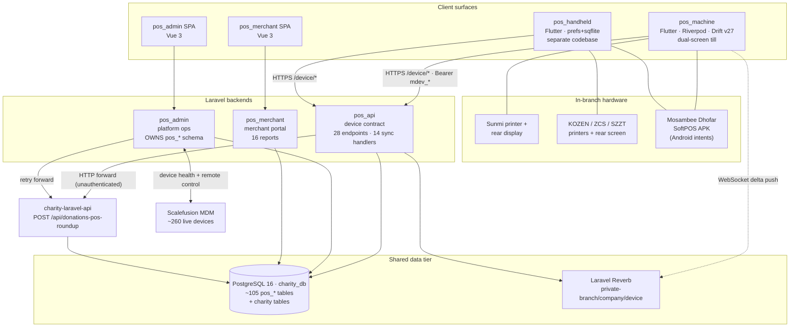

### 3.1 What is authoritative for what

| Concept | Authority today | Evidence |
|---|---|---|
| Order pricing (subtotal, discount, comp, tax, grand) | **The device.** Server stores as-sent, validates only `subtotal − discount − comp + tax == grand` ±1 baisa | `pos_api/.../CreateOrderHandler.php:36-42,627-638` |
| Tender sum | Server, ±1 baisa against stored grand | `PayOrderHandler.php:168-171` |
| Comp rows | Server, exact sum + per-reason cap | `CreateOrderHandler.php:495-533` |
| Stock balance | **Server**, from frozen snapshots at pay; devices deduct locally for display only | `ConsumeInventoryAction.php`, `PayOrderHandler.php:178` |
| Loyalty balance | **Server**, strict debit inside the pay transaction | `ApplyLoyaltyRedeemAction.php:37-75` |
| Commission split | **Server**, per-channel baisa-exact, immutable snapshot | `RecordSaleCommissionAction.php:104-165` |
| Receipt number | **Server**, atomic under `lockForUpdate`; offline orders carry none | `AllocateOrderNumberAction.php:58-84` |
| Expected cash / Z-report | **Server**, computed in the close transaction | `CloseShiftHandler.php` |
| Catalog | Server; device caches with delta cursor + full-sync self-heal | `config_repository.dart:20-133` |

This matches the newest spec's authority model (S 2.4: sales device-authoritative, stock server-derived) — with one important caveat the spec did not anticipate: because pricing is device-authoritative and the two device codebases diverge, *the price a customer pays depends on which device rings the sale*.

### 3.2 Sync path (the load-bearing mechanism)

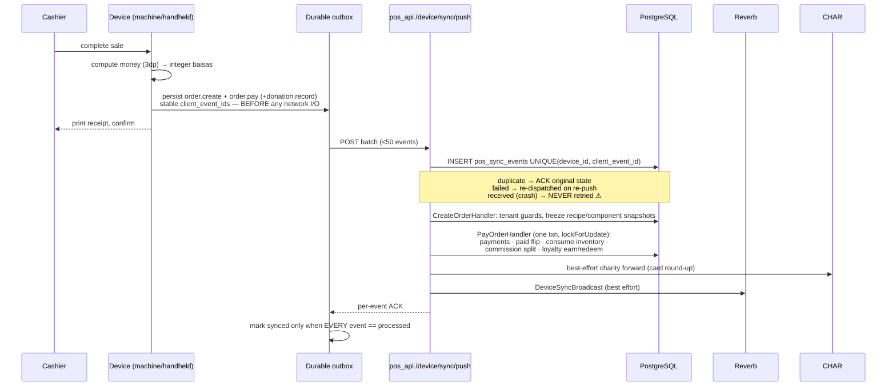

### 3.3 Money representation

Money is integer **baisas** on the wire (1 OMR = 1000 baisas) and `decimal(12,3)` OMR in the database, converted only at boundaries. This is respected uniformly: `Money::toBaisas`/`toOmr` in `pos_api/src/app/Support/Money.php:17-27`, `omrToBaisas` in both Flutter apps, integer-baisas columns in Drift. Documented deviations: `pos_ingredient_purchases.unit_cost` is `decimal(12,6)` (per-gram costs below 0.001 OMR), percentages are `decimal(5,2)`, unit-conversion factors `decimal(14,4)`, and `pos_offers.config` JSON carries integer baisas.

---

## 4. Blueprint Evolution

Three documents, one evolving specification.

| # | Document | Date | Role |
|---|---|---|---|
| 1 | **MITHQAL 2.0 Blueprint** (62 pp) | 23 May 2026 | The master spec: 5 surfaces, 12 phases, full schema, API architecture, cross-cutting systems (offline, Soft POS, geofence, Scalefusion, round-up, audit, i18n, tenancy, observability, security), roles matrix, testing strategy, go-live checklist. |
| 2 | **Feature Additions & Ingredient Model** (9 pp) | June 2026 | Companion. 18 restaurant features split MVP-critical vs Phase 7+, plus the authoritative unit-of-measure ingredient model. Explicitly: "nothing in that document changes." |
| 3 | **Architecture & Feature Specification** (15 pp) | 3 Aug 2026 | **Newest — wins conflicts.** Consolidates session design decisions; reviews a handwritten 12 July additions note; names go-live blockers and a recommended build order. Explicitly sits *alongside* the other two, not replacing them. |

### 4.1 What changed across the three

| Area | May blueprint | June additions | Aug spec | Reconciliation |
|---|---|---|---|---|
| **Item model** | Separate `products`, `product_recipes`, `add_ons`, no combos | Modifier groups with constraints + recipe-variant mapping | **Unified recursive `items` + `item_components`** covering recipe/combo/sub-recipe/add-on | Aug **supersedes**. Largest architectural delta in the whole set. |
| **Ingredient units** | `unit` + `unit_cost` + threshold | primary_unit / piece_unit_label / units_per_piece / allow_fractional_pieces + day-end piece reconciliation | Adds purchase/stock/recipe unit triplet + **yield factor**; confirms "Option C" | Additive: June is the storage model, Aug extends it. Both retained. |
| **Catalogue sync** | Full snapshot at pair + WebSocket deltas | — | **Cursor delta sync** (`?since=`) + "ship rules not results" (effective-dated prices, offers as schedule rules) | Aug refines May. |
| **Inventory authority** | Server-authoritative, negative-stock anomaly | — | Explicit table: sales = device/append-only, stock = server/derived | Aug formalises May. |
| **Order channels** | POS + handheld + customer tablet | — | **QR ordering, print agent, KDS stations, waiter screen, drive-up** | New scope in Aug. |
| **Refunds** | `refunded` status exists in schema | Deferred to Phase 7+ with a design (linked negative order) | Silent | June's deferral stands. |
| **Customer tablet** | Full spec (§8), Phase 11 | — | Not mentioned; customer-facing ordering reframed as QR-on-phone | Aug effectively **supersedes** the tablet with QR ordering. |
| **Loyalty** | Visit stamps + spend points | — | Adds product/category-scoped stamps (§6.6) | Additive. |
| **Compliance** | Generic VAT mention | — | **Oman 5% VAT + compliant tax invoices as a go-live blocker; ZATCA/Fatoora explicitly NOT applicable** | Aug is decisive. |
| **Onboarding** | Manual vetted | — | Keeps manual vetting; menu import must use **one MITHQAL template**, not per-client importers | Aug adds a decision. |
| **Order-ahead** | — | — | **Deferred**; arrive-then-order only | Aug decides. |

### 4.2 Requirements unique to one document (must not be lost)

- **May only:** customer tablet application, Scalefusion device-health specifics, round-up donation mechanics and reporting split, geo-fence layered enforcement, observability/Sentry architecture, backup + restore-drill policy, the ten portal reports, the roles/permission key catalog, multi-tenancy technical controls (§9.11).
- **June only:** void/comp reason-code semantics (`affects_inventory`, `affects_cogs`, `requires_manager`), printer failover queue behaviour, shared-drawer configurability, gift cards, menu time-windows, tips, packaging charges, expiry tracking, delivery-platform integrations.
- **August only:** unified item model, combos, sub-recipe/prep batch production, yield factors, blind counting, receiving without a PO, partial-delivery line states, supplier returns vs waste and the credit chain, supplier scorecard, the variance report doctrine ("calibrate recipes first, police second"), KDS/print-agent/waiter-screen/drive-up, mother kitchen, house accounts, training mode, POS-failure resilience.

### 4.3 Open questions the spec leaves for implementation

1. **S 1.4** — when a modifier is applied to an item inside a combo, which line does its stock impact attach to? Must be decided *before* combo + modifier code is written.
2. **S 1.9** — negative-stock policy: block, warn, or allow silently. (Current code: allow on the sale path, refuse on every manual path — an implicit answer that should be ratified.)
3. **S 1.8** — costing method: weighted average vs FIFO. (Current code: last-purchase-wins, which is neither.)

---

## 5. Consolidated Master Requirements

The full merged register — 12 domains, ~90 numbered requirements with source attribution and supersession notes — is maintained as a separate working document (`requirements.md`, reproduced in Appendix A). Its structure:

| Domain | IDs | Count | Primary source |
|---|---|---|---|
| R1 Product, Ingredient & Recipe Model | R1.1–R1.12 | 12 | Aug spec Part 1 (+ June §2) |
| R2 Inventory Operations | R2.1–R2.14 | 14 | Aug spec Part 5 (+ May §5.6, June §1.3) |
| R3 Offline Operation & Synchronization | R3.1–R3.11 | 11 | Aug spec Part 2 + May §9.1 |
| R4 Order Channels & Fulfilment | R4.1–R4.12 | 12 | Aug spec Part 3 (new scope) |
| R5 Payments | R5.1–R5.12 | 12 | Aug spec Part 4 + May §9.2 |
| R6 Loyalty, Discounts, Offers, Comps | R6.1–R6.8 | 8 | May §5.8–5.9 + June §1.2 |
| R7 Shifts, Cash, Expenses, EOD | R7.1–R7.4 | 4 | June §1.2 + Aug 7.1 |
| R8 Platform, Devices, Security, Compliance | R8.1–R8.15 | 15 | May §9.4–9.13 + Aug 7.1–7.3 |
| R9 Customers / CRM | R9.1–R9.3 | 3 | May §5.7 + Aug 6.5 |
| R10 Reporting | R10.1–R10.4 | 4 | May §5.11 + June/Aug additions |
| R11 Charity Round-Up | R11.1–R11.3 | 3 | May §9.6 |
| R12 Deferred / out of scope | — | 10 items | all three |

**Merge rule applied throughout:** newest requirement overrides older conflicting ones; unique non-conflicting requirements from older documents are retained. Where the August spec restructures a concept the May blueprint had already specified in detail (e.g. modifier groups), the detail is preserved under the newer structure rather than discarded.

---

## 6. Current Features — what is actually built

This is a verified inventory, not a restatement of intent.

### 6.1 pos_api — the device contract (the most mature component)

- **28 endpoints** under `/api/v1` in a single route file (`pos_api/src/routes/api.php:44-156`): pair, activate, POS staff login, three PIN-verify surfaces, broadcasting auth, heartbeat, config + config/delta, sync/push, orders active/history, branch-devices, transfers inbox/claim, next order number, current shift, customers search/show/store, branch reports, kitchen + production start/finish/cancel, disposition, messages.
- **14 sync event handlers**: `order.create`, `order.hold`, `order.transfer`, `order.pay`, `order.deliver`, `order.void`, `shift.open`, `shift.close`, `expense.log`, `restock.request`, `donation.record`, `stock.count`, `product.waste`, `slider.display` (`SyncEventDispatcher.php:62-83`).
- **Exactly-once ingestion** on `UNIQUE(device_id, client_event_id)`; duplicates ACK the original state; `failed` rows re-dispatch on re-push (`IngestSyncEventsAction.php:53-111`).
- **Config bundle**: one 1,292-line builder emitting 25+ slices including tombstoned deletions, taxes, offers, void/comp reasons, loyalty rules, delivery providers, per-branch stock, expense categories, and a `money_unit: baisas` meta (`BuildDeviceConfigAction.php:313-405`).
- **42 `Device*Test.php` contract test files / 434 test methods.** These are the device contract and should be treated as such.
- Custom `pos_device` guard, three rate limiters (device-pair 10/min IP + 20/min kiosk, device-api 120/min/device, pos-login 10/min/device shared across all PIN surfaces).
- Reverb broadcasting on `private-company.{id}` / `private-branch.{id}` / `private-device.{id}` with channel classes as the authorization boundary.

### 6.2 pos_admin — platform operations

153 migrations owning ~105 `pos_*` tables; 39 API controllers; 35-page Vue SPA; 39-case `PlatformPermission` enum, 5 seeded roles, 12 policies; TOTP 2FA; audit logging with 40 call sites and CSV export. Functional modules: merchant/company onboarding with document verification, branch + geography management, device registry with Scalefusion v3 integration (~260 live devices, 8 remote-control endpoints incl. factory reset/wipe, all audited), bank reconciliation (Bank Dhofar `.xlsx`, Oman Arab Bank `.csv`, matched on normalized terminal_id + auth code with a <0.0005 OMR tolerance and bank-fee capture), two-sided commission machinery (card payouts vs cash/bank invoices, estimated-vs-actual bank-fee settlement), pending-reconciliation queue, advertiser rate cards and delivery-metered ad invoices, orders viewer across all merchants.

### 6.3 pos_merchant — merchant portal

49 controllers, ~130 Action classes, 24 Vue modules, 16 reports each with a dedicated Action. Catalog (products, categories, versioned recipes, add-on groups with min/max constraints, product-as-add-on, per-option consumption). Inventory is the deepest module — 39 actions covering ingredients with alternate units, suppliers, GRN purchase receipts with accounts-payable payment history, restock request workflow (suggest → submit → approve → allocate → resolve), warehouse receive-and-distribute, product-stock allocation and transfer, branch transfers, stock counts, ingredient and product waste. Plus customers (merge, plates, analytics), loyalty rules and wallet ledger, discounts and offers, expense review, taxes, delivery providers and settlement, floor plans with table insights, staff/roles, messaging, a restricted Scalefusion "Device Live" surface, and branch targets. **Tenant isolation is a real global scope** (`BelongsToCompanyScope`) plus per-user branch scope, with dedicated coverage tests.

### 6.4 pos_machine — main POS (Flutter)

Boot chain: activation code → staff PIN with GPS → shift open → geofence gate → POS. Drift schema v27, 23 tables, additive migration ladder, money as integer baisas. Durable `OrderOutbox` persisted before any network I/O. Payments: cash, Bank POS, gift, and card via the Mosambee Dhofar SoftPOS APK launched by Android intent (not an SDK); split payments with last-leg remainder equalization and custom per-guest plans; card-only charity round-up emitting one `donation.record` per rounding leg. Unresolved-charge handling: a `neverReachedTerminal` classifier that hard-blocks marking-paid for charges that provably never reached the acquirer, and a prompt with no auto-cancel that escalates at two minutes and waits for a human. Sunmi printing (receipts, kitchen tickets, X and Z reports), a second Flutter engine driving the customer display with ad sliders and ML Kit audience counting, held orders, order transfer, HH-2 shared shifts, manager gates (native BiometricPrompt + server-verified PIN), fail-closed geofence, dynamic company taxes, en/ar localization, delta config sync with Reverb live push. Expense logging, restock requests, stock counts, product waste and kitchen production are **real online-required features, not stubs**.

### 6.5 pos_handheld — handheld POS (Flutter, separate codebase)

~19.7k lines, plain `setState`/`ValueNotifier`, SharedPreferences outbox + sqflite order log. Money outbox with grand-total derived in integer baisas (so the server invariant holds by construction), last-tender rounding absorption, and **dead-lettering: batches park as "stuck" after 5 server rejections with a red drawer tile, per-batch dialog, retry-all, and Sentry paging**. HH-2 shared shifts with deterministic close event ids. Multi-vendor hardware: KOZEN `POIPrinterManager` via reflection, KOZEN rear component-service screen, bundled ZCS/SZZT printer SDKs, Mosambee SoftPOS. Plate OCR. 175 tests across 16 files. CI runs analyze + test + debug APK. **Absent versus the machine:** charity round-up (entirely), i18n, rear-display payment proxy.

### 6.6 Charity integration

Round-up flow verified end to end: machine offers a card-only ceil-to-OMR prompt → `donation.record` per card leg with `payment_index` → `DonationRecordHandler` writes POS-owned `pos_roundup_donations` → best-effort `POST {CHARITY_API_URL}/api/donations-pos-roundup` carrying `pos_reference` (donation uuid) → charity's `store_pos_roundup` writes `charity_transactions` + `charity_transaction_shares`, idempotent on a partial-unique `idempotency_key`. POS never writes `charity_transactions` directly. When a card tender is `pending_reconciliation`, the donation is written `pending` and forwarding is deferred until admin approval (P-F7).

---

## 7. Blueprint Gap Analysis

Status legend: ✅ Full · 🟡 Partial · 🔴 Missing · ⚠️ Incorrect · 🔵 Different-but-valid · ⚪ Cannot verify

**99 requirements assessed:** 🟡 PARTIAL 55 · 🔴 MISSING 20 · ✅ FULL 16 · 🔵 DIFFERENT 7 · ⚠️ INCORRECT 1

### R1 — Product, Ingredient & Recipe Model

| ID | Requirement | Status | What exists / what is missing | Evidence | Pri |
|---|---|---|---|---|---|
| R1.1 | Unified item model: one items table + self-referencing item_components (recipe/combo/sub-recipe/add-on) | 🔵 DIFFERENT | Build retains [B]'s separate-entity model extended toward [S]'s flexibility: product-as-add-on (linked_product_id), per-product components, per-option consumption deltas (add/remove), cooked prep products, price_delta on add-ons. Missing from the [S1.1] design: combos as catalog items, is_substit… | No items/item_components tables: grep 'item_components' + CREATE 'items' over pos_admin/src/database/migrations (153 files) = zero hits. Instead: pos_products/pos_addo… | P3 |
| R1.2 | inventory_mode per item (none/direct/recipe) with tenant default + per-item override | 🟡 PARTIAL | Per-item mode fully exists as stock_mode (none=untracked, direct=unit, recipe=ingredient) plus an extra 'cooked' mode beyond spec. Missing only the tenant-configurable default — the fallback is a hardcoded system default ('untracked'). | pos_admin/src/database/migrations/2026_06_25_010000_add_stock_mode_to_pos_products.php:32-49 (stock_mode 'ingredient'/'unit'/'untracked', default 'untracked', data bac… | P3 |
| R1.3 | Combo meals: fixed/sum-with-discount/per-component pricing; discount allocation; substitution w/ price_delta | 🟡 PARTIAL | Fixed-price combos are achievable as 'bundle' pricing rules over normal order lines, with discount snapshotted to pos_order_discounts (line linkage). Missing: combo as a catalog item, sum-with-discount and per-component-override pricing modes, substitution with price_delta. Restaurant-critical [S… | grep -rni 'combo' over pos_merchant/src/app, pos_api/src/app, pos_admin/src/app + migrations = zero hits. Fixed-price bundles exist only as offers: pos_merchant/src/ap… | P2 |
| R1.4 | Modifier groups: min/max, required, defaults, mutually exclusive, free-qty-before-charging; option resolves to nothing/product/ingredient qty | 🟡 PARTIAL | Present: min/max constraints, required (min>=1), defaults (is_default), mutual exclusion (selection_mode 'single'), and option resolving to nothing / linked product / ingredient consumption qty — the [A§1.2] recipe-variant mapping included. Missing: free-quantity-before-charging (first N options … | pos_addon_groups.selection_mode (2026_05_28_010000:64), min/max_selections (2026_07_02_010000:179); pos_addons is_default/ingredient_id/linked_product_id/price_delta (… | P3 |
| R1.5 | Settle open question: stock impact of a modifier applied inside a combo | 🔵 DIFFERENT | The build's design implicitly dissolves the question: bundles are pricing rules over real order lines, so a modifier inside a bundle consumes exactly like any modifier (per-line frozen deltas). No explicit decision record found anywhere; the question must be genuinely settled only if combo-as-ite… | No combo entity exists (grep 'combo' = zero); modifier consumption is frozen per real order line regardless of offers: pos_api ConsumeInventoryAction.php:228-297 (PD3b… | P3 |
| R1.6 | Sub-recipes/prep items: batch production (raw→prep) AND consumption; depth-limited, cycle-detected recursion | 🟡 PARTIAL | Prep items = 'cooked' products with batch production (raw→prep stock) and shelf consumption — foam-as-prep works, batch expiry/disposition included. Recursion is bounded to one level by construction: production lines consume ingredients only, so a prep item cannot feed another prep batch (no prep… | Kitchen production: pos_productions/pos_production_lines (audit-db-schema §2.6); StartProductionAction consumes raw ingredients under lock w/ overdraw refusal (pos_api… | P3 |
| R1.7 | Purchase/stock/recipe units + conversions; yield factor per ingredient (trim/cook loss) | 🟡 PARTIAL | Unit conversion model is solid (alt entry units, piece model, metric siblings, overflow guards). Yield factor — which [S1.6] calls the largest cause of false variance — is entirely absent: recipes consume gross quantities, so the shipped Portion Variance report systematically misattributes trim/c… | Conversions exist: pos_ingredient_units factor dec(14,4) (2026_06_30_010000), IngredientUnitConverter.php:34-95 (convert-at-entry store-in-base, PD4 metric families), … | P2 |
| R1.8 | Ingredient primary-unit model: primary_unit, piece fields, per-batch history, cost_per_unit; day-end piece reconciliation | ✅ FULL | Every [A§2] field and behavior is present, including fractional-piece rejection, Arabic piece labels, and dual-surface (portal + device) day-end piece reconciliation. Residual timing/blindness issues on counting belong to R2 domain (audit-inventory F2/F5). | pos_ingredients.unit/default_unit_cost/min_stock_threshold (2026_05_29_010100:62-67); piece_unit_label(_ar), units_per_piece dec(14,4), allow_fractional_pieces (2026_0… | — |
| R1.9 | Variants (size) carry their own component rows — not price-factor modifiers | 🔵 DIFFERENT | Sizes are modeled either as separate products (each with its own recipe) or as modifier options whose per-option ingredient deltas adjust real consumption — genuine component differences, honoring the no-price-factor intent. No first-class size-variant entity exists, and no price-factor mechanism… | No variant entity: grep -rni 'variant' (excluding 'variance') over migrations + app code = comment noise only. [A]'s recipe-variant mapping exists as per-option consum… | P3 |
| R1.10 | Costing: weighted average recalculated on receipt; cost snapshot at moment of sale onto the sale line | 🟡 PARTIAL | Snapshot-at-sale half is complete and consistently applied. The [S1.8] weighted-average model is implemented nowhere (last-purchase-wins instead, matching the older [A] doc), and only one of the two purchase paths updates cost at all — GRN-flow merchants get stale COGS snapshots (audit-inventory … | Sale-time snapshot FULL: recipe_snapshot_json freezes unit_cost at order create (pos_api CreateOrderHandler.php:657-682); movements freeze unit_cost_at_time (ConsumeIn… | P2 |
| R1.11 | Negative-stock policy decision (block/warn/allow) + auto-86; offline = soft warning only | 🟡 PARTIAL | A coherent fixed policy exists (allow-on-sale, block-elsewhere) with auto-86 gating for unit/cooked stock, but it is not a configurable per-tenant block/warn/allow decision; ingredient-mode gating offline goes silently stale (ingredientBalances never locally depleted — pos_controller.dart:250,705… | Hardcoded matrix: sale path allows negative (ConsumeInventoryAction.php:26-28); manual/logistics paths refuse overdraw (RecordWasteAction.php:103-116, TransferStockAct… | P3 |
| R1.12 | Yield-calculating entry helper ('4 lattes per box' divides on input; stores per-unit qty) | 🔴 MISSING | No divide-by-servings input helper exists on recipe or purchase forms. Nearest facilities: alternate entry units (factor multiplication, PD4) and the piece purchase form (units_per_piece). Pure UX/input-helper gap [S6.2]; storage model already stores per-unit quantities in base units. | grep -rniE 'yield/servings/per (box/batch)/makes [0-9]' over pos_merchant src/resources/js Merchant/Catalogue + Merchant/Inventory pages = only CSS 'divide-y' noise; r… | P3 |

### R2 — Inventory Operations

| ID | Requirement | Status | What exists / what is missing | Evidence | Pri |
|---|---|---|---|---|---|
| R2.1 | Blind stock counting + frequency tiers, count-when-idle reconcile, layout ordering, offline handheld counting, rotation/spot-checks, too-perfect flags | 🟡 PARTIAL | Count mechanics (piece conversion, variance auto-write) fully work on portal + both devices, but every S5.1 anti-fraud control is absent: counts show expected qty, no frequency tiers, no timestamp-reconciled count-when-idle (expected = balance at server apply time, StockCountHandler.php:134-138),… | Counting exists: pos_merchant SubmitStockCountAction; pos_api StockCountHandler.php:98-138; pos_machine lib/screens/stock_count_screen.dart; pos_handheld lib/screens/o… | P2 |
| R2.2 | Day-end reconciliation: counted pieces → primary units → variance auto-writes reconciliation_variance waste + note | ✅ FULL | Fully implemented per A§2.8 on both surfaces. Caveats: note is optional (not enforced manager note), and known timing defect F2 (machine does not flush its order outbox before stock.count → queued sales double-deplete on top of variance waste; stock_count_screen.dart:84-96). | pos_merchant SubmitStockCountAction.php:63,130-237 (pieces×units_per_piece, variance<0 → WasteRecord reconciliation_variance + waste movement, >0 → adjustment, note st… | P3 |
| R2.3 | Receiving: with AND without PO, quick supplier, running-average cost recalc, price-creep flag, three-way match, photo, unit conversion, offline | 🟡 PARTIAL | Receiving-without-PO with unit conversion and AP fields is solid. Missing: any PO concept (so no with-PO receiving, no three-way match), running-average costing (GRN path stales COGS snapshots — the sharpest financial defect in R2), price-creep flag, delivery-note photo, inline quick-supplier at … | GRN exists: CreatePurchaseReceiptAction.php:111 (atomic, status 'received' at create); supplier optional (StorePurchaseReceiptRequest.php:29 supplier_uuid nullable); u… | P1 |
| R2.4 | Partial deliveries: per-line PO states, backorder-vs-short-close, door rejection → supplier claim, over-delivery tolerance, supplier fill-rate | 🔴 MISSING | Nothing exists: no PO entity, no line states, no backorder/short-close decision, no rejection-at-door claim, no over-delivery tolerance, no fill-rate. GRN is a one-shot document born in status 'received'. | Searched: grep -rniE 'purchase_order/pos_po_' over all 153 pos_admin migrations = 0 hits; grep 'fill.?rate' over pos_merchant = 0 hits; audit-inventory §7: 'Partial re… | P2 |
| R2.5 | Supplier returns & credit notes: return ≠ waste, reverse at original cost, credit chain + outstanding-credits report | 🔴 MISSING | No return document, no credit-note entity, no credit chain, no outstanding-credits report. Goods returned to a supplier can only be booked as waste or manual adjustment — exactly the return-as-waste conflation S5.4 forbids. | Searched: grep -rniE 'credit_note/creditnote/supplier_return/supplier return/return_to_supplier' over pos_merchant src/app = 0 hits. Only 'credit' is GRN is_credit = b… | P2 |
| R2.6 | Supplier-item catalogue: multi-supplier prices, effective-dated price lists, lead time/delivery days, scorecard | 🔴 MISSING | Supplier master CRUD exists; nothing else. Raw material for price comparison exists in pos_ingredient_purchases (supplier-linked cost history, 2026_07_01_010000:75-120) and the Restock/Purchasing report, but no catalogue, price lists, lead times, or scorecard is built. | pos_suppliers = name/contact/notes/status only (pos_admin migrations/2026_05_29_010000_create_pos_suppliers_table.php:26-41). Searched: grep 'supplier_item/price_list/… | P2 |
| R2.7 | Scope boundary: track credits owed, NO full accounts payable, export to accounting | 🟡 PARTIAL | The 'do not build full AP' boundary holds. What shipped is supplier-payables tracking (merchant owes supplier); the spec's supplier-credits-owed tracking is absent because returns/credit notes (R2.5) do not exist. No accounting-software export format. | Boundary respected (no full AP/GL module). Payables-lite shipped in the inverse direction: pos_purchase_receipt_payments append-only w/ balance_after, is_credit/due_da… | P3 |
| R2.8 | Waste logging two-tap w/ reason taxonomy (incl. staff meal, customer return, prep waste); voids-before-fire consume nothing; comps deduct | 🟡 PARTIAL | Waste flows exist on portal + both devices with frozen costs, and the void/comp inventory semantics are exactly right. Gap: reason taxonomy lacks staff-meal, customer-return and prep-waste buckets (they fall into 'other' free text, killing category reporting); ingredient waste is portal-only (dev… | RecordWasteAction.php:99-186 (waste record + movement, frozen cost, 'other' requires notes); device product.waste on both POS apps (pos_api ProductWasteHandler; machin… | P3 |
| R2.9 | Variance report: expected-vs-counted identity, unexplained gap, per-ingredient tolerance thresholds, money-valued | 🟡 PARTIAL | A money-valued variance suite exists and is well-engineered, but per-ingredient tolerance thresholds are absent (all variance reported flat), and the report is a decomposition-since-last-count rather than the S5.7 opening/received identity (functionally equivalent, DIFFERENT presentation). | PortionVarianceReportAction.php:1-66 — per-ingredient decomposition in qty AND money w/ frozen unit_cost_at_time, buckets theoretical/waste/count_variance/adjustments/… | P2 |
| R2.10 | Multi-branch transfers: direct, piece-bridged conversion, both sides confirm | 🟡 PARTIAL | Direct transfers with cost-carrying paired movements work (sender-side, immediate, one txn). Missing: both-sides-confirm workflow (no dispute/in-transit path), and piece-bridging relies on manually-defined alt units rather than the ingredient's units_per_piece. | TransferStockAction.php:84-150 — header+lines w/ unit_at_set + unit_cost_at_time (migration :42-56), paired transfer_out/in movements, alt-unit conversion, overdraw re… | P3 |
| R2.11 | Mother/commissary kitchen: central recipes + batch production + transfer as movement type with transfer cost | 🟡 PARTIAL | Building blocks all shipped (batch production, central warehouse, cost-carrying transfers, company-level recipes) but production cannot target the central pool, so the commissary flow (central kitchen produces → distributes prep to branches at transfer cost) is not composable today. S6.1 is later… | All parts exist: pos_productions batch production (P-G1, locked ingredient consume at start, shelf credit at finish) but branch_id is a REQUIRED FK (migration :55-57 —… | P3 |
| R2.12 | Restock requests POS→approval→fulfilment movements; consumption-based smart suggestions; branch allocation | ✅ FULL | Complete end-to-end incl. both POS apps' request screens and B5.6.4's consumption-window suggestions (7/14/30 via parameter). Historical caveat only: pre-Phase-A fulfilments credited branches with no central debit, legacy rows uncorrected (audit-inventory F8). | Device restock.request creates request rows only (pos_api RestockRequestHandler.php:46-75); lifecycle routes web.php:632-654; warehouse fulfilment locks central rows, … | P3 |
| R2.13 | Ingredient expiry: batches with expiry, 7/3/1-day alerts, auto-fill expired into waste confirmation (Ph7+) | 🟡 PARTIAL | The concept shipped for cooked-product batches (expiry + disposition-to-waste), not for ingredient purchase batches; no expiry alerting exists. Requirement is explicitly Phase 7+ in [A], so the gap is on-schedule. | Cooked-product half exists: pos_products.shelf_life_days + pos_productions.expires_at per batch (migration 2026_07_15_010000:18) with FIFO day-end disposition (ApplyDi… | P3 |
| R2.14 | Stock movement ledger: append-only, typed, signed qty, unit cost at time, reference, user | ✅ FULL | Matches B5.6.3 exactly and exceeds it (production/allocation types, parallel product-unit ledger, occurred_at business time). Caveat shared platform-wide: append-only is application-convention only — zero DB triggers/CHECKs protect ledgers from raw mutation (db-schema F-12; tracked under platform… | pos_admin migrations/2026_05_29_010300:63-100 — movement_type varchar32, SIGNED decimal(12,3) qty, unit_cost_at_time frozen, polymorphic reference_type/id, recorded_by… | P3 |

### R3 — Offline Operation & Synchronization

| ID | Requirement | Status | What exists / what is missing | Evidence | Pri |
|---|---|---|---|---|---|
| R3.1 | Catalogue delta sync: updated_at + monotonic cursor, 30-60s poll, push-notify then pull | 🟡 PARTIAL | Core delta sync works: server-issued timestamp cursor (skew-immune), 60s poll, Reverb push-then-pull on machine, delta-failure self-heals to full sync. Gaps: deltas cannot signal deletion of taxes/branch_stock rows/deactivated delivery providers (config_repository.dart:62-64, healed only by full … | pos_api/src/app/Actions/Device/BuildDeviceConfigAction.php:578 (updated_at>=since filter), :594-687 (deleted tombstone map); pos_machine/lib/data/config_repository.dar… | P3 |
| R3.2 | Ship rules not results: effective-dated price rows, offers as device-evaluated schedule rules, order-open-time price applies | 🟡 PARTIAL | Offers/discounts fully ship as schedule rules evaluated offline on-device (both apps, happy-hour windows, day masks, midnight wrap). Two blueprint elements absent: (1) effective-dated price rows do not exist — products carry a single basePriceBaisas, so scheduled price changes are impossible; (2)… | Offers as rules: pos_machine/lib/services/offer_engine.dart (432 ln, 5 types) + Offer.appliesAt pos_models.dart:967-988; discount windows pos_models.dart:866-899. MISS… | P2 |
| R3.3 | Outbound queue: idempotency keys + server dedup, disk-persisted queue, per-device monotonic sequence numbers, bounded retry with backoff | 🟡 PARTIAL | Idempotency keys and server dedup are excellent (exactly-once, stable UUIDs, duplicate ACK echoes original state, failed-row re-dispatch). Disk persistence exists both devices but the handheld outbox is a whole-list read-modify-write: a sale enqueued during an in-flight flush is erased by the sta… | Idempotency: pos_machine/lib/data/order_sync_repository.dart:62-67,154-167 (ids frozen in eventsJson); pos_api/src/app/Actions/Device/IngestSyncEventsAction.php:56-113… | P0 |
| R3.4 | Authority model: sales device-authoritative append-only; stock server-derived recomputed; local deduction display-only | ✅ FULL | Implemented exactly as specified: server trusts device money snapshots (validates subtotal-discount-comp+tax==grand ±1 baisa only), sync events are an append-only ledger, stock is recomputed server-side at pay/deliver, local depletion is display-only gating. Residual parity defect: the machine's … | pos_api CreateOrderHandler.php:627-638 (invariant-only validation, no re-evaluation); PayOrderHandler.php:178 -> ConsumeInventoryAction (server deducts at pay from fro… | P2 |
| R3.5 | Invoice numbering: per-device prefix or pre-allocated block (01-000001 / 02-000001) | 🔵 DIFFERENT | Implemented as a single server-side atomic sequence per company (or branch) with merchant prefix/padding, allocated online at payment with a 3s device fuse — not per-device prefixes or pre-allocated blocks. Collision-free by construction while online, and 'collision-free by omission' offline: off… | pos_api/src/app/Support/OrderNumbering.php:15-84 (merchant-configurable prefix + zero-pad, ONE sequence per company/branch scope); AllocateOrderNumberAction.php:59-89 … | P2 |
| R3.6 | Clock skew: record device time AND server-received time; per-device offset at sync | 🟡 PARTIAL | Recording half is done: both stamps persist on every pos_sync_events row. The offset half is absent: no per-device skew is computed, bounded, or applied anywhere. Financially-relevant fields (opened_at, captured_at, voided_at, shift windows) are trusted raw from the device clock; shift close attr… | pos_api/src/app/Actions/Device/IngestSyncEventsAction.php:87-93 (client_timestamp + server_received_at persisted per event). MISSING: grep found no consumer comparing … | P2 |
| R3.7 | Handheld: same protocol, longer polls/larger batches; open-order single-ownership with server arbitration on divergence | 🟡 PARTIAL | Same protocol fully verified: identical endpoints, same sync-push wire shape, same idempotency, source 'handheld' accepted server-side. Single ownership holds: carts are device-local, cross-device movement is online-only transfer with atomic server claim, and the terminal-status upsert guard make… | pos_handheld/lib/services/order_sync_service.dart:408 source:'handheld' vs pos_api Order.php:49 SOURCES; core/api_config.dart 3-line diff vs machine; TransferOrderHand… | P3 |
| R3.8 | Offline scope: orders/cash/print/expenses offline; card + cross-device visibility online-only; held orders device-scoped offline | 🟡 PARTIAL | Orders, cash tenders, printing, and held orders (device-scoped, local resume source, server mirror for visibility only) all work fully offline; card and cross-device visibility are online-only as specified. Deviation: expense capture is online-required on BOTH devices (blueprint 9.1.2 lists expen… | Orders/cash/print offline via outbox + device printers (order_sync_repository.dart:25-74; sunmi_receipt_service.dart). Held orders local-first: pos_handheld/lib/servic… | P3 |
| R3.9 | Offline split intent: cash leg settles, card leg pending_offline_capture completed on reconnect | 🔴 MISSING | No offline card intent exists anywhere. Card legs must complete through the co-installed SoftPOS APK at tender time; offline, a customer simply cannot pay by card and no mechanism records a card leg for later capture. The only 'pending' state is pending_reconciliation — a different concept (charg… | Searched 'pending_offline/offline_capture/pendingOffline' across pos_machine/lib, pos_handheld/lib, pos_api/src/app, pos_admin/src/app, pos_merchant/src/app — zero hit… | P2 |
| R3.10 | Conflict policy: inventory server-authoritative (negative-stock anomaly), pricing snapshot-authoritative, loyalty server-authoritative, order-edit soft-lock online-only, void-wins on reconnect | 🟡 PARTIAL | Three of five axes match: inventory is server-authoritative with oversell permitted on the sale path; pricing is snapshot-authoritative (device totals trusted, invariant-checked); loyalty is server-authoritative (earn server-only at pay, redeem strictly ledger-validated). Gaps: the anomaly flag i… | ConsumeInventoryAction.php:26-28 (negative stock allowed on sale path only); CreateOrderHandler.php:627-638 (snapshot-authoritative pricing); ApplyLoyaltyRedeemAction.… | P2 |
| R3.11 | Real-time: WS channels per company/branch/device; order/inventory/catalog events; <2s p95 propagation | 🟡 PARTIAL | Reverb infrastructure is real and correctly scoped: three channel tiers with channel-class auth, one generic ShouldBroadcastNow event fired best-effort after durable processing, and the machine does push-notify-then-pull. Shortfalls vs blueprint: only device-originated sync events and pos_admin s… | pos_api/src/routes/channels.php:33-35 (company.{id}/branch.{id}/device.{id}, pos_device-guarded); SyncEventDispatcher.php:104-121 (DeviceSyncBroadcast after each proce… | P3 |

### R4 — Order Channels & Fulfilment

| ID | Requirement | Status | What exists / what is missing | Evidence | Pri |
|---|---|---|---|---|---|
| R4.1 | QR ordering: table + branch codes, customer phone menu to order | 🔴 MISSING | Per-table QR tokens exist and are deliberately reserved for this feature, but there is no customer-facing menu, branch code, or order endpoint anywhere. | Scaffolding only: pos_tables.qr_token unique (pos_admin migration 2026_05_27_030100:86, comment anticipates customer menu); minted/rolled in pos_merchant CreateTableAc… | P2 |
| R4.2 | Print agent: POS as in-branch agent, server pushes print jobs to LAN printers | 🔴 MISSING | The persistent Reverb connection exists (live_sync.dart, private-branch.{id}) but carries only config-delta nudges; none of the 14 sync event types is a print job. No LAN or cloud-print output path on any device. | map-pos_api §8 presence check (route+controller inventory): no print/printer/print-agent code in pos_api. grep esc_pos/escpos/9100/NetworkPrinter in pos_machine and po… | P2 |
| R4.3 | Print reliability: job status, printer confirm, 10-15s flag, queue + 3 retries, reprint, status banner, heartbeat w/ printer status | 🟡 PARTIAL | Device-local resilience (failure alert + reprint) exists; the spec's server-side print-job entity, managed queue/retries, printer confirmation, and printer-status heartbeat are all absent. | Present: order safe before print (order_sync_repository.dart:25-74); fail-safe never-throw printing (sunmi_receipt_service.dart:11-14,52-58); G4 failure alerts 'order … | P2 |
| R4.4 | Printer hardware: ESC/POS, network LAN not USB, thermal counter + impact kitchen | 🟡 PARTIAL | Counter thermal printing works on integrated hardware (a valid interim); LAN/network printers and impact kitchen printers are unsupported anywhere. | pos_machine prints only via integrated Sunmi thermal (sunmi_printer_plus ^4.1.1, pubspec.yaml:38); handheld via KOZEN/ZCS/SZZT integrated SDKs (MainActivity.kt:83-100)… | P3 |
| R4.5 | KDS: web station pages, per-category routing, split w/ parent link, all-stations-done, paper+screen | 🔴 MISSING | Paper half exists (kitchen tickets); no stations, routing, or screen exists. Merchant 'kitchen positions' setting is staff-access gating, not routing. | map-pos_api §8: KDS absent; GET /device/kitchen + productions are P-G1 batch production, not a display. Anticipation only: channels.php:24 calls branch.{id} 'the KDS f… | P2 |
| R4.6 | Waiter/pass screen: completed orders awaiting collection | 🔴 MISSING | Nothing exists; it is item 10 of [S] Part 8's recommended build order (paired with station routing). | grep waiter across pos_merchant/pos_api app code: only StaffPosition::Waiter enum (pos_merchant StaffPosition.php:19) and an OrderSource docblock. No pass-screen route… | P2 |
| R4.7 | Drive-up: arrive-then-order via branch QR + soft geofence, car description, paid fires immediately, unpaid held w/ flag | 🔴 MISSING | Staff-side plate-tagged orders serve as the interim; the customer arrive-then-order flow, fire-on-payment semantics, and unpaid-fired flag depend on the absent QR channel (R4.1). | Primitives only: plate_number on orders (order_sync_payload.dart:96-116,278; CreateOrderHandler.php:107), P-F2 customer plates, handheld plate OCR. 'car' in Order::TYP… | P2 |
| R4.8 | Order-ahead: explicitly DEFERRED | ✅ FULL | Compliance by absence — nothing was built, matching the deferral. No action needed. | grep order[_-]?ahead/scheduled_(at/for)/pickup_time/preorder across pos_api + pos_merchant app code: zero hits; CreateOrderHandler has no future-dating. | P3 |
| R4.9 | Dine-in table service: floors/tables config, table statuses, transfer/merge, turn-time flags | 🟡 PARTIAL | Core dine-in is strong and transfer/merge shipped ahead of Ph7+. Gaps: occupancy is device-local (server derives from orders; open carts invisible to sibling terminals until hold/transfer — double-seat risk multi-terminal), no reserved status (reservations deferred, consistent), turn-time is retr… | pos_floors/pos_tables schema (pos_admin 2026_05_27_030000/030100: seats, party min/max, shape, qr_token); merchant FloorPlanner + CRUD (web.php:264-285); device cache … | P3 |
| R4.10 | Kitchen queue priority (express/VIP/allergy) — Ph7+ | 🔴 MISSING | Deferred scope, consistent with Ph7+; also blocked on KDS existing at all. | grep priority/vip/allergy in pos_machine/lib: zero; grep priority in pos_api + pos_merchant app code: zero. | P3 |
| R4.11 | Menu time-windows (breakfast/lunch/dinner availability) — Ph7+ | ✅ FULL | Delivered ahead of the Ph7+ schedule as product-level daily windows with midnight wrap, enforced on both devices with tests. Category/menu-level scheduling remains deferred per S7.4 (consistent with R12). | Schema pos_admin 2026_07_07_010000 (available_from/until, overnight wrap); merchant CreateProductAction.php:92/UpdateProductAction.php:59; config ships fields; machine… | P3 |
| R4.12 | Delivery platform integrations post-pilot; manual entry interim | ✅ FULL | Manual-entry interim is fully built end-to-end incl. commission settlement; platform APIs correctly absent (post-pilot). Caveats owned elsewhere: no provider-management UI found (P3), order.deliver missing in-txn lock (audit-sales-flow F3), confirmation re-dates opened_at (deliberate). | Interim complete: DeliveryProvider registry + CRUD (pos_merchant web.php:903-909), per-provider product prices (tables.dart:63-67), P-G7 device flow (pos_controller.da… | P3 |

### R5 — Payments

| ID | Requirement | Status | What exists / what is missing | Evidence | Pri |
|---|---|---|---|---|---|
| R5.1 | Three independent payment dimensions: where taken (customer phone / POS / handheld), method (card/cash/online transfer), splitting | 🟡 PARTIAL | POS-machine and handheld capture points plus splitting fully exist and are orthogonal to method. Missing: the customer-phone channel entirely (QR ordering not built; 'customer_tablet' source is a dormant enum value), and no 'online transfer' method — bank_pos is a record-only standalone bank-term… | pos_api/src/app/Models/Payment.php:44 METHODS=[cash,card,split_part,loyalty,gift,bank_pos]; pos_api/src/app/Models/Order.php:49 SOURCES=[main_pos,handheld,customer_tab… | P2 |
| R5.2 | Split bills: evenly / by item / by amount; order separate from payments; successive payments reduce balance to zero | 🟡 PARTIAL | Evenly and by-amount splits work on both devices (handheld HH-5 settles the card leg last). Split BY ITEM does not exist on either device. Payments are separate pos_payments rows, but settlement is one-shot: order.pay carries all legs at completion; there is no server-side partial-payment/outstan… | pos_machine/lib/state/pos_controller.dart:1398-1434 (equal shares, last-leg remainder), 1824-1843 (custom-amount plan f19b990); order_sync_payload.dart:286-311 (one te… | P2 |
| R5.3 | Split receipt: one receipt per table; payment breakdown stored for drawer reconciliation; individual tax invoice reprintable from stored data | 🟡 PARTIAL | One receipt per order with full per-leg tender breakdown persisted (drawer reconciliation reads pos_payments; shift close sums cash legs). Reprint exists (manager-gated) but reproduces the whole order receipt only — no individual per-payer tax invoice can be regenerated from stored data, and the … | pos_machine/lib/services/sunmi_receipt_service.dart:48-236 (single receipt listing split payments + per-guest round-up lines); pos_payments one row per tender (pos_adm… | P3 |
| R5.4 | Tax config: per-merchant tax types; stacking (multiple taxes per line); inclusive vs exclusive pricing | 🟡 PARTIAL | Per-merchant tax types and multi-tax stacking are live, but tax is computed per ORDER (on the post-discount post-comp base), not per line — product-level tax_rate exists in schema but devices ignore it. Inclusive pricing is a dead flag: schema+portal checkbox+config field exist, no device or serv… | Dynamic company taxes on device (pos_machine pos_controller.dart:739-741; per-tax round3-then-sum pos_models.dart:147-161); tax_inclusive column exists (pos_admin migr… | P2 |
| R5.5 | Soft POS card via bank APK (Android intent); store response code/txn ref/auth code/masked BIN only (no PAN) | 🟡 PARTIAL | Intent-driven bank-APK integration is fully live on both devices (handheld twin bridge); the app never touches PAN — card capture happens inside the SoftPOS APK, terminal_id/bank_id snapshot onto pos_payments at pay (PayOrderHandler.php:140-143). Deviation: the ENTIRE Mosambee response map is sto… | pos_machine android/.../MosambeeBridge.kt:19-20,217-297 (intents com.mosambee.softpos.login/.payment to com.mosambee.dhofar.softpos, startActivityForResult); evidence … | P3 |
| R5.6 | NFC-timeout reconciliation: manager bypass -> pending_reconciliation -> admin queue -> resolve vs settlement file / flag refund; 48h aging alert | 🟡 PARTIAL | Core flow is one of the strongest features in the build (deferred commission + charity forward, shared approve/bank-file path, audit trail). Four gaps: (1) the bypass is a CASHIER decision, not the blueprint's manager bypass, on both devices; (2) 48h aging alert does not exist anywhere; (3) handh… | Lifecycle verified end-to-end: PayOrderHandler.php:118-203 (pending tender + deferred commission), DonationRecordHandler.php:94-124 (deferred charity forward), pos_adm… | P1 |
| R5.7 | Payment idempotency: no duplicate charge/record on retry | ✅ FULL | Record-side idempotency is complete and test-covered at every layer. Residual risks outside the requirement's letter: retrying an UNCERTAIN card charge can physically double-charge (no terminal inquiry API — presented to the cashier as their decision), and the machine has a post-charge crash wind… | UNIQUE(device_id, client_event_id) + duplicate ACK of original state + failed-row re-dispatch (pos_api IngestSyncEventsAction.php:53-111); payloads built once and pers… | P3 |
| R5.8 | Cash: tendered amount + change; gift orders (zero-charge, inventory deducts, manager approval) | 🟡 PARTIAL | Gift orders meet the requirement exactly. Cash is split-brained: the machine computes change on screen but never persists it (pos_payments.change_given NULL for all machine sales — tendered-gross is lost), while the handheld persists it and the server then double-subtracts it in shift expected-ca… | Gift orders FULL: pos_controller.dart:2867-2882 (manager-gated gift tender at full grand, zero collected), PayOrderHandler.php:163-165 + RecordSaleCommissionAction.php… | P1 |
| R5.9 | Gratuity/tips on card (Ph7+): pre-payment tip step, per-staff per-shift for payroll; manual cash tips at close | 🔴 MISSING | No tip capture, storage, or payroll attribution exists on any surface. Explicitly Phase 7+ scope, so this is an accepted deferral, not a defect. | Searched \b(tip/tips/gratuity)\b in pos_machine/lib and pos_handheld/lib = 0 hits; grep tip_/gratuity across all 153 pos_admin migrations = 0; no tip column on pos_pay… | P3 |
| R5.10 | Parcel/packaging charges per order (Ph7+), separate line on order + receipt | 🔴 MISSING | No packaging/parcel charge line exists on orders or receipts. The internal_purpose='packaging' product type is unrelated (inventory consumption of cups/lids). Phase 7+ deferral — accepted. | Grep packag/parcel in pos_machine/lib and pos_handheld/lib = only comments; pos_admin migrations: only internal_purpose='packaging' product classification (2026_07_22_… | P3 |
| R5.11 | House accounts / customer credit due list: tab settled later, credit limit, statement, ageing | 🔴 MISSING | House accounts (merchant extends credit, settled later) do not exist in any form: no credit limit, no due list, no statement, no ageing, no way to close an order against an account. The nearest scaffold is the prepaid customer wallet ledger, which is the opposite money direction and itself not sp… | Grep credit_limit/house_account in pos_admin/src/database/migrations = 0; grep house/credit_limit/ageing in pos_merchant/src/app = 0 relevant hits; Payment::METHODS ha… | P2 |
| R5.12 | Gift cards (Ph7+): stored value, cross-branch redemption, liability tracking, expiry/reissue | 🔴 MISSING | No stored-value gift card entity, balance, redemption, or liability ledger anywhere. The existing 'gift' tender is a manager-approved free order (R5.8), which must not be confused with gift cards. Explicitly Phase 7+ deferred — accepted. | Grep gift_card in pos_admin/src/database/migrations = 0; audit-loyalty-discounts confirms 'no coupons or gift cards (deferred)'; the 'gift' tender method (Payment.php:… | P3 |

### R6 — Loyalty, Discounts, Offers, Comps

| ID | Requirement | Status | What exists / what is missing | Evidence | Pri |
|---|---|---|---|---|---|
| R6.1 | Loyalty: visit-based stamps AND spend-based points in parallel, full config (min order, stamps to unlock, earn ratio, redemption value, min threshold, expiry), restrictions (products/categories/branches/days/tags/max per order) | 🟡 PARTIAL | Core is solid: parallel multi-rule stamps+points, min_order_value earn gate, points_per_omr ratio, redemption_value, min-threshold max(min_redemption_points, redemption_points), append-only ledger with balance snapshots, 13 contract tests. Missing: expiry_days and ALL B5.8 restrictions (product/c… | pos_admin/src/database/migrations/2026_06_08_010000_create_pos_loyalty_rules_table.php (multi-rule visit_based/spend_based; doc-comment :17-27 documents restrictions+e… | P2 |
| R6.2 | Product/category-scoped stamps (buy 9 coffees get 1 free) | 🔴 MISSING | Does not exist anywhere (server or device) — earn is always company-wide on the whole order subtotal. However the absence is spec-consistent: [S] Part 7.4 explicitly defers this feature, and spec 6.6 notes the existing multi-rule model structurally supports it later. Not a build break; schedule i… | Searched: eligible_product_ids/eligible_category_ids scoping in pos_merchant/pos_api app code (zero hits); no earn-scope logic in EvaluateLoyalty (whole post-discount … | P3 |
| R6.3 | Loyalty evaluator = pure function shared server + device for identical offline results | 🔵 DIFFERENT | Implemented differently but mostly validly: instead of a shared Dart+PHP evaluator, earn became server-authoritative (consistent with B9.1.6 'loyalty server-authoritative'), eliminating offline-earn divergence by construction; redemption thresholds match across the three copies by inspection but … | Twin logic-identical PHP pure functions (diff-verified): pos_merchant .../EvaluateLoyalty.php:46 vs pos_api .../EvaluateLoyalty.php:30. NO Dart port: earn is server-on… | P1 |
| R6.4 | Discount rules: product/category/order scope, % or fixed, validity windows (date/day/time), branch scope, stackable flag, auto vs manager approval; preset vs custom by permission | 🟡 PARTIAL | Everything in the requirement exists in schema and most of it works end-to-end offline (incl. happy-hour windows with midnight wrap and branch scoping, snapshot to pos_order_discounts with name/amount_type frozen). Two gaps: (1) the stackable flag is dead — shipped and cached but read by zero dev… | Schema full-featured: pos_admin migration 2026_06_05_010000 (scope, amount_type, validity, dayofweek_mask, time_start/end w/ midnight wrap, branch_scope_json, stackabl… | P2 |
| R6.5 | Discount evaluator shared server + device (identical offline/online results) | 🔵 DIFFERENT | The architecture chosen (device computes, server trusts snapshots per B9.1.6) validly removes the server/device divergence problem by never evaluating server-side — but the blueprint Phase 6 exit criterion 'identical results' is still unmet in two ways: (1) the tested stacking evaluator is dead c… | pos_merchant/src/app/Actions/Pos/Discounts/EvaluateDiscounts.php:88 (full stacking semantics, 20 test invocations) has ZERO production callers; devices ship different … | P2 |
| R6.6 | Comps ≠ discounts ≠ voids: separate line type, reason codes w/ caps, always manager PIN, inventory deducts, COGS normal, comp value not revenue; comp report | 🟡 PARTIAL | The comp mechanism itself is fully built and cleanly separated from discounts and voids: separate pos_order_comps-style rows with reason snapshots, caps, manager PIN on both devices, inventory deducts normally (comps not excluded from consumption), comp excluded from the commission base, and the … | Server: CreateOrderHandler::writeComps pos_api CreateOrderHandler.php:460-538 (tenant-valid comp_reason_id mandatory unless is_gift, max_amount cap :494-501, approver … | P1 |
| R6.7 | Void/item-void reason codes: configurable master list, affects_inventory / affects_cogs / requires_manager flags per code; loss report by reason + staff | 🟡 PARTIAL | Whole-order void reason codes are shipped end-to-end (with one documented deviation: no distinct affects_cogs flag — folded into affects_inventory, so no COGS-only behavior exists). The item-void half of the requirement is structurally impossible today: partial item void of a paid order never rea… | Whole-order side complete: pos_admin migration 2026_07_02_010000 :87-133 (pos_void_reasons company-scoped w/ affects_inventory + requires_manager, AR/EN, defaults seed… | P1 |
| R6.8 | Manual loyalty adjustment w/ reason (Manager+); loyalty reversal on void/refund; no double-earn/redeem | ✅ FULL | All three clauses implemented and test-covered. Caveats, none gap-worthy: refund-side reversal is N/A because refunds do not exist anywhere (Phase 7+ deferral, confirmed dormant scaffolding only); 'Manager+' is realized as the loyalty.manage permission key rather than a hard role check (valid und… | Manual adjust: pos_merchant/src/app/Actions/Pos/Loyalty/AdjustLoyaltyAction.php via atomic locked writer, required reason + actor recorded + audit log, route web.php:7… | P3 |

### R7 — Shifts, Cash, Expenses, End-of-Day

| ID | Requirement | Status | What exists / what is missing | Evidence | Pri |
|---|---|---|---|---|---|
| R7.1 | Shift management: open w/ float + PIN, all events tagged shift_id, close w/ counted cash vs expected, variance to audit log, same-day manager reopen, shared-drawer multi-cashier config, shift report | 🟡 PARTIAL | Core lifecycle (open w/ float+PIN, server-authoritative close w/ counted-vs-expected+variance, audited manager same-day reopen, shift report page, HH-2 shared shifts w/ 23 contract tests) is done. Gaps: (1) 'all events tagged shift_id' NOT implemented — zero shift_id columns; attribution is tempo… | Open both apps: pos_machine/lib/screens/shift_open_screen.dart + staff_startup_gate.dart:26-35 (PIN gate); server close computes expected_cash+variance: pos_api/src/ap… | P1 |
| R7.2 | End-of-day close + X/Z reports: count drawer vs system cash/card/online totals, explain variance, close shift — go-live blocker | 🟡 PARTIAL | X (mid-shift, device-local, honestly labeled) and Z (server-computed in the close transaction, printed, reprintable) exist on both devices; drawer counted vs expected with SHORT/OVER verdict works. But the 7.1 blocker is only per-shift: (1) only CASH is reconciled against a count — card and onlin… | Z server-authoritative in close txn: pos_api CloseShiftHandler::salesSummary (orders/tenders/voids/round-up/expenses); machine X/Z print layouts: pos_machine/lib/servi… | P1 |
| R7.3 | In-POS expense capture: category, amount, note, photo; portal review approve/reject; feeds net profit + drawer | 🟡 PARTIAL | Capture (category from config, baisa amount, note) works on both devices, flows expense.log → pos_expenses 'recorded' → merchant review/approve/reject → net profit under the PD5 cash model (non-rejected expenses on logged_at day, purchase-tax-recoverable adjustment). Two gaps: (1) receipt PHOTO c… | Device capture: pos_machine/lib/screens/log_expense_screen.dart + expense_restock_service.dart:22; pos_handheld/lib/screens/ops_screens.dart:268-380; server: pos_api E… | P2 |
| R7.4 | Petty cash / cash in-out — implied by drawer reconciliation | 🟡 PARTIAL | The only petty-cash mechanism is expense.log, and it is deliberately excluded from drawer math. There is NO paid-in (adding float mid-shift), NO paid-out/cash-drop (skimming to safe), and no drawer-adjustment event of any kind on device, wire, schema, or portal — expected_cash is strictly opening… | Petty-cash OUTFLOW exists as the expense feature, explicitly labeled: pos_machine/lib/screens/log_expense_screen.dart:9 'Log a petty-cash expense'; pos_handheld/lib/sc… | P2 |

### R8 — Platform, Devices, Security, Compliance

| ID | Requirement | Status | What exists / what is missing | Evidence | Pri |
|---|---|---|---|---|---|
| R8.1 | Multi-tenant isolation: company_id everywhere, global BelongsToTenant scope, guard separation, ownership checks, channel auth, CI cross-tenant tests, nightly leak sampler | 🟡 PARTIAL | Isolation itself held under two adversarial re-audits. Exists: merchant global scope, 3 separated auth planes (platform_admin pre-filter, merchant pre-filter, pos_device guard), channel auth, cross-tenant contract tests. Missing/deviating: nightly leak sampler NOT BUILT (B9.11.7); pos_api is manu… | pos_merchant/src/app/Models/Scopes/BelongsToCompanyScope.php (global scope); pos_api manual scoping verified across sampled endpoints (audit-security-tenancy §3); pos_… | P2 |
| R8.2 | Admin omniscience audited: every cross-tenant admin READ logged | 🔴 MISSING | Mutation auditing is broad (40 call sites incl. 2FA, device control, reconciliation money actions), but no admin read of merchant data (merchant lists, orders viewer, reports, audit-log viewer itself) is ever logged. B9.11.6 read-auditing has zero implementation | Searched: WriteAuditLogAction call sites in pos_admin/src/app/Http/Controllers/Api/Admin/ — present only in mutation paths (Scalefusion control, geo CRUD); no index/sh… | P3 |
| R8.3 | Device registry: Scalefusion enrolment, register/assign to branch, geofence radius 100-2000m, health polling, remote lock/wipe, assignment history | ✅ FULL | All six sub-requirements verified, incl. the exact 100-2000m blueprint bounds and remote lock/unlock/factory_reset/wipe. One residual P3 observation: destructive wipe shares the single DevicesControl permission with benign buzz/alarm (no step-up) | pos_admin/src/app/Services/ScalefusionService.php (v3 API, kiosk_id join, cached summary 120s/900s); src/routes/admin.php:274-313 (register/assign/unassign/decommissio… | P3 |
| R8.4 | Geo-fencing: device lock screen outside fence + server-side validation on order/pay with tolerance; breach history | 🟡 PARTIAL | Device lock, server validation with tolerance, and sign-in gating all real. Missing: breach history/log (no table, no rows written on rejection beyond a failed sync event). Caveat: server check runs only when GPS is supplied in the payload (GeofenceGuard skips absent coordinates) — fail-open serv… | pos_machine/lib/screens/geofence_gate.dart:10-24 + lib/providers/providers.dart:292-350 (fail-closed device lock); pos_api/src/app/Actions/Device/GeofenceGuard.php:27-… | P2 |
| R8.5 | Audit log: append-only, before/after snapshots, all surfaces, immutable (INSERT-only + hash chain), 24-month retention — go-live blocker | 🟡 PARTIAL | Exists: append-only-by-convention writer with before/after snapshots on admin + merchant portals, CSV viewer, device events captured separately in pos_sync_events ledger. Missing: tamper-evident hash chain (B9.13.5), any DB-level immutability (no trigger/rule — raw SQL bypasses the ORM guard), 24… | pos_admin/src/app/Actions/Security/WriteAuditLogAction.php (old/new values, 40 call sites); Models/AuditLog.php:17-26 (UPDATED_AT=null, throws on updating/deleting — O… | P1 |
| R8.6 | PII encryption at rest (bank JSON, phones, email, plates); PIN hashed; PCI scope minimal | 🟡 PARTIAL | Staff/owner/user PII encrypted; PINs bcrypt; PCI scope minimal (masked BIN only, no PAN — SoftPOS intent flow). Missing: customer phone/vehicle-plate/DOB/tags plaintext (structural — unique(company,phone) + plate LIKE search need plaintext, no blind index exists); pos_payments.bank_response JSON … | pos_admin/src/app/Models/CompanyOwner.php:69-71 + User.php:78,85-86 + PosStaff.php:62 (encrypted casts); pos_api/src/app/Models/Customer.php:30-35 (phone/plate/DOB NOT… | P2 |
| R8.7 | Backups: daily encrypted pg_dump, dual destination, restore drills | 🔴 MISSING | No backup tooling, schedule, or restore-drill script exists in any of the seven repos, including the repo that owns the shared Postgres container (charity-db). A host-level crontab outside the repos cannot be ruled out (CANNOT_VERIFY at host level), but nothing in-repo implements B9.13.3. Single … | Searched pg_dump/backup/restore across pos_admin/pos_api/pos_merchant docker-compose.prod.yml + docker/ dirs, charity/charity-db/, charity/deployment/ — zero hits; doc… | P1 |
| R8.8 | Observability: Sentry all surfaces + Crashlytics, admin-only dashboard, merchant-friendly errors, structured JSON logs with trace ids | 🟡 PARTIAL | Sentry present on pos_admin, pos_api, and pos_machine (build-arg gated); absent on pos_merchant; disabled on pos_handheld. Crashlytics replaced by Sentry (valid substitution). No structured JSON logs or request trace ids in any Laravel app. Admin-only error dashboard not in-repo (presumably Sentr… | pos_admin+pos_api composer.json: sentry/sentry-laravel ^4.25; pos_merchant composer.json: no sentry (grep=0); pos_machine pubspec.yaml:55 sentry_flutter + lib/core/sen… | P2 |
| R8.9 | Bilingual AR/EN + RTL across surfaces + receipts; OMR 3-decimals | 🟡 PARTIAL | Machine app, merchant portal, and admin portal are bilingual; OMR 3-decimal discipline is verified platform-wide. Missing: pos_handheld has no Arabic at all; receipts are essentially English (only the business name prints in Arabic — item names, totals, tax, footer labels EN-only, no RTL layout) | pos_machine/lib/l10n/ (app_en.arb + app_ar.arb full l10n); pos_merchant/src/resources/js/locales/{ar,en}.json; pos_admin Vue locales dir (map-pos_admin §0); pos_handhe… | P2 |
| R8.10 | Oman VAT (5%) compliant tax invoices on every receipt — go-live blocker; ZATCA N/A | 🟡 PARTIAL | Dynamic multi-tax config, tax totals, VAT number, CR and receipt numbering all exist. Gaps against 'compliant tax invoice': the printed tax line is a hardcoded 'Tax (5%)' regardless of the merchant's actual configured taxes (multi-tax or non-5% rates misprint); offline-completed sales print witho… | pos_taxes table (2026_06_24, per-company rates); per-line tax with per-tax-line rounding on both devices (pos_models.dart:147-161); receipt prints VAT No. when configu… | P1 |
| R8.11 | Merchant onboarding manual vetted; menu import via ONE MITHQAL template with preview+validate before commit | 🟡 PARTIAL | Manual vetted onboarding fully implemented. Menu import exists but diverges from S7.2: it is a products-only CSV (no recipes, modifiers, add-on groups, or category creation — category resolved by existing name only) and commits valid rows immediately with a post-hoc per-row failure report — there… | pos_admin merchant lifecycle (admin.php:194-265, KYC docs, status history, vetting) = manual onboarding kept; pos_merchant/src/routes/web.php:315-316 POST products/imp… | P2 |
| R8.12 | Operational resilience: POS-dies-mid-service plan (print agent failover), training mode | 🔴 MISSING | No print agent exists, so print-agent failover cannot exist; no training/demo mode on any surface. Partial adjacent mitigations that do exist: order transfer machine-to-machine (P-G series), held-order local resume, HH-2 shared shifts letting staff continue on another terminal — but no designed P… | Print agent ABSENT in pos_api (map-pos_api: only tables[].qr_token + channel comments anticipate it); training mode: grep training/demo.mode/sandbox across all 3 Larav… | P2 |
| R8.13 | Two permission planes (portal users vs POS staff), independent credentials, custom roles, POS permission catalog (void/discount/split/restock/expense/reports/shift/bypass) | 🟡 PARTIAL | Both planes exist with independent credentials (password vs branch-bound PIN) and custom roles on the portal side. The POS permission catalog is implemented DIFFERENTLY: position-policy settings (manager approval, reports access, kitchen) rather than a per-staff grant catalog — void/comp/gift req… | Portal plane: pos_users + spatie teams=company_id, MerchantPermission enum ~40 cases (pos_merchant/src/app/Enums/MerchantPermission.php), PlatformPermission 39 cases +… | P2 |
| R8.14 | API versioning /api/v1/... and envelope responses | ✅ FULL | Device API and admin API both versioned with consistent data/meta/errors envelopes; error codes structured (e.g. device_unassigned, invalid_pin). pos_merchant's SPA backend is unversioned session-auth web routes — an internal-surface deviation, not a blueprint violation for the public/device cont… | pos_api/src/routes/api.php:44-156 (28 endpoints under /api/v1); pos_admin/src/routes/admin.php:47 (admin/api/v1); envelope {data, meta, errors[]} verified in DeviceOrd… | P3 |
| R8.15 | Device app distribution via MDM push; app versions recorded per device | 🟡 PARTIAL | Version recording per device is implemented end-to-end (device reports on heartbeat, admin fleet joined via kiosk_id). App distribution via MDM push is a Scalefusion-console operation with no code artifact to verify — no CI step uploads APKs to Scalefusion, so distribution is presumably manual th… | pos_devices.app_version column (pos_admin migration 2026_05_12_160004:68); pos_api HeartbeatController.php:30,42 accepts and stores app_version per heartbeat; Scalefus… | P3 |

### R9–R12 — Customers/CRM · Reporting · Charity Round-Up · Deferred scope

| ID | Requirement | Status | What exists / what is missing | Evidence | Pri |
|---|---|---|---|---|---|
| R9.1 | Customer profiles: AR/EN name, phone(s), email, DOB, tags, vehicle plates, merge, order history, loyalty activity, notes | 🟡 PARTIAL | Exists: EN name, single phone (unique natural key), DOB, tags, plates M2M, merge, order history, loyalty activity, analytics. Missing (explicitly deferred by schema-owner docblock, deliberate pilot scope): Arabic name, email, multiple phones, notes. | pos_admin/src/database/migrations/2026_06_01_010000_create_pos_customers_table.php (name+phone only; docblock: 'No email, no notes, no Arabic name yet'); 2026_07_03_01… | P3 |
| R9.2 | POS identification of a customer by phone OR vehicle plate | ✅ FULL | Device search covers phone, name, and plate in one endpoint; find-or-create on phone prevents duplicates. Nothing missing. | pos_api/src/app/Http/Controllers/Api/V1/Device/DeviceCustomersController.php:33-84 (search matches name, phone, and CustomerVehiclePlate.plate_number, company-scoped, … | — |
| R9.3 | House accounts: tab settled later, credit limit, statement, ageing (S6.5) | 🔴 MISSING | No credit facility exists at all. The customer wallet is the opposite concept (prepaid store credit, merchant-portal-only topup/adjust/ledger, cannot go negative, cannot even be spent at POS yet). Credit limit, statements, ageing: nowhere. | Searched credit_limit/house_account/statement/ageing across pos_merchant, pos_api, pos_admin app+migrations: zero hits. What exists is a PREPAID wallet: pos_customer_w… | P2 |
| R10.1 | Ten portal reports with filters, consolidated vs per-branch, Excel/PDF export, saved views (B5.11) | 🟡 PARTIAL | 10/10 reports shipped with filters, branch scoping, and CSV/PDF/XLSX export (exceeds spec). Only gap in this row: saved views are backend-only dead endpoints with no UI. Correctness defects are R10.4's row. | All 10 blueprint reports + 6 more: pos_merchant/src/routes/web.php:826-884, one Action each in src/app/Actions/Pos/Reports/ (ReportsController.php:53-71); anomaly flag… | P3 |
| R10.2 | Variance report: theoretical vs actual per ingredient, money-valued, per-ingredient tolerance thresholds | 🟡 PARTIAL | Core theoretical-vs-actual money-valued report exists and is correct. Missing: per-ingredient tolerance thresholds (S5.7). Defect: the older Loss/Waste shortfall contradicts it for the same window — its own successor's docblock calls it a bug, but it still ships. | PortionVarianceReportAction exists (frozen-cost money valuation, logistics excluded, PortionVarianceReportAction.php:43-45,170-192). Grep tolerance/threshold in that a… | P2 |
| R10.3 | Comp report; shift report; supplier fill-rate/scorecard; outstanding supplier credits | 🟡 PARTIAL | Comp and shift reports: shipped. Supplier fill-rate/scorecard and outstanding-credits: entirely absent — structurally blocked because no PO/partial-delivery (R2.4) or supplier-return/credit-note (R2.5) features exist to report on. GRN accounts-payable tracks money owed TO suppliers, not credits o… | CompReportAction + DiscountedCompedProductsReportAction exist; ShiftReportAction + audited same-day reopen (ShiftsController.php:36-90). Grep fill_rate/scorecard/lead_… | P2 |
| R10.4 | Reports reconcile to source events (Phase 7 exit criterion) | ⚠️ INCORRECT | Reports are internally query-consistent but verifiably do NOT reconcile to source events or to each other: day misattribution (UTC+4), comp overstatement of every NET figure, unconfirmed card money shown as realised income with silent later restatement, plus cross-surface metric-definition diverg… | audit-reporting F1: all date windows UTC while business is UTC+4 (ReportFilter.php:67-68) — every daily/hourly figure shifted; F2: net_sales/profit never subtract comp… | P1 |
| R11.1 | Round-up to next whole OMR on CARD payments only, customer-facing surfaces only, no offer when already whole | ✅ FULL | Fully compliant: card legs only, ceil-to-OMR, customer-display prompt, no offer on whole amounts, never cash/handheld/delivery. The payments agent lists handheld absence as a 'parity gap' — against B9.6 it is compliance. | pos_machine/lib/state/pos_controller.dart:1443-1461 (card-only gate, ceil-to-OMR, remainder >=0.001 so whole totals get no offer, delivery excluded), :3364-3397 custom… | — |
| R11.2 | Donation row to existing charity table in-process (same DB), linked to order/payment, queued offline, idempotent replay, status lifecycle | 🔵 DIFFERENT | Architecture validly supersedes the blueprint (HTTP forward, statuses pending/success/void + forwarded_at ≈ queued/recorded/reconciled; offline queueing and exactly-once verified). The broken piece is the reliability tail: failed forwards on settled orders are stranded forever (sweep unscheduled)… | pos-owned pos_roundup_donations (pos_admin migration 2026_06_18_010000) + HTTP forward to charity POST /api/donations-pos-roundup instead of in-process write — rationa… | P1 |
| R11.3 | Merchant revenue excludes the donation (sale/donation split in reporting) | ✅ FULL | Donation excluded from revenue, commission base, and loyalty earn by construction. Cross-reference (payments-domain P1, not this row): bank auto-match compares payment.amount only, so every donation-carrying charge lands in amount_mismatches (BankReconciliationService ignores roundup_amount). | pos_payments.amount = base tender only, Σ(tenders)==grand_total which never includes round-up (audit-payments §8-9; DonationRecordHandler.php:154-158 breadcrumbs); mer… | — |
| R12 | Deferred/scoped-out items are genuinely absent: order-ahead, reservations, delivery integrations, gift cards, menu scheduling, course mgmt, full AP, retail barcode, self-registration, ZATCA | ✅ FULL | Every deferral is intentional and clean. Two harmless early fragments noted: product available-hours UI (f30c388, ahead of menu-scheduling deferral) and inert sku/barcode columns. The 'track credits owed' half of the S5.5 AP boundary is missing — captured under R10.3/R2.5, not a scope violation h… | Greps across pos_merchant/pos_api/pos_admin app code: order_ahead/scheduled_order/preorder=0, reservation=0, gift_card=0, course=0, self.regist=0, zatca/fatoora=0. Del… | P3 |

---

## 8. Existing System Correctness Audit

The question this section answers is not "does the feature exist" but "is the business process trustworthy end to end".

| Module | Workflow | Correctness | Financial risk | Inventory risk | Verdict |
|---|---|---|---|---|---|
| Sales | Order create → pay (online) | **Sound.** One transaction, `lockForUpdate`, terminal-status re-check, exactly-once, cannot double-pay | Low | Low | Trust |
| Sales | Order create → pay (offline replay) | **Conditionally sound.** Exactly-once holds; but deterministic rejections strand the sale invisibly on the machine | High | High | Fix before pilot |
| Sales | Order edit after create | Sound while non-terminal (wholesale child replacement); immutable after paid | Low | Low | Trust |
| Sales | Partial item cancel of a paid order | **Broken.** Device-local only; no wire event exists; server keeps full amounts | High | High | Fix |
| Sales | Delivery order (`order.deliver`) | **Weak.** No in-transaction lock/re-check → concurrent duplicates can double-consume | Medium | Medium | Fix |
| Inventory | Consumption at pay | **Sound.** Frozen snapshots, atomic SQL increments, row locks, symmetric reverse on void | Low | Low | Trust |
| Inventory | GRN receiving | **Incomplete.** Never updates ingredient cost → COGS snapshots freeze stale costs | Medium | Low | Fix |
| Inventory | Restock fulfilment | Sound today (paired locked legs); legacy rows credited branch with no central debit and were never reconciled | Low | Medium | Backfill |
| Inventory | Day-end count | **Weak.** Reconciles against apply-time balance; queued sales landing after a count double-deplete | Low | Medium | Fix |
| Inventory | Branch transfers, waste, adjustments | Sound; overdraw refused on every manual path (TOCTOU-susceptible but locked at write) | Low | Low | Trust |
| Payments | Cash / split / mixed tender | Sound; exact-sum enforced device-side, ±1 baisa server-side | Low | — | Trust |
| Payments | Card via Mosambee (machine) | **Sound after `caefd36`/`5aea76b`**, except a login-stage failure still offers force-record | Medium | — | Small fix |
| Payments | Card via Mosambee (handheld) | **Broken.** Pre-fix classification: charges that never reached the bank can be force-recorded | High | — | Fix before pilot |
| Payments | Pending-reconciliation lifecycle | Sound design (commission + charity deferred), but reporting treats it as finalized income | Medium | — | Fix reporting |
| Payments | Bank reconciliation auto-match | **Broken for round-up sales.** Statement gross includes the donation; matcher ignores `roundup_amount` | Medium | — | Fix |
| Commissions | Per-channel split | Sound and baisa-exact; mixed-tender leak fixed forward; **legacy `channel='all'` rows never corrected** | Medium (historical) | — | Backfill |
| Loyalty | Earn / redeem / void reversal | Mechanically sound and well tested; but no expiry, no restrictions, no validity windows; comped orders still earn | Medium | — | Fix + complete |
| Loyalty | Offline over-redeem | **Broken.** Strict server redeem fails the whole pay event forever | High | High | Fix before pilot |
| Discounts | Device evaluation | Works, but three divergent semantics exist and `stackable` is never read | Medium | — | Consolidate |
| Offers | 5 offer types | Engines sound and unit-tested; `multi_buy` diverges between the two devices | Medium | — | Fix |
| Shifts | Open / close / Z | Sound server-side computation; **change double-subtraction on handheld**, shared-shift orphaning on machine, closes never drain the outbox | High | — | Fix before pilot |
| Shifts | End-of-day / day lock | **Missing.** Only per-shift close, cash-only reconciliation | Medium | — | Build |
| Expenses | Capture → review → net profit | Sound and wired; but never reduce drawer cash, and machine can double-log on retry | Low | — | Small fix |
| Voids | Whole-order void | **Sound.** Full unwind of inventory, loyalty, round-up, commission in one locked transaction | Low | Low | Trust |
| Voids | Tender reversal | **Absent by design.** Voided cash stays in expected cash; card-paid voids leave the customer charged with no tracking | High | — | Fix |
| Refunds | Any refund flow | **Does not exist anywhere.** Deliberate Phase 7+ deferral | — | — | Build later |
| Reporting | Every date-windowed report | **Systematically wrong by 4 hours** (UTC days vs UTC+4 business days) | Medium | — | Fix |
| Reporting | Sales net / profit | **Wrong.** Comps never subtracted; pending card money shown as finalized | Medium | — | Fix |
| Reporting | Loss/Waste shortfall | **Wrong.** Counts transfers-out and production as loss | Low | — | Fix |
| Tenancy | Cross-tenant isolation | **Sound.** Global scope in merchant, disciplined device-derived scoping in api, contract-tested | Low | — | Trust |

---

## 9. Sales Flow Analysis

### 9.1 The traced execution chain

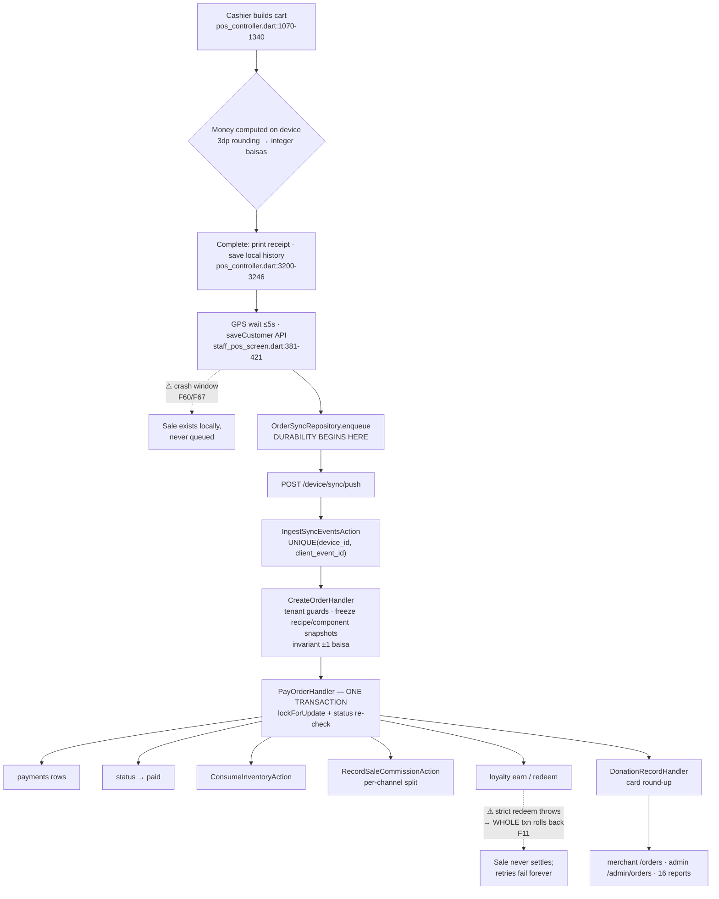

### 9.2 What the server validates — and does not

**Validated:** the additive invariant `subtotal − discount − comp + tax == grand` within ±1 baisa (`CreateOrderHandler.php:627-638`); comp rows summing exactly to `comp_total` plus per-reason `max_amount` caps (`:495-533`); tender sum equal to grand ±1 baisa (`PayOrderHandler.php:168-171`); every foreign reference belonging to the device's own tenant (`assertReferencesInTenant`, `:279-347`).

**Not validated (verified absent):** Σ(line totals) against subtotal; `line_total` against `qty × unit_price`; Σ(discount rows) against `discount_total` (comps are checked, discounts are not — an inconsistent strictness); tax against the company's configured rates; discount amounts against the referenced rule; tender sign (a negative tender amount passes, skewing the commission channel split — F59).

This is deliberate snapshot-authoritative design and it is the right call for offline-first. The gap is that the cheap sign and sum hardening was never added alongside it.

### 9.3 Order lifecycle facts

- **Statuses:** `open`, `held`, `kitchen`, `paid`, `pending_verification`, `void`, `refunded`. `kitchen` and `refunded` are **never written by any code path**, and neither device ever emits `order_type: 'car'` despite the blueprint's drive-up requirement (`pos_api/src/app/Models/Order.php:27-49`).
- **Edit after create** is a wholesale child-row purge and rewrite via upsert-by-uuid while the order is open/held/kitchen; blocked once terminal (`CreateOrderHandler.php:77-134`).
- **Double-pay is impossible**: `lockForUpdate` + status re-check inside the transaction, plus `client_event_id` dedupe. Test-covered (`DeviceSyncOrderTest.php:242,271,325,418`).
- **Held orders** resume from the *local* store on both devices. The server exposes `GET /device/orders/active` for cross-device resume and both codebases contain comments promising it — **but no client ever calls it** (F61). Held mirrors are write-only; abandoned ones accumulate as `held` rows indefinitely.
- **Delivery orders** settle as `pending_verification` (inventory consumed at punch, no tender); merchant confirmation flips to paid and **re-stamps `opened_at`** to the confirmation day, shifting every `opened_at`-windowed aggregate (F38 — the one deliberate break in an otherwise strict immutability model).

### 9.4 Machine vs handheld asymmetries in the sales path

| Aspect | pos_machine | pos_handheld |
|---|---|---|
| Money construction | Each aggregate converted independently; relies on ±1 tolerance | Grand derived in integer baisas — invariant exact by construction |
| Rejected batches | Retries forever, no cap, **no operator surface** | Parks as "stuck" after 5 rejections, red tile, manual retry, Sentry |
| `change_given` on wire | Never sent | Sent — and double-subtracted server-side |
| Round-up | Yes | **Absent entirely** |
| Line/category discounts | Applied | **Dropped at catalog parse** |
| Outbox storage | Per-row Drift updates (race-safe) | Whole-list prefs rewrite (**P0 lost-write race**) |

---

## 10. Inventory & Ingredient Flow Analysis

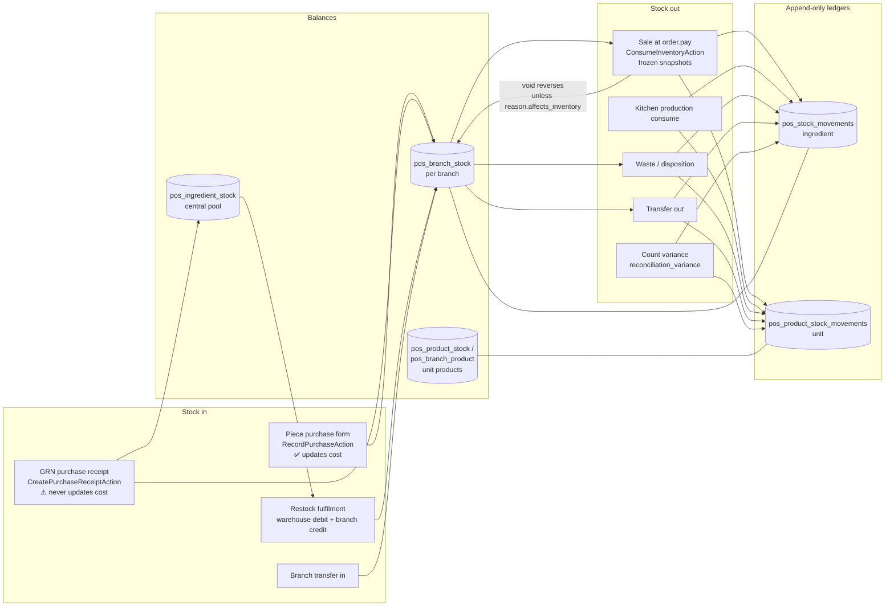

### 10.1 What is right

- **Consumption fires exactly once at `order.pay`** (and at delivery punch), inside the pay transaction, under a row lock with a terminal-status re-check (`PayOrderHandler.php:89-104,178`).
- **It consumes the frozen snapshot, not live rows** — `recipe_snapshot_json` + `component_snapshot_json` written at create, merged with option deltas clamped at zero (commit `a655f46`; `ConsumeInventoryAction.php:228-297`). A recipe edited after the sale does not rewrite that sale's consumption.
- **Atomic SQL increments** rather than read-modify-write (commit `d832222`), eliminating lost updates.
- **Two append-only ledgers with exactly two canonical writers** (`WriteStockMovementAction`, `WriteProductStockMovementAction`); every writer was enumerated; `pos_admin` writes none.
- **Negative stock is allowed only on the sale path.** Waste, transfers, restock fulfilment, kitchen production and disposition all refuse overdraw.
- **The June unit-of-measure model is fully implemented**: `piece_unit_label`, `units_per_piece` (`decimal(14,4)`), `allow_fractional_pieces` on `pos_ingredients`, plus purchase batches, alternate-unit conversion with overflow guards, and day-end stock counts with piece conversion.
- `stock_mode` per product (`ingredient` / `unit` / `untracked`, plus a runtime `cooked`) with a data backfill migration.

### 10.2 Where stock can still become wrong

1. **GRN receiving never refreshes `default_unit_cost`** (F44). Only the older piece-purchase form implements the Additions §2.4 step-4 cost update. Merchants using GRN exclusively sell against permanently stale ingredient costs, which then freeze into every COGS snapshot, waste valuation and variance figure. Two purchase entry paths produce divergent cost states for identical purchases.
2. **Day-end count reconciles against the apply-time balance** (F45). The machine submits a count without first flushing its own outbox, and sales queued on other devices can land after the count. Those sales were already reflected in the physical count, so the system writes a variance-waste for them *and* replays their consumption — double depletion, over-blamed waste.
3. **Config poll resurrects locally-decremented shelf stock** on the machine (F51). The handheld drains its outbox before polling config for exactly this reason; the machine polls (and on reconnect fires sync + flush concurrently, unordered), so a poll landing mid-backlog restores counts the queued sales already consumed — re-enabling oversell.
4. **No yield or shrinkage factors exist anywhere** (spec R1.7). This is the spec's named "single largest cause of false variance", and the variance reporting that exists is therefore uncalibrated.
5. **Two admitted historical conservation holes were fixed forward and never reconciled** (F42): legacy fulfilled restock requests credited a branch with no central debit, and orders sold before `component_snapshot_json` restocked the *live* component set on void.
6. **`order.deliver` lacks the in-transaction lock** that pay and void have (F58) — concurrent duplicates can double-consume.

### 10.3 What the newest spec asks for that does not exist

Purchase orders and partial receiving (GRN is a one-shot atomic document with no PO concept and no void route), supplier returns and credit notes, three-way match, rejection-at-door, over-delivery tolerance, supplier fill rate and scorecard, supplier-item catalogue with effective-dated price lists, blind counting (the count screens show expected quantities), mother-kitchen transfer cost, sub-recipe/prep batch production as a first-class item, expiry-date batch tracking.

---

## 11. Payments Analysis

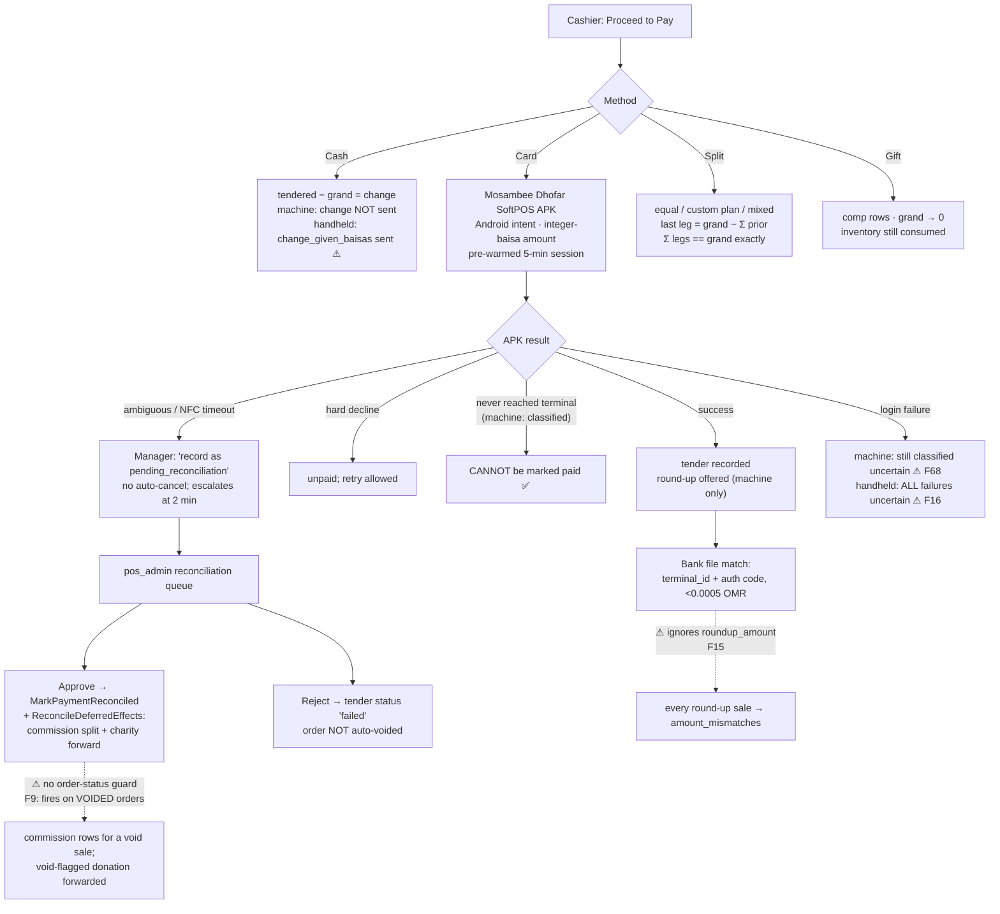

### 11.1 Verified-correct mechanics

- **Exact-sum tendering**: devices force Σ(legs) == grand exactly (last leg absorbs the remainder); the server tolerates ±1 baisa.
- **Idempotency is solid**: payloads are built once and persisted with stable event ids before any network I/O; `order.pay` re-locks and re-checks status in-transaction; `(device_id, client_event_id)` is unique.
- **Commission rounding keeps sums exact**: each non-merchant share is rounded and the merchant takes the exact remainder *per channel*, so Σ(rows) == collected and Σ(channel rows) == channel slice.
- **Mixed-tender apportionment** (`c076237` / `ed40469` / `08b6db2`) is correct by construction: rows are channel-stamped `card` | `cash_bank`, payouts claim only card-channel residuals, invoices claim cash_bank. This fixed a real leak where payouts paid merchants their own drawer cash.
- **`terminal_id` and `bank_id` are snapshot onto `pos_payments` at pay time**; the bank matcher prefers the snapshot and uses the device join only as legacy fallback. (The June handoff listed this as outstanding — it has since been done.)
- **PCI posture is correct**: no PAN handling; only response code, transaction reference, auth code and masked BIN are stored.

### 11.2 Payment defects

| # | Defect | Impact |
|---|---|---|
| F16 | **Handheld can force-record charges that never reached the bank** — `isUncertain` is still the pre-`caefd36` `!success && !canceled` with no `neverReachedTerminal` exclusion anywhere in the repo (and a stale comment claiming parity with the machine). Provably-never-reached failures that reach the "Record payment" button: app not installed, unable to launch login, payment activity not found, unable to launch payment — **plus** (found in verification) `BUSY`, the three `BAD_ARGS` cases and `MissingPluginException`, because the Dart wrapper drops the error *code* and keeps only the message. Only the missing-terminal-id case is preflighted, contradicting `caefd36`'s own commit message claiming the handheld "refuses the charge up front" | Invented revenue with no bank transaction, unresolvable in reconciliation |
| F68 | A **login-stage** failure ("Payment login failed.") is classified uncertain. Verification tightening: **this is a shared residual gap on *both* apps** — the machine's `neverReachedTerminal` does not cover that string either, so it is not part of the handheld divergence | A failed-login attempt can be booked as a pending card sale on either device |
| F15 | **Bank reconciliation ignores `roundup_amount`** — the capture is base+round-up but `pos_payments.amount` holds only the base, so every donation-carrying charge lands in `amount_mismatches` | Systematic false mismatches on exactly the transactions the charity flow depends on |
| F9 | **`ReconcileDeferredEffectsAction` has no order-status guard** — approving a pending charge on a since-voided order writes a commission split for a void sale and forwards a void-flagged donation to charity | Polluted commission aggregates; real external money moved with no clawback |
| F59 | Tender amounts are **not validated for sign or range** — `[cash +10, card −5]` balances the invariant, writes a negative payment row and skews the channel split | Fabricable money shapes from a compromised token |
| F67 | Post-charge crash window: card captured, then receipt printing → local save → GPS acquisition all precede the durable outbox write | Rare but unrecoverable captured money with no server record |
| F5 | **The mixed-tender commission leak is still live for legacy rows.** New orders are fully fixed (channel-split recorders shipped 2026-08-04), but `CreatePayoutAction` still claims pre-fix `channel='all'` rows *whole* unless the order was pure cash/bank — so an unclaimed legacy mixed-tender residual will still be overpaid by the next payout covering its window. This grandfathering is deliberately pinned by a test (`MixedTenderApportionmentTest.php:139-157`: a legacy 6.000 card + 4.000 cash order pays out 9.620). Symmetrically, legacy mixed orders' cash-slice commission can never be invoiced | Ongoing overpayment, not merely historical. Realized damage window: payout launch (2026-06-09) → fix (2026-08-04) — *Cannot Verify* from code whether production payouts claimed mixed orders in that window |

---

## 12. Refunds, Returns, Voids & Reversals

### 12.1 Whole-order void — the one reversal that works

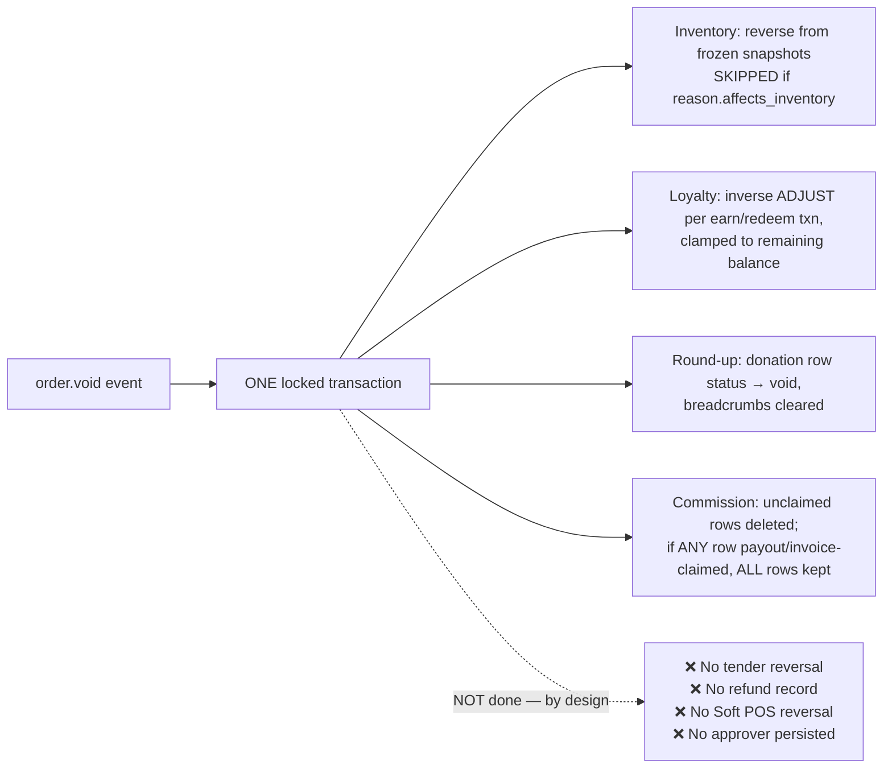

`VoidOrderHandler.php:101-265`. This is genuinely well built: symmetric consume/reverse from the same frozen snapshots, balance-clamped loyalty clawback, and an order-level claim guard so a partially-settled commission set is never half-deleted.

**Void reason codes (Additions §1.2) are fully shipped** — schema with seeded defaults, merchant CRUD, config-bundle delivery, snapshot of id + label onto the order, and a Loss/Waste breakdown by reason and by staff. `affects_cogs` is deliberately folded into `affects_inventory`.

### 12.2 The reversal chain is incomplete in four places

1. **Partial item void does not exist on the wire** (F10/F12). The machine emits `order.void` only for a full-order cancel; a partial cancel rewrites the local snapshot to "Partially Canceled" and stops. For a *paid* order the server keeps the full amounts, restores nothing, adjusts no loyalty/commission/round-up, and every report is unchanged. The dialog *forces* a void reason for partial cancels and then discards it (there is no reason field on the local record). This directly violates the Additions requirement that reason capture cover whole-order **and** single-line voids.
2. **No tender reversal at all** (F54/F62). Payments are deliberately untouched, and the shift close's cash query has no order-status join — so a voided cash sale still counts in expected cash. If the cash was returned, the drawer reads short with no mechanism to explain it. The device-local fallback Z uses the *opposite* convention, so offline and server disagree about the same drawer.
3. **Card-paid voids leave the customer charged with zero signal** (F55). No Soft POS reversal API exists on either device (the handheld's code says plainly that Mosambee has no reversal). No warning in the cancel dialog, no report, no queue of voided card-paid orders needing a manual refund. Books net to zero while the acquirer keeps the capture.
4. **No server-side authorization or attribution on void** (F56). Sync push is device-token auth; the handler validates no staff, position or manager approval and *discards* the `staff_id`/`authorized_by` the devices send (they survive only in the raw `pos_sync_events` payload). `pos_orders` has no `voided_by` column. Per-reason `requires_manager` ships in the config bundle and is enforced only on-device. The spec expects the log to record who actually voided.

### 12.3 Refunds

**Confirmed absent platform-wide.** `STATUS_REFUNDED`, `OrderStatus::Refunded` and `WalletLedgerEntryType::RefundIn` are dormant scaffolding no code ever writes; `refunds_total` in the sales report is permanently zero. This matches the June deferral to Phase 7+. Two consequences to note now: the report's refund semantics are already written in a way that will double-subtract when refunds ship (F83), and until then the *only* reversal available to a merchant is a whole-order void with no money movement.

---

## 13. Loyalty Analysis

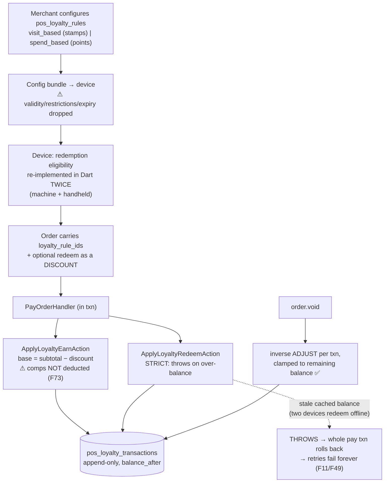

**Sound:** the multi-rule model, the twin PHP `EvaluateLoyalty` pure functions (diff-verified identical between `pos_merchant` and `pos_api`), earn on post-discount subtotal inside the pay transaction, redemption as a discount plus a strict ledger debit, atomic locked ledger writes, void reversal with balance clamping, exactly-once replay protection, manual adjustment in the portal with reason + actor + audit, and 13 contract tests covering replay, over-redeem and multi-rule cases.

**Not sound:**

| # | Issue | Evidence |
|---|---|---|
| F11/F49 | **Offline over-redeem permanently strands the sale.** Strict redeem throws inside the pay transaction; the ingest layer re-dispatches failed events forever, so it re-fails forever. The customer already got the discount; the order is paid locally and unpaid server-side — no inventory, no commission, no earn. The code comment admits reconciliation is "a later refinement" | `ApplyLoyaltyRedeemAction.php:20-28,35-71` |
| F73 | **Fully comped/gifted orders still earn full points.** The earn base never deducts comps, and the "fully gifted earns nothing" guard only checks gift *tenders* with grand > 0 — machine gifts ride comp rows (grand becomes 0), so the guard never fires | `ApplyLoyaltyEarnAction.php:59-64`; `PayOrderHandler.php:205-213` |
| F48 | **Every documented restriction is enforced nowhere**: `expiry_days`, eligible products/categories, branch scope, day/time windows, `max_redemption_per_order`, customer tags — all documented in the migration, zero references in application code. Rule `validity_start`/`validity_end` are dropped by both devices when building their models. Points and stamps never expire; a rule past its end date keeps paying out until manually paused | `2026_06_08_010000_create_pos_loyalty_rules_table.php:17-27,53-55`; `config_mapper.dart:949-957` |
| — | **No Dart port of `EvaluateLoyalty`** — devices never compute earn (they send rule ids and the server accrues), but redemption eligibility is independently re-implemented in two Dart codebases | `staff_pos_screen.dart:2986-3038`; `pos_handheld/lib/main.dart:2050-2087` |
| — | Product/category-scoped stamps (spec §6.6) do not exist — explicitly deferred by the spec itself | `spec.txt:465` |
| F41 | `pos_loyalty_transactions.order_id` is an unsigned bigint with **no FK and no index**; the migration's "Phase 8 wires this" promise was never delivered | `2026_06_08_010200:1502-1504` |

---

## 14. Offers, Promotions & Discounts Analysis

**Three divergent discount semantics coexist in one platform:**

| Implementation | Semantics | Used in production? |
|---|---|---|
| `pos_merchant/…/EvaluateDiscounts.php` (the blueprint's shared evaluator) | Non-stackable-first ordering, multiple rules stack, percents compound on the running line subtotal, order rules after line rules | **No — zero production callers, only its own tests** |
| `pos_machine` | Best *single* product/category rule per line + one order-level slot + offers; `stackable` cached in Drift and **never read** | Yes |
| `pos_handheld` | Order-scope non-auto rules **only** — product/category-scoped and `auto_apply` rules are dropped at catalog parse | Yes |

The blueprint's Phase 6 exit criterion — "both evaluators shared between server and device so offline and online produce identical results" — is unmet in the strongest possible sense: the shared evaluator is dead code, and the two devices that *are* used disagree with each other (F21, F47, F75). A merchant configuring a 10% category discount sees it applied on the till and ignored on the handheld.

**Offers** are better: five types (`bogo`, `bundle`, `multi_buy`, `cheapest_free`, `spend_get`) in `pos_offers` with strict merchant-side config validation, pure engines on both devices, both unit-tested, money stored as integer baisas inside the config JSON. The server stores and ships them verbatim with no server-side evaluator. **But the two engines diverge on `multi_buy`** (F20/F46): the machine marks a matching set's units consumed *before* checking whether the discount is positive and then breaks, starving later offers of those units; the handheld deliberately breaks *before* consuming, and its in-code comment calls the machine's behaviour "a real overcharge". Same cart, same offers, different totals depending on the device.

**Schedule/happy-hour windows evaluate fully offline on-device** — a six-axis predicate with weekday-mask conversion and midnight wrap, mirroring the server's `Discount::appliesAt`. This satisfies the newest spec's "ship rules, not results" requirement for offers and discounts (though *not* for prices — see §23).

**Snapshotting is replay-safe**: applications land in `pos_order_discounts` with name, amount-type, reason, offer id and line linkage. **But** Σ(discount rows) is never compared to `discount_total` (F74), and the machine has a clamp edge where the emitted rows can sum to more than the stored total — desyncing the by-rule/by-offer discount reports from the sales report.

Not built: coupons, vouchers, gift cards (deferred), customer-specific offers, BOGO across categories with priority rules.

---

## 15. Expenses Analysis

Complete and correctly wired, with two seams.

Device capture (`log_expense_screen.dart` on the machine, `ops_screens.dart` on the handheld) → `expense.log` sync event → `pos_expenses` with status `recorded` → merchant portal review/reject → net profit subtracts non-rejected expenses on the `logged_at` day under the PD5 cash model, including a purchase-tax-recoverable setting.

Gaps:
- **Expenses never reduce expected drawer cash** (F66). This is documented as deliberate ("informational only — never in the drawer math"), but the May blueprint explicitly includes on-the-spot *supplier cash payments* — money that leaves the till. Every such payment therefore surfaces as an unexplained shortage while the expense prints one line above it on the same Z report. There is no `paid_from_drawer` flag to distinguish.
- **No shift or device linkage on `pos_expenses`** (F65) — company/branch/staff/`logged_at` only.
- **No receipt-photo capture on either device**, though the blueprint specifies it and the portal has the column.
- **The machine mints a fresh `client_event_id` per submission attempt** (F52), so a cashier resubmitting after an ambiguous timeout double-records the expense. The handheld caches `_eventId ??= _newEventId()` per form for exactly-once.

---

## 16. Cash & Shift Management Analysis

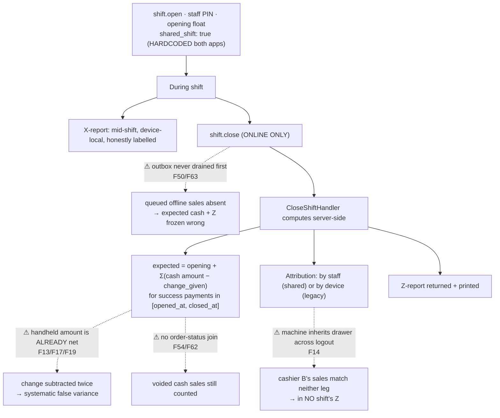

**The June handoff's claim that device shift screens are stubs is stale.** Both apps have complete open/close flows, mid-shift X-reports, server-authoritative Z-reports printed at close, and HH-2 staff-shared shifts with adopt/heal paths. The merchant portal has a Shift Report page and an audited same-day reopen. There are 23 contract tests across `DeviceSyncShiftTest` and `DeviceCurrentShiftTest`.

**Four money-affecting defects:**

1. **Handheld cash change is double-subtracted** (F13/F17/F19 — found independently by three agents, then adversarially verified). The handheld's tender `amount_baisas` is documented as the *net* amount applied to the bill ("cash overpayment rides changeGiven, not the amount") and is forced to equal grand; it *also* sends `change_given_baisas`. `CloseShiftHandler` computes net cash as `SUM(amount) − SUM(change_given)` (line 74) and repeats the subtraction in the Z tender lines (line 177), subtracting change from an amount that never contained it. The exact-sum tender rule proves the amount must be net, so **the server-side shift math is the incorrect side**.
   **Direction (corrected during verification):** understated expected cash means the counted drawer *exceeds* expectation — the variance reads **phantom OVER** by the change total, not short. (3.000 bill, 5.000 tendered, 2.000 change: drawer 13.000 vs expected 11.000 = +2.000 over.) The practical risk is unexplained overages, and worse, **masking of real shortages of equal size**. No contract test exercises `change_given` — all 18 call sites send 0 or omit it. The machine never sends it, so the two devices' drawer math is inconsistent.
2. **Shared-shift orphaning** (F14). The machine keeps the open shift across staff logout ("the next cashier inherits the drawer") and its startup gate skips the per-staff server probe whenever any local shift exists. Cashier B therefore works under A's shift without opening their own; orders carry B's `staff_id`; the close attributes only the shift staff's orders plus staff-less orders on the opening device — B's match neither. B's cash physically enters A's drawer but is excluded from A's expected cash and from every Z, so A reads **over** by exactly B's cash while B's sales appear in no shift anywhere.
   **Verification correction:** this is *platform-sanctioned, not machine-only*. `/device/shift/current` deliberately falls back to the device's own open shift regardless of staff, and a contract test pins that behaviour ("a different staff member… inherits it… staff param or not"). The handheld's per-login probe fixes only the cross-device sub-case; the same orphaning occurs there whenever a second cashier logs into the device holding the first cashier's shift. The Additions requirement that shared drawers be *configurable per branch* does not exist — `shared_shift: true` is hardcoded in both apps, and no server test covers a staff member ringing sales while holding no shift.
3. **Closes never drain the outbox** (F50/F63). Both apps push `shift.close` directly with no flush and no pending-row guard. Sales still queued land inside the already-closed window and the stored expected/variance/Z never update. Only a manual same-day reopen recovers. This bites hardest exactly after an outage.
4. **Voided cash stays in expected cash** (F54/F62) with no refund or cash-out record type to explain the returned money.

**Structural gaps:** no `shift_id` column exists anywhere in 153 migrations (F41/F65) — attribution is purely temporal plus staff/device identity, so expenses, restocks, waste and counts cannot be tied to a shift; and there is **no branch-level end-of-day close or day lock** (F64), so the spec's go-live blocker is only partially satisfied. Only cash is reconciled against a count; card and online totals are informational. A machine can also keep selling under a shift another terminal already closed, and those sales fall after `closed_at` and are orphaned from every Z.

---

## 17. Product & Menu Analysis

| Blueprint concept | Built as | Status |
|---|---|---|
| Categories + subcategories | `pos_product_categories` with `parent_id`, 2 levels | ✅ |
| Products | `pos_products` — base/cost/delivery price, tax rate, `stock_mode`, availability windows, low-stock threshold, shelf life, internal flag, branch availability | ✅ |
| Recipes | `pos_product_recipes` + `pos_product_recipe_versions` (append-only pre-edit snapshots) | ✅ |
| Add-ons / modifier groups | `pos_addon_groups` with `selection_mode`, min/max selections, global vs product-owned, category/product bindings; `pos_addons` with price delta, ingredient link, **product-as-add-on** link; `pos_addon_consumptions` per option with add/remove direction | ✅ — the June "modifier groups with constraints" requirement is met |
| Components (cups, lids) | `pos_product_components` + `component_snapshot_json` on order items | 🔵 different but valid |
| Variants (sizes) | **Not a first-class concept** — expressed as add-on options with consumption deltas | 🟡 |
| Combos / meals | **Absent** | 🔴 |
| Sub-recipes / prep items | Partially via kitchen `pos_productions` (batch cooking with expiry) — but not as recursive item components | 🟡 |
| Unified `items` + `item_components` (Aug spec R1.1) | **Not built.** The catalog is products + recipes + components + add-on consumption | 🔵 deliberate divergence — decide: migrate or supersede |
| Tax category, inclusive/exclusive | `pos_taxes` per company with stacking; `tax_inclusive` column exists on products but is **stored and not honoured** | 🟡 |
| Menu import | CSV product import exists; the spec's "one MITHQAL template with preview + validate before commit" does not | 🟡 |
| Kitchen routing / stations | **Absent** | 🔴 |
| Menu time-windows | `available_from`/`available_until` on products exist | 🟡 (Ph7+ anyway) |
| Barcode/SKU | Present (partial uniques), though retail features are out of scope | ✅ |

---

## 18. Customer / CRM Analysis

Built: `pos_customers` (AR/EN name, phone, secondary phone, email, DOB, tags, wallet balance) with `(company_id, phone)` uniqueness; `pos_customer_vehicle_plates` as a proper M:N with per-company plate indexing; `pos_customer_wallet_ledger` append-only; duplicate merge in the portal; customer analytics; device-side find-or-create with plate capture; live search by phone or plate on `/device/customers/search`.

Gaps: **house accounts / customer credit** (spec §6.5 — credit limit, statement, ageing) do not exist; the wallet is a stored-value balance, not a credit facility. Customer PII (`phone`, plate, DOB, tags) is stored **in cleartext** in the shared database — structurally, because the unique constraint and `LIKE` plate search need deterministic plaintext and there is no blind-index column. The blueprint requires these columns encrypted at rest.

---

## 19. Employee, User, Role & Permission Analysis

Three auth planes exist as specified:

| Plane | Mechanism | Notes |
|---|---|---|
| Platform admin | `pos_admin_session` guard; candidate pool restricted to `platform_admin` *before* the password check; TOTP 2FA parks a pending state | 39-case `PlatformPermission` enum, 5 seeded roles, 12 policies, team_id 0 sentinel |
| Merchant portal | Session auth; candidate restricted to `user_type = merchant` before validate; `MerchantTenantContext` + global company scope | ~40-case `MerchantPermission` enum, spatie teams keyed by `company_id` |
| POS device + staff | Custom `pos_device` bearer guard on `pos_devices.device_token`; staff PIN bcrypt-checked scoped to company **and** branch; manager PIN verified server-side against `manager_approval_positions` | Generic 401s with no existence oracle; shared 10/min brute-force bucket across all PIN surfaces |

**Where authorization is weaker than the blueprint intends:**

- **Sensitive POS actions are gated device-side only.** Void, comp, discount and gift approval gates are positions emitted in `/device/config` and enforced in Dart. The server accepts `order.void` on device-token auth alone and *discards* the staff id and approver the device sends (F56). A rooted device can void/comp/discount its own tenant's orders freely. Cross-tenant is impossible, so this is a within-tenant integrity issue, not a leak.
- **The manager fingerprint gate accepts any device-enrolled fingerprint** (F35). "Register manager" is one successful `BiometricPrompt` that sets a SharedPreferences boolean; every later approval passes for *any* finger enrolled in Android settings, with no binding to a manager identity. The server-verified PIN fallback is explicitly online-only, so offline manager gates reduce to device-enrolled biometrics. A cashier who enrolls their own finger can self-approve voids, comps, gifts and discounts offline.
- **No `voided_by` / approver persisted** on orders — the spec explicitly wants the log to record who actually voided.
- All 8 Scalefusion remote controls — including factory reset, delete device, wipe SD card — share **one** `DevicesControl` permission with benign actions like buzz and alarm, with no step-up (F: P3).

---

## 20. Multi-Branch / Multi-Tenant Architecture

**The tenancy story is the strongest part of the security posture**, and it improved since the handoff was written.

- `pos_merchant` now has a **real global scope** (`BelongsToCompanyScope`) reading `MerchantTenantContext`, deliberately no-op when unpinned (guests, console, queue, route binding), with additive create-stamping and a `withoutGlobalScope` escape hatch. Correctly exempted: `User`, `Company`, `AuditLog`, `Device`. Guarded by `TenantGlobalScopeTest` and `TenantScopeCoverageTest`. Raw report queries that bypass the ORM were sampled and all anchor `company_id` at the base.
- `pos_api` is **confirmed manual-scoping** — but disciplined: every endpoint derives `company_id`/`branch_id` from the guard-resolved device, never from the request body. Fifteen controllers/actions were sampled and all scope correctly.
- `pos_admin` uses opt-in `TenantScope` with null context meaning platform-wide, which is correct for a platform operator.
- **The previously-critical cross-tenant order-create FK leak is confirmed closed**, with `assertReferencesInTenant` covering products, add-ons, customer, table, staff and joined tables, and nine dedicated contract tests.
- **VULN-4 (staff_id payload validation) is now closed** — and not only in `order.create`: `assertStaffInTenant` appears in the comp approver path, shift open, product waste, stock count, expense log, and the online production/disposition paths.
- Broadcast channel authorization scopes a device to its own company/branch/device.

Open items: the **nightly tenant-integrity sampling job (§9.11.7) is not built** (grep returns zero), and the **admin API data plane skips the `isPlatformAdmin` re-check** (C2) — `routes/admin.php:47` uses the framework `auth` alias rather than `EnsureUserIsAuthenticated`, and `SetTenantContext` actively accommodates a merchant principal by pinning their company. Practical exploitability is gated by cookie isolation, so this is a defence-in-depth inconsistency rather than a confirmed breach — but it is the one place where the "impossible by construction" guarantee the blueprint demands is not achieved.

Branch scoping is enforced per POS staff member (staff can only log into devices at their branches) and clamped once in `ReportFilter::fromArray` for all merchant reports — except the customer report's loyalty block, which ignores it.

---

## 21. Flutter POS Applications Analysis

**The single most consequential architectural fact in this audit: `pos_machine` and `pos_handheld` are two separately written applications that compute the same money.**

They are not one codebase with feature flags (which is what the May blueprint specified: "POS, handheld and customer tablet share a single codebase with feature flags per device class"). They do not share a package. They are kept aligned by hand-ported "parity" code, with comments saying so explicitly — the handheld's offer engine header reads "ported VERBATIM", its shift builders "mirror pos_machine's `shift_payload.dart` exactly", and commit `f02d437` is titled "Gating parity with pos_machine".

| Dimension | pos_machine | pos_handheld |
|---|---|---|
| State management | Riverpod 3 | plain `setState` + `ValueNotifier` singletons |
| Local storage | Drift (SQLite), schema v27, 23 tables | SharedPreferences (outbox) + sqflite (order log, held orders) |
| Size / history | 123 commits, granular | 9 commits, two named "new", one mega-commit contains the entire API + hardware integration |
| Tests | unit tests green; legacy charity-flow/widget tests stale | 175 tests / 16 files |
| i18n | en/ar | none |
| Round-up | full | **absent** |
| Outbox safety | per-row Drift updates (race-safe) but **no dead-letter, no cap, no UI** | dead-lettering + red tile + retry + Sentry, but **whole-list rewrite → P0 lost-write race** |
| Discounts | line + category + auto-apply + order | **order-scope non-auto only** |
| Card failure classification | post-`caefd36` (`neverReachedTerminal` hard-block) | **pre-`caefd36`** |
| Telemetry | — | Sentry fully wired but **DSN empty → disabled** |

Each app has a safety mechanism the other lacks, and each has a defect the other fixed. There is no propagation path in either direction. This is the structural root cause of findings F3, F16, F20, F21, F28, F30, F52, F70 and F77 — nine separate findings that are all the same problem.

**Duplicated modules that must agree and are only manually synced:** `offer_engine.dart`, tax formula in `pos_models.dart` / `catalog.dart`, discount/comp clamping, cart and line-total math, stock gating, receipt totals, sync-payload invariants, shift payload builders, Mosambee bridge, API service (1,024-line diff), session service (424-line diff).

Add to that the two **PHP** "keep in sync" twins — `RecordSaleCommissionAction` (pos_api ↔ pos_admin) and `EvaluateLoyalty` (pos_api ↔ pos_merchant), both currently identical but guarded by nothing (F76) — and the platform has **four independently-maintained copies of settlement-critical money math**.

---

## 22. Device & Hardware Integration Analysis

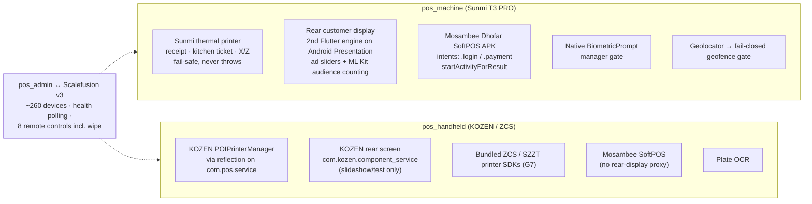

**Verified strengths:** the printer service is fail-safe by design (never throws — a dead printer cannot break a sale); card charges pass integer-baisa amount strings with a pre-warmed single-use 5-minute session; the customer display runs as a genuinely separate Flutter engine exchanging order state and round-up responses over a platform channel; Scalefusion control is authorized, audited and tenant-safe.

**Hardware problems that matter:**

1. **The Sunmi NP521 customer-display digitizer stays bound to display 0** (F37) — taps on the customer screen activate whatever sits under the same coordinates on the *operator* screen. `setScreenTpSwitch` is received by `com.sunmi.usbscreen` and ignored. This breaks the round-up accept/decline prompt — the one customer-facing input the whole charity programme depends on — and lets customers trigger arbitrary staff-POS actions. A complete support ticket with adb/dumpsys evidence is prepared in-repo; the fix requires Sunmi firmware.
2. **Printer failover (June MVP-critical) is not implemented.** Printing is fail-safe but there is no print-job queue with status, no 3-retry-with-backoff, no persistent on-screen alert with one-tap reprint, no "pending print" list, no printer status in the device heartbeat. A kitchen printer that dies mid-service fails silently.
3. **Cleartext HTTP is enabled in the release manifest** (F36) — combined with the operator-editable server base URL in Settings, a terminal can be pointed at an `http://` endpoint and will transmit the device bearer token, staff PINs and order data unencrypted.
4. **Shared default Mosambee terminal PIN** with a server-null value clearing a cached real PIN back to the default (P3, both apps by design parity).

---

## 23. Offline-First / Synchronization Analysis

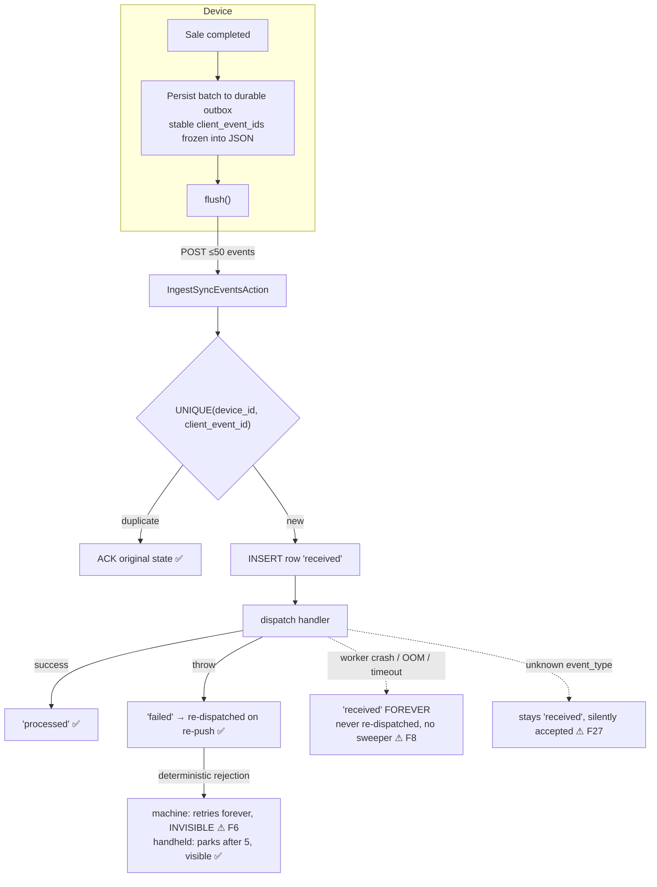

**What is genuinely well built:** persist-before-network on both devices; `client_event_id`s minted once and frozen into the persisted payload so every retry sends identical ids; exactly-once with duplicate-ACK echoing the original state; server-validated batch cap of 50; in-transaction `lockForUpdate` guards on pay and void so concurrent replays consume or reverse stock exactly once; the `bf0bf72` `withTrashed` fix so mid-queue product/add-on deletions no longer strand offline sales; charity-side idempotency on `pos_reference`; atomic server order-number allocation with offline orders carrying no number at all (collision-free by omission — a series gap, not a collision, which satisfies the spec's per-device-prefix requirement differently but validly); server-issued delta cursors immune to clock skew; Reverb live-delta push on the machine.

**Where it breaks:**

| # | Scenario | Consequence |
|---|---|---|
| F1 **(P0)** | Handheld: sale enqueued during an in-flight flush; flush writes back its stale snapshot | The new batch is **erased before ever being pushed**. Revenue, stock, loyalty and commission for a charged sale never reach the server. **No recovery path exists** — app restart, the 60s poll, the drawer tap and retry-all all re-read the same erased key, and nothing re-enqueues from the order log (which physically cannot rebuild the wire batch: its rows carry no product ids or `client_event_id`s). The only trace is a passive "not synced" history chip while the pending count reads 0. Window is the entire flush duration, largest exactly when draining a backlog on reconnect. Two overlapping enqueues race the same way |
| F6 | Machine: any permanently-rejected batch | Retries forever with no cap, no parking, and **no operator surface at all** — `watchPending()` has zero consumers in `lib/` |
| F7 | Machine: order enqueued without a GPS fix at a fenced branch | The payload is frozen at enqueue and re-sent verbatim; the server fails closed on every replay. The comment claims it "stays queued until a fix is obtained" — nothing ever re-enriches a queued payload. **Permanently unsettleable and invisible.** Verification narrowed the trigger: the live geofence gate normally supplies a cached fix, so this needs *both* the 5s current-position and last-known lookups to fail (location services toggled mid-session, or a fence added mid-session). A *stale last-known fix outside the fence* freezes into the same trap. Only recovery is un-fencing the whole branch |
| F8 | Server: worker crash between row insert and handler completion | Row stranded at `received`; ingest re-dispatches only `failed`; no sweeper exists. Neither client nor server can ever settle it — manual DB surgery only |
| F53 | Customer or table deleted while an order sits in the outbox | `order.create` still resolves those strictly (no `withTrashed`) → permanent rejection. A routine merchant cleanup can strand real sales |
| F57 | Void reason soft-deleted after an offline void was queued | Void fails on every re-push; order stays paid server-side while the till shows it cancelled |
| F51 | Machine config poll during a backlog | Restores shelf counts the queued sales already consumed → oversell |
| F52 | Machine `shift.close` / `expense.log` retry | Fresh event id per attempt → "shift already closed" dead-end; duplicate expenses |
| F26 | Large offline backlog | All handlers plus charity HTTP forwards run **inline in the push request** (no queue worker) against a 120/min limiter and PHP timeout |

**Not implemented from the newest spec:** per-device monotonic sequence numbers for ordering guarantees (R3.3), clock-skew *checking* (both timestamps are recorded but never compared or offset-corrected — R3.6), and "ship rules not results" for **prices** specifically (offers and discounts are rules, but prices are cached values with no `effective_from`, so the spec's "order opened at 18:55 keeps the 18:55 price" guarantee is not achievable — R3.2).

---

## 24. Reporting Analysis

24 merchant report/analytics actions, 5 admin surfaces, 1 device branch report. Test coverage exists for all the main reports (18 feature test files).

**Three systematic misstatements affecting every merchant:**

1. **UTC day boundaries in a UTC+4 market** (F23). Every merchant, admin and device report parses bare `YYYY-MM-DD` into UTC start/end of day while orders are stored UTC from devices in Oman. Midnight–04:00 local sales land on the previous day's report; hour-of-day heatmaps are rotated four hours; day-close totals can never match shift and drawer reality. This is one shared helper (`ReportFilter.php:67-68`) plus the admin and device equivalents — small fix, platform-wide effect.
2. **Comps are never subtracted** (F22/F24). The server invariant is `grand = subtotal − discount − comp + tax`, proving comped food collects no money. But `net_sales = SUM(subtotal) − SUM(discount_total)` with no comp term anywhere, and `net_profit` follows from it. The Z-report and the device branch report deduct comps correctly — so the till and the portal disagree about the same day.
3. **Pending-reconciliation card sales are reported as finalized 100%-merchant income** (F25). `PayOrderHandler` correctly defers commission recording while any tender is pending; `SalesReportAction` treats paid orders with no commission ledger rows as *no-profile* sales and flows the full grand total into both `merchant_net` and `finalized_net` with zero commission deducted, while excluding them from `pending_net`. Unconfirmed card money reads as realized, commission-free cash-in-hand: **`commission_total` understates and `net_profit` overstates** during the reconciliation window, then both silently restate after admin approval. The report layer contains no reference to `pending_reconciliation` at all, and the per-order surfaces contradict it — the orders list marks the same orders `commission_status = none, is_finalized = false`.

**Report-specific defects:** Loss/Waste "shortfall" counts transfers-out and production consumption as unexplained loss — and the newer Portion Variance report's own docblock calls this "the bug this avoids" while the buggy version still ships (F78). Inventory Consumption and the dashboard top-ingredients tile count manual adjustments as consumption, inflating days-of-stock and triggering the >20% theft anomaly flag on routine corrections (F79). COGS excludes cooked and unit products entirely (server writes NULL recipe snapshots for those modes) and misses add-on consumption costs because readers never look at `consumption_snapshot_json` (F72/F80) — production and bought-in merchants show 100% margins. Orders-viewer money banners include voids and unpaid orders by default (F81). The device tender mix has no payment-status filter, so failed retried legs double-appear (F82).

---

## 25. Accounting & Financial Integrity Analysis

**There is no general ledger, and none is intended.** The newest spec explicitly draws the boundary: track credit notes and amounts owed, but do not build accounts payable — export to the client's accounting software instead. What exists instead is a **transaction-and-settlement model**:

- Orders and payments as the revenue record, with frozen money columns and an enforced additive invariant.
- `pos_sale_commissions` — append-only, baisa-exact, per-channel splits with the merchant taking the exact remainder. One immutable breakdown per order.
- Settlement in two directions: `pos_payouts` claim card-channel residuals, `pos_commission_invoices` bill cash/bank-POS channel, `pos_commission_settlements` reconcile estimated versus actual bank fees with a reverse-before-payout guard.
- `pos_purchase_receipts` with an accounts-payable payment history carrying `balance_after` — a small AP ledger for supplier invoices.
- COGS from frozen recipe snapshots; net profit from sales minus COGS minus non-rejected expenses under a documented cash model.
- Charity donations as a separate liability-shaped record forwarded to the charity ledger.

**Integrity assessment:** the money engine itself is well constructed — rounding preserves sums exactly, snapshots make history immutable, and the mixed-tender channel fix closed a real leak. The integrity risks are not in the arithmetic; they are in **completeness**: comps missing from net figures, pending money counted as finalized, uncorrected legacy commission rows, no tender reversal, GRN not updating costs, and a delivery flow that deliberately re-dates revenue.

**Historical integrity is otherwise strong.** Snapshot coverage is near-complete: product name/price, recipe, component and consumption snapshots on order items; discount/offer/comp/void-reason snapshots; commission percent and party snapshots; frozen payout/invoice/settlement splits; GRN frozen totals; recipe version history. A price change tomorrow does not alter yesterday's invoice; a recipe edit does not rewrite past COGS. **The two exceptions** are the delivery `opened_at` re-stamp (F38) and the GRN cost-staleness path (F44), which corrupts *future* snapshots rather than past ones.

---

## 26. Database Analysis

~105 live `pos_*` tables across tenancy, devices, staff, catalog, dual inventory systems, customers/loyalty, orders/payments/shifts/sync, commissions/settlements/payouts/invoices/round-ups, marketing/ad-billing, and messaging/targets. All 153 migrations live in `pos_admin`; `pos_api` and `pos_merchant` each carry exactly one `testing`-env-guarded SQLite mirror.

**Strengths:** money is uniformly `decimal(12,3)` with documented, justified deviations. All three apps run UTC and separate business time (`occurred_at`, `opened_at`, `captured_at`) from `created_at`. Four mutable-balance-plus-append-only-ledger pairs (branch/central ingredient stock, branch/central product stock, loyalty accounts, customer wallet). Hot query paths are properly indexed: `pos_orders` on `(company, opened_at)`, `(branch, opened_at)`, `(company, status)`, `(staff, opened_at)`; `pos_stock_movements` on `(branch, occurred_at)`, `(ingredient, occurred_at)`, `(reference_type, reference_id)`; `pos_sync_events` unique on `(device_id, client_event_id)`.

**Schema-level risks:**

| # | Issue | Why it matters |
|---|---|---|
| — | **Append-only and snapshot immutability are enforced only in the application layer — zero triggers, CHECKs or rules in the entire schema.** A raw `DB::table()->update()` or any non-Eloquent access bypasses every guarantee | The audit log's immutability (`booted()` throws on updating/deleting) has the same weakness |
| F39 | `client_event_id` remains **globally unique** on `pos_orders` and `pos_roundup_donations` even though `pos_sync_events` was deliberately re-scoped to `(device_id, client_event_id)` in `2026_06_22` precisely because a global unique let one tenant's device suppress another's event | Same cross-tenant collision class, one layer down |
| F41 | **No `shift_id` anywhere** outside `pos_shifts` (grep across all 153 migrations returns zero) | Shift money attribution is reconstructed from time windows and identity; with shared shifts spanning devices there is no referential anchor |
| F40 | ~13 tables pair `softDeletes` with **hard uniques that include trashed rows** (customers by phone, ingredients/suppliers/categories/addon groups/taxes/providers by name, floor and table labels, reason codes) — only `pos_products` and `pos_staff` use partial uniques excluding `deleted_at` | Soft-delete then re-create with the same natural key fails with a DB unique violation |
| F42 | Two admitted conservation holes fixed forward with **no backfill** | Drifted historical balances stand |
| F43 | Nine `hasTable`-guarded stubs create charity/marketing-owned tables; the "charity migrates first" assumption is **comment-only**, and real `restrictOnDelete` FKs run from `pos_devices` into charity `banks`/`organizations`/`commission_profiles` | A fresh shared DB migrated pos_admin-first breaks charity's own migrations; charity-side deletes fail while POS rows reference them |
| — | Both test mirrors have **drifted** from the August production columns (`bank_fee`, `is_shared`) | Contract tests can pass against a schema production no longer matches |
| — | `pos_payments` has no `company_id`/`branch_id` — tenant scope requires a join through `pos_orders` | Every payment query must remember the join |
| F38 | Delivery confirmation **re-stamps `pos_orders.opened_at`** | The single deliberate break in the immutability model |

---

## 27. Security Analysis

Severe findings first.

| Severity | Finding | Evidence |
|---|---|---|
| **High** | **`pos_devices.device_token` is stored in plaintext** and the guard matches the raw column. Because all POS apps and the charity system share one Postgres, any read primitive (leaked backup, SQL injection in a sibling app, DBA overreach) yields live bearer credentials that fully impersonate any terminal. Hashing it is on the backlog and not done | `2026_05_24_020000…:76`; `AppServiceProvider.php:44-46` |
| **High** | **The charity round-up endpoint is public and unauthenticated.** `POST /api/donations-pos-roundup` sits in a group whose only middleware is `throttle:120,1` — no bearer, no shared secret, no HMAC. It honours caller-supplied `status`, `amount`, `pos_device_id` and `organization_id`, creating `charity_transactions` and share rows. Anyone who can reach the host can fabricate donation records | `charity-laravel-api/src/routes/api.php:46-55`; `ForwardCharityDonationAction.php:52-78` |
| **Medium** | **Admin API data plane skips the platform-admin re-check** (C2). `routes/admin.php:47` uses the framework `auth` alias, not `EnsureUserIsAuthenticated`, and `SetTenantContext` actively accommodates a merchant principal by pinning their company. Gated in practice by cookie isolation → defence-in-depth inconsistency, not a confirmed breach | `routes/admin.php:47`; `SetTenantContext.php:36-40` |
| **Medium** | **Customer PII in cleartext** — phone, vehicle plate, DOB and tags are unencrypted in the shared DB, structurally because a unique constraint and `LIKE` plate search need deterministic plaintext and no blind index exists. The blueprint requires these encrypted | `pos_api/app/Models/Customer.php:30-35` |
| **Medium** | **Manager fingerprint gate accepts any enrolled finger** (F35) — offline manager approvals reduce to device-enrolled biometrics with no identity binding | `manager_authorization_service.dart:23-35` |
| **Medium** | **Cleartext HTTP allowed in the release manifest** plus an operator-editable base URL (F36) | `AndroidManifest.xml:21` |
| **Medium** | **Hardcoded default super-admin password fallback** in config, consumed by a seeder that uses `updateOrCreate` and `syncRoles([SuperAdmin])` — if the seeder ever runs with the env var unset, the platform SuperAdmin is created or **reset** to a source-committed credential | `config/pos_admin_auth.php:37`; `DefaultAdminUserSeeder.php:22-38` |
| **Medium** | **No tamper-evident hash chain on the audit log** (blueprint §9.13.5). No `hash`/`previous_hash` column exists; immutability is ORM-level only, so silent row deletion or reordering at the DB layer is undetectable | `2026_05_12_160004…:90-106` |
| Low/P3 | All 8 Scalefusion controls including factory reset and wipe share one permission with no step-up | `DeviceScalefusionController.php:106-128` |

**Verified sound:** login rails restricting the candidate pool by user type *before* the password check on both portals; TOTP 2FA parking a pending state; SHA-256 single-use activation tokens with expiry and revoke; bcrypt PINs with a shared per-device brute-force bucket and generic 401s (no existence oracle); no `.env` committed in any repo and no hardcoded API keys in application code; broadcast channel authorization scoping devices to their own company/branch; no IDOR on any `{uuid}` route (every mutation resolves under the device's own tenant with `lockForUpdate`); merchant↔merchant isolation held under this pass and two prior adversarial re-audits.

---

## 28. Code Quality & Architectural Review

**What is good and should not be disturbed:** the thin-controller → Action pattern is applied consistently across all three Laravel apps (~130 Actions in merchant alone); ledger writes funnel through exactly two canonical writers per domain; contract tests are treated as a real contract (434 device test methods); permission enums are exhaustive and gate reads and writes separately; migrations are strictly additive with documented rationale in docblocks — several of the sharpest findings in this audit came *from* those docblocks admitting known problems, which is a sign of a healthy engineering culture.

**Structural problems worth fixing:**

1. **Four hand-synced copies of money math** (§21) — two Dart, two PHP pairs. No shared package, no cross-repo drift test.
2. **Dead code that implies working features**: `EvaluateDiscounts` (the blueprint's shared stacking evaluator, fully tested, zero production callers); `GET /device/orders/active` (server-ready cross-device resume that no client calls); `stackable` (shipped, cached, never read); `kitchen` and `refunded` order statuses (never written); `order_type: 'car'` (never emitted).
3. **A 4,049-line Vue inventory page with 9 tabs** and a 1,292-line config builder — both are load-bearing and both are past the point where a change is safely reviewable.
4. **Silent-acceptance patterns**: unknown sync event types return success and sit at `received` forever; `_readOutbox` returns `[]` on a JSON parse failure, discarding every queued sale; `_writeOutbox` swallows write failures.
5. **Mock data reachable in a real device state** (F29) — the handheld falls back to hard-coded products, categories and a 5% tax whenever the synced catalog is null, *including* an activated device whose first config fetch failed, and even pre-seeds a demo cart line under the same condition.
6. **Sentry is wired and disabled** on the handheld (empty production DSN), which makes the parked-revenue paging — the mitigation for its most serious money risk — a no-op today.
7. **Coarse commit history on the handheld** (9 commits for a payments device, one containing the entire API and hardware integration) makes bisecting a money bug there impractical.

---

## 29. Target Architecture

The target is **not a rewrite**. The existing module decomposition is sound; what it lacks is a shared calculation core, a recovery layer for stranded money, and the fulfilment surfaces the newest spec introduced.

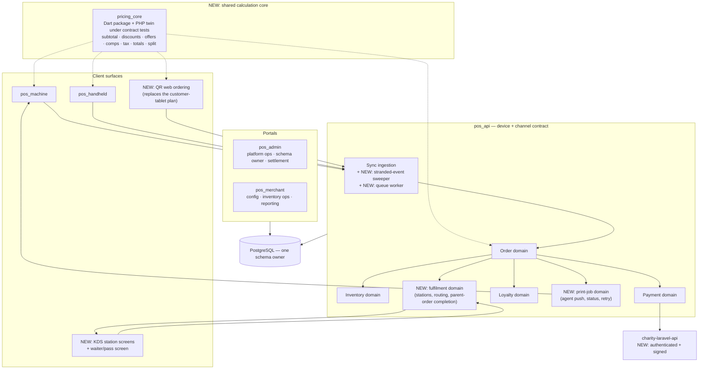

**Five additions to the current architecture, in dependency order:**

1. **A shared pricing core.** One authoritative implementation of cart money, published as a Dart package consumed by both Flutter apps, with a PHP counterpart in `pos_api` held to the same golden-case test vectors. This does not require making the server recompute prices (the offline-first snapshot model should stay) — it requires that the two clients and the server's *validator* agree by construction rather than by hand-porting.
2. **A money-recovery layer.** Dead-lettering and operator surfacing on the machine, a server-side sweeper for events stranded at `received`, a re-enqueue path from local order history, and payload re-enrichment for geofence-blocked orders. Nothing in the platform today can answer "which sales did we take money for and never record?".
3. **Fulfilment surfaces** — print-job domain (job status, retry, agent push, failure alerting on the POS screen) and station routing with parent-order completion feeding a waiter screen. Both are pure additions with no migration risk.
4. **QR ordering as the customer channel**, replacing the May blueprint's customer-tablet application, per the August spec.
5. **A compliance layer** — Oman VAT tax-invoice formatting on receipts, branch end-of-day close with a day lock, and an audit-log hash chain.

## 30. Domain Boundaries & Source of Truth

| Domain | Owns | Authoritative source | Must not own |
|---|---|---|---|
| **Catalog** (merchant) | products, categories, recipes, components, add-on groups, taxes, discounts, offers | `pos_merchant` writes; config bundle distributes | Order money |
| **Pricing** (**new, shared**) | cart math: line totals, discount/offer selection, comp clamping, tax, grand, split allocation | The shared core; device computes, server validates | Persistence |
| **Sales** (pos_api) | order header + lines, statuses, snapshots, receipt numbers | Device event log, server-persisted, immutable once terminal | Stock balances, loyalty balances |
| **Inventory** (pos_api + pos_merchant) | balances, both ledgers, consumption, waste, transfers, counts, GRN, restock | **Server**, derived from frozen snapshots | Prices |
| **Payment** (pos_api + pos_admin) | tenders, pending-reconciliation lifecycle, bank matching, refunds (future) | Server; bank file is the external truth for card | Order composition |
| **Commission/Settlement** (pos_admin) | per-sale splits, payouts, invoices, settlements | Server, immutable snapshot at pay or at approval | Sale pricing |
| **Loyalty** (pos_api) | accounts, ledger, earn/redeem/expiry | **Server** — strictly | Discount composition |
| **Shift/Cash** (pos_api) | shifts, expected cash, Z reports, day close (future) | Server-computed at close | Sale money |
| **Charity** (charity app) | donation ledger, shares | Charity system; POS holds only the forwarding record | Merchant revenue |
| **Fleet** (pos_admin + Scalefusion) | devices, assignment, geofence, health, remote control | pos_admin for assignment; Scalefusion for health | Business data |

**The one boundary violation to correct:** pricing currently has *four* owners (two Dart apps, one dead PHP evaluator, one PHP validator). Everything else respects its boundary.

## 31. Required Changes by Component

### 31.1 Database changes

| Change | Reason | Risk |
|---|---|---|
| Add `shift_id` to `pos_orders`, `pos_payments`, `pos_expenses` (nullable, backfilled by time window) | Shift attribution has no referential anchor; blocks accurate shift reports | Low — additive |
| Add `voided_by_staff_id`, `void_approved_by_staff_id` to `pos_orders` | Spec requires the log to record who voided | Low |
| Add `hash` + `previous_hash` to `pos_audit_logs` + a chain job | Blueprint §9.13.5 tamper evidence | Low |
| Hash `pos_devices.device_token` (add `device_token_hash`, dual-read, drop plaintext) | Plaintext bearer credentials in a shared DB | Medium — coordinated device re-auth |
| Convert ~13 soft-delete uniques to partial uniques excluding `deleted_at` | Re-creating a deleted customer/ingredient/table currently fails | Medium — Postgres-only, needs dedupe first |
| Scope `client_event_id` uniques on `pos_orders` and `pos_roundup_donations` to `(device_id, client_event_id)` | Same cross-tenant collision class already fixed for `pos_sync_events` | Medium |
| Add `paid_from_drawer` to `pos_expenses` | Petty cash must reduce expected drawer cash | Low |
| Add PO + partial-receiving structures (`pos_purchase_orders`, per-line ordered/received/outstanding) | Spec R2.4; GRN has no PO concept | Medium — new subsystem |
| Add supplier returns + credit notes (`pos_supplier_returns`, `pos_credit_notes`) | Spec R2.5; return ≠ waste | Medium |
| Add `yield_factor` to `pos_ingredients`; `effective_from` price rows for products | Spec R1.7 and R3.2 | Medium |
| Backfill: legacy `channel='all'` commission rows; restock rows with NULL resolution; component-drift balances | Three admitted, uncorrected historical holes | **High — money-affecting, needs a reconciliation plan** |
| Re-sync both test-mirror schemas with production columns | Contract tests can pass against a stale schema | Low |

### 31.2 API changes (pos_api)

- **New events:** `order.item_void` (partial cancel with reason, quantity, and server-side unwind), `order.refund` (when refunds ship), `print.job.ack`.
- **Harden existing:** tender sign/range validation; Σ(discount rows) vs `discount_total`; Σ(line totals) vs subtotal; `order.deliver` `lockForUpdate` + status re-check; reject unknown `event_type` with an explicit failed status rather than silent acceptance.
- **New recovery surface:** a scheduled sweeper re-dispatching events stranded at `received` past a threshold; an admin view of stranded/failed events by device.
- **Fix in place:** `CloseShiftHandler` change-subtraction (or normalize the handheld's payload — decide one side and add a contract test); shift close must reject or warn when the device reports pending outbox rows; loyalty redeem must degrade to a recorded discrepancy rather than failing the whole pay transaction.
- **Move sync processing to a queue worker** with the HTTP request only enqueueing, so a large backlog cannot time out mid-batch.
- **New domains:** print jobs (create/claim/ack/fail + agent long-poll or WebSocket), stations and routing, parent-order completion.
- **Auth the charity forward** — shared secret or HMAC signature, and reject unauthenticated posts at the charity end.

### 31.3 pos_machine changes

Ordered by severity: dead-letter + park rejected batches after N attempts and **surface them** (consume `watchPending()`, a red pending tile, per-batch detail, manual retry); re-enrich geofence-blocked payloads with a fresh fix instead of re-sending a fix-less payload forever; re-enqueue from local order history for sales that were saved but never queued; move the durable outbox write *before* GPS acquisition and the customer API call; emit `order.item_void` with the reason the dialog already collects; classify Mosambee login failures as never-reached-terminal; drain the outbox before config polls and before shift close; use deterministic event ids for `shift.close`, `expense.log` and `restock.request`; fix the `multi_buy` consume-before-break overcharge; bind the manager fingerprint gate to a manager identity; remove `usesCleartextTraffic` from the release manifest; replace the hardcoded "Tax (5%)" receipt label with the configured tax names.

### 31.4 pos_handheld changes

**First, before anything else: fix the outbox lost-write race** — read-modify-write under a lock, or move to sqflite rows like the machine's Drift approach. Then: port the `neverReachedTerminal` classification so charges that never reached the bank cannot be force-recorded; stop sending `change_given_baisas` (or align with whatever server-side decision is made); apply product/category-scoped and auto-apply discounts; remove the mock-catalog fallback for activated devices; configure the Sentry DSN so parked-revenue paging actually pages; add charity round-up for parity.

### 31.5 pos_merchant changes

Subtract `comp_total` from `net_sales` and `net_profit`; make date filters business-timezone aware; exclude pending-reconciliation orders from *finalized* income (they belong in a separate "awaiting confirmation" bucket); fix Loss/Waste to exclude transfers-out and production consumption; remove `Adjustment` from consumption types; read `consumption_snapshot_json` in COGS and value cooked/unit products; default orders-viewer totals to exclude voids and unpaid; build the receiving/PO, supplier-return and credit-note UIs; add the blind-count mode; build the ingredient branch-transfer front end (backend exists, no UI).

### 31.6 pos_admin changes

Add the order-status guard to `ReconcileDeferredEffectsAction`; make bank reconciliation match on `amount + roundup_amount`; schedule the round-up retry sweep (and add a scheduler service to the compose stack — nothing currently runs `schedule:run`); pass the donation's real status in the sweep rather than null; wire `EnsureUserIsAuthenticated` into the admin API group; build the nightly tenant-integrity sampler; add step-up authorization for destructive Scalefusion commands; remove the hardcoded default super-admin password.

## 32. Migration Strategy

**Non-negotiable constraints:** migrations are additive only and owned solely by `pos_admin`; the live `charity_db` is shared with a production charity system; older device APK versions will remain in the field after a backend deploy; and roughly two months of committed work postdates the last written handoff.

1. **Never break the device contract in place.** The 434 contract test methods define what deployed APKs expect. Additive fields and new event types only; when a payload's *meaning* must change (the `change_given` semantics), version the field or gate on a device app-version rather than reinterpreting the existing one.
2. **Backfills are separate, reviewable, reversible artifacts** — not migrations. The three money-affecting backfills (legacy commission channels, NULL-resolution restocks, component-drift balances) each need a dry-run report approved by the operator before any write, because each one restates settled money.
3. **Schema changes that need dedupe first** (partial uniques, `client_event_id` re-scoping) run as: add the new constraint alongside → report violations → resolve → drop the old.
4. **Device-token hashing** runs dual-read (accept plaintext or hash) for one release, then re-issues tokens, then drops the plaintext column.
5. **Test-mirror schemas must be re-synced in the same PR** as any production column change, or contract tests silently drift from reality.
6. **The unified item model (R1.1) should be an explicit product decision, not a migration.** Migrating a live catalog with recipes, components, add-on consumption and frozen order snapshots into `items`/`item_components` is a multi-week project whose only near-term payoff is combos. Recommendation: **formally supersede the spec on this point**, implement combos as a bounded extension of the existing model, and revisit only if nested prep items become a real merchant requirement.

---

## 33. Implementation Roadmap

Ordered by dependency and risk, not by feature appeal. Each phase is independently shippable.

### Phase 0 — Stop the bleeding (money integrity)
Nothing else ships until these are done. All are small, surgical, and testable.

- **HH-001** Handheld outbox lost-write race (the P0).
- **HH-002** Handheld `neverReachedTerminal` classification.
- **MC-001** Machine dead-letter + park + operator surfacing for rejected batches.
- **MC-002** Machine geofence payload re-enrichment.
- **API-001** Loyalty redeem must not fail the whole pay transaction.
- **API-002** Sweeper for events stranded at `received`.
- **ADM-001** Order-status guard in `ReconcileDeferredEffectsAction`.
- **ADM-002** Schedule the round-up retry sweep + add a scheduler service (nothing runs `schedule:run` today).
- **API-003 / HH-003** Resolve the `change_given` double-subtraction (server-side fix + contract test).
- **MC-003** Machine shared-shift orphaning.

**Exit:** a scripted adversarial pilot — offline backlog + concurrent sales + forced rejections + a mid-backlog shift close — loses no sale and leaves no invisible stranded event on either device.

### Phase 1 — Architecture stabilization
- **CORE-001** Extract the shared pricing core (Dart package + PHP golden-vector twin). This is the phase's centrepiece and it blocks safe work on both clients.
- **CORE-002** Retire `EvaluateDiscounts` dead code; decide one discount semantic (stacking or best-single) and implement it once.
- **CORE-003** Drift guard for the PHP twins (`RecordSaleCommissionAction`, `EvaluateLoyalty`) — a cross-repo equivalence test.
- **API-004** Wire hardening: tender sign/range, discount-row sums, line-total sums, `order.deliver` lock, explicit failure for unknown event types.
- **API-005** Move sync processing to a queue worker.
- **DB-001** `shift_id` columns + backfill; `voided_by` columns.
- **SEC-001** Device-token hashing (dual-read → re-issue → drop).
- **SEC-002** Authenticate the charity forward.

### Phase 2 — Complete what is half-built
- **RPT-001** Business-timezone date filters (one shared helper, platform-wide effect).
- **RPT-002** Comps in net sales and net profit.
- **RPT-003** Pending-reconciliation money out of finalized income.
- **RPT-004** Loss/Waste transfer + production exclusion; adjustments out of consumption; COGS covering cooked/unit/consumption snapshots.
- **PAY-001** Bank reconciliation matching on `amount + roundup_amount`.
- **INV-001** GRN receiving updates `default_unit_cost`.
- **INV-002** Count reconciliation against a flushed outbox.
- **VOID-001** `order.item_void` event + server unwind + reason persistence.
- **VOID-002** Tender-reversal record type so voided cash and card-paid voids are explainable.
- **LOY-001** Loyalty expiry, validity windows and restrictions.
- **HH-004** Handheld discount parity; **MC-004** machine `multi_buy` fix; **HH-005** handheld round-up.
- **UI-001** Ingredient branch-transfer front end (backend already exists).

### Phase 3 — Go-live blockers from the newest spec
- **VAT-001** Oman VAT-compliant tax invoices on every printed receipt.
- **EOD-001** Branch end-of-day close + day lock, reconciling cash, card and online.
- **AUD-001** Audit-log hash chain + admin-API platform re-check + nightly tenant-integrity sampler.
- **PRT-001** Print-job domain: queue, status, 3 retries, on-screen failure alert, one-tap reprint, printer status in heartbeat.

### Phase 4 — Spec features not yet built
- **PO-001** Purchase orders + partial receiving (per-line states, backorder vs short-close at the door, over-delivery tolerance, rejection-at-door).
- **SUP-001** Supplier returns + credit-note chain + outstanding-credits report; supplier-item catalogue, lead time, delivery days, scorecard.
- **CNT-001** Blind counting + value-based count schedules + physical-layout ordering.
- **VAR-001** Yield factors, then the full variance report with per-ingredient tolerances valued in money.
- **KDS-001** Stations, category routing, order splitting with parent-order completion, waiter/pass screen.
- **QR-001** QR ordering (table + branch codes), then drive-up (soft geofence, car description, paid-fires-immediately / unpaid-held-until-released).
- **COMBO-001** Combos as a bounded extension of the existing catalog (see §32.6).
- **CRED-001** House accounts: credit limit, statement, ageing.

### Phase 5 — Scale & polish
Delta-sync completeness (deletions of taxes/providers/branch-stock currently heal only on full sync), effective-dated prices, per-device sequence numbers, clock-skew correction, report query performance (PHP-side COGS scans, company-wide cohort scans), menu import via the MITHQAL template, training mode, POS-failure resilience for the print agent.

### Phase 6 — Hardening & pilot
Load-test sync at peak; tenant-isolation fuzzing in CI; backup restore drill; Sentry verified live on every surface (the handheld's DSN is empty today); the blueprint's go-live checklist end to end.

## 34. Dependency Graph

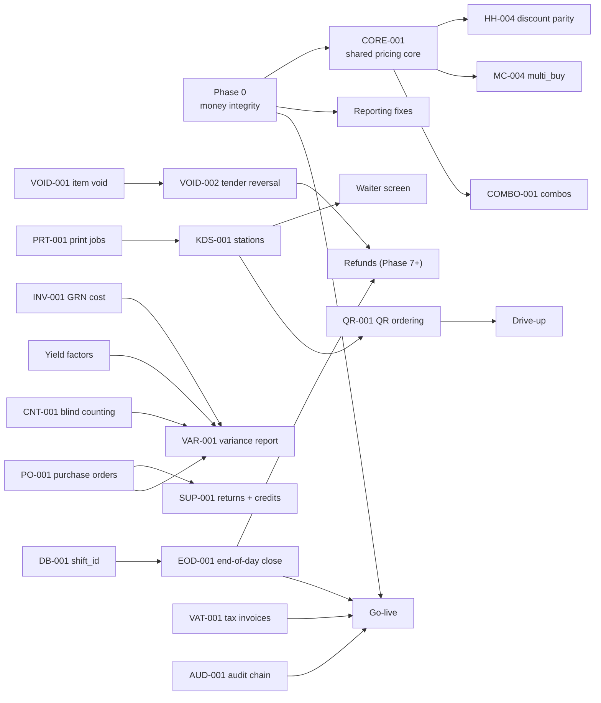

The critical path to a defensible pilot is: **Phase 0 → VAT-001 + EOD-001 + AUD-001 → go-live**. Everything else is value, not permission.

## 35. Testing Plan

**Golden-vector tests for the pricing core** (the highest-value new test asset): a shared fixture set of ~60 carts — every discount scope, offer type, comp/gift shape, tax stacking, inclusive/exclusive, split allocation, and rounding boundary — asserted identically by the Dart package, the PHP validator, and both apps' integration layers. Any divergence fails CI in every repo.

**Contract tests** (`pos_api/src/tests/Feature/Device*Test.php`) must gain coverage for the cases that let real defects through: `change_given` non-zero on shift close; a tender with a negative amount; discount rows that do not sum to `discount_total`; concurrent `order.deliver`; an event type the server does not know; an order whose void reason was soft-deleted after queueing.

**Offline/sync scenario suite** — a scripted device harness: 50 sales offline then reconnect; a sale rung *during* a flush (the P0 regression test); a deterministic rejection (loyalty over-redeem, deleted customer, no-GPS at a fenced branch) asserting the sale is parked and visible, never silently retried; a shift closed with a non-empty outbox; a stock count submitted with queued sales; a worker killed mid-handler asserting the sweeper settles the event.

**Money reconciliation tests** — seed a day of mixed activity (cash, card, split, comps, gifts, voids, pending-reconciliation, delivery, round-ups) and assert that the Z report, the merchant sales report, the admin report, the commission ledger and the device branch report all reconcile to the same numbers. Today they would not.

**Cross-tenant fuzzing in CI** as the blueprint requires, plus the nightly integrity sampler as a production canary.

**Hardware tests** — Mosambee: success, hard decline, NFC timeout, app missing, login failure, activity not found (each asserting the correct force-record eligibility); printer: offline mid-service asserting the failure surfaces on screen; customer display: round-up accept/decline on the affected Sunmi hardware.

**Restore the stale Flutter test harness** — the machine's legacy charity-flow and widget tests still assume the removed hardcoded 5% tax and need a `ProviderScope` + catalog-bridge fixture.

## 36. Production Readiness Checklist

| Item | State |
|---|---|
| Tenant isolation verified by automated cross-tenant tests | ✅ present in merchant + api contract tests; ⚠ CI fuzzing + nightly sampler not built |
| Admin cross-tenant reads audited | 🟡 audit logging broad (40 call sites) but not a systematic read-audit |
| Onboarding end to end (company → branch → device → user) | ✅ |
| Geofencing blocks out-of-fence devices | ✅ server fail-closed + device lock gate |
| Catalog with recipes drives POS sales | ✅ |
| Inventory deductions match sale events | ✅ mechanically; ⚠ GRN cost staleness + count-window double-depletion |
| Roles enforced on portal and POS | 🟡 portal yes; POS void/discount gates are device-side only |
| Discounts and loyalty produce correct outcomes | ⚠ device divergence, no loyalty expiry/restrictions |
| All reports reconcile to source events | 🔴 UTC days, comps, pending-as-finalized, Loss/Waste |
| Round-up writes to the charity ledger | 🟡 writes locally; retry sweep never runs; forward endpoint unauthenticated |
| NFC-timeout reconciliation works admin-side | ✅ machine path; ⚠ handheld can force-record non-charges |
| Offline replay: no duplicates, no losses | 🔴 P0 handheld race; machine stranding invisible |
| Hold/resume across devices | 🔴 server-ready, no client calls it |
| Daily encrypted backups + restore drill | ⚪ Cannot verify from repos |
| Application-layer encryption on sensitive columns | 🟡 staff/owner/user PII yes; **customer phone/plate cleartext** |
| Sentry on all surfaces with release tagging | 🟡 backend/portals yes; **handheld DSN empty** |
| Audit log immutable + hash chain | 🟡 ORM-immutable; **no hash chain** |
| Soft POS tested on real hardware incl. NFC timeout | ✅ machine; ⚠ handheld classification |
| Bilingual AR/EN with RTL end to end | 🟡 machine yes; **handheld has no i18n** |
| Oman VAT-compliant tax invoices | 🔴 not implemented |
| End-of-day close | 🔴 per-shift only, cash-only |
| Pilot vendors trained and signed off | ⚪ Cannot verify |

## 37. System Health Scores

Scored against what a production multi-tenant POS/ERP handling real money must be, not against effort spent.

| Area | Score | Why |
|---|---|---|
| **Architecture** | 7/10 | Clean module decomposition, disciplined Action pattern, correct authority split for sales vs stock. Loses points for four hand-synced copies of money math and two divergent POS codebases where the blueprint specified one. |
| **Backend (pos_api)** | 8/10 | The strongest component. Exactly-once ingestion, single-transaction settlement with locks, frozen snapshots, 434 contract tests. Loses points for no queue worker, no stranded-event recovery, and missing wire hardening. |
| **Database** | 7/10 | Uniform money precision, UTC discipline, real ledgers, near-complete snapshot coverage, indexed hot paths. Loses points for zero DB-level enforcement of append-only guarantees, no `shift_id`, soft-delete unique collisions, and three uncorrected historical drifts. |
| **Sales** | 7/10 | Online path is genuinely solid and double-pay-proof. Loses points for partial voids being device-local fiction, delivery lacking a lock, and cross-device resume being dead code. |
| **Inventory** | 7/10 | Frozen-snapshot consumption, atomic increments, dual append-only ledgers, the full June unit-of-measure model. Loses points for GRN not updating costs, no yield factors, count-window double-depletion, and no PO/receiving/returns subsystem. |
| **Payments** | 6/10 | Excellent split/commission/rounding mechanics and a well-designed pending-reconciliation lifecycle. Loses points hard for the handheld force-record defect, the round-up bank-match failure, deferred effects firing on voided orders, and unvalidated tender signs. |
| **Loyalty** | 5/10 | Mechanically sound earn/redeem/reversal with good tests. Loses heavily for the offline over-redeem strand, comped orders earning points, and every documented restriction and expiry being unimplemented. |
| **Expenses** | 6/10 | Complete capture → review → net-profit chain. Loses points for no drawer effect, no shift linkage, no receipt photos, and double-logging on retry. |
| **Reporting** | 4/10 | Broad coverage (24 merchant actions, tested) undermined by three platform-wide misstatements — UTC days, missing comps, pending-as-finalized — plus Loss/Waste and COGS defects. Numbers merchants act on are wrong today. |
| **Security** | 6/10 | Strong tenancy, good auth rails, sound token lifecycle, no IDOR. Loses points for plaintext device tokens in a shared DB, an unauthenticated charity endpoint, cleartext customer PII, the admin-API re-check gap, and no audit hash chain. |
| **Flutter POS (machine)** | 7/10 | Genuinely capable: dual-screen, real hardware, offline-first, delta sync with live push, thoughtful unresolved-charge UX. Loses points for no dead-lettering or operator surfacing of stranded money, the pre-outbox crash window, and the fingerprint gate. |
| **Flutter POS (handheld)** | 4/10 | Real hardware breadth and the best dead-lettering in the platform — but it carries the only P0, a pre-fix card classification, missing discounts, no round-up, no i18n, disabled telemetry, and a 9-commit history for a payments device. |
| **Offline capability** | 6/10 | The core protocol is right: persist-before-network, stable ids, exactly-once, duplicate-ACK. Loses points because *recovery* is missing — three distinct ways a sale can strand permanently, two of them invisible. |
| **Maintainability** | 6/10 | Consistent patterns, honest docblocks that admit known bugs, strong test culture. Loses points for duplicated money math, dead code implying working features, and two files past reviewable size. |
| **Test coverage** | 7/10 | ~1,000 backend tests, 434 device contract methods, 175 handheld tests, per-report tests. Loses points because the defects that shipped are precisely the untested cases (`change_given` ≠ 0, comps in reports, concurrent deliver) and the machine's legacy harness is stale. |
| **Production readiness** | 4/10 | Two go-live blockers unmet (VAT invoices, end-of-day close), one P0 open, reporting systematically misstated, and no answer to "which sales did we lose?". |

**Weighted overall: 6/10** — a strong engine with unguarded edges.

## 38. Final Decision

### ✅ **YES, AFTER CRITICAL FIXES**

**Why not "YES":** one P0 can silently destroy a completed sale on the handheld, two more paths strand sales invisibly on the machine, the handheld can book card money the bank never saw, and every report a merchant would use to notice any of this is itself misstated. A pilot run today would produce discrepancies nobody could explain from the system's own records.

**Why not "MAJOR REFACTOR REQUIRED":** the things that are hardest to change later are already right. The authority model is correct (sales device-authoritative and append-only, stock server-derived). Idempotency is real and enforced at the database level. Money is integer baisas end to end. Settlement is transactional, locked and snapshot-immutable. Multi-tenancy holds under adversarial testing. Ledgers are append-only with single canonical writers. Historical integrity is preserved by comprehensive snapshotting. None of the six critical fixes requires touching any of that — they are additions and corrections at the edges: a lock around a read-modify-write, a classification list, a dead-letter queue, a status guard, a scheduler entry, an unwind event.

**Why not "NO":** nothing in the audit found a foundational modelling error that new features would compound. The one genuine architectural divergence — the unified item model — is a *product* decision about combos, not a defect, and the existing catalog model is coherent on its own terms.

**The one structural condition attached to the "yes":** the two Flutter codebases must stop being independently maintained sources of pricing truth before more pricing features are added to either. Nine of this audit's findings are the same problem wearing different clothes. Every new offer type, discount scope or tax rule doubles that surface. Extracting the shared pricing core is Phase 1 for a reason — it is the difference between fixing these nine and fixing them again next quarter.

**Concretely:** close Phase 0 (ten items, all surgical), then VAT invoices, end-of-day close and the audit hash chain, and the platform is defensibly pilot-ready. The shared pricing core should land before Phase 2's feature work, not after.

---

## 39. Engineering Backlog

Directly assignable. `BE` = backend, `FL` = Flutter, `DB` = schema change. Every P0/P1 item below was adversarially re-verified against source (19 CONFIRMED, 1 PARTIAL with a corrected variance direction, 0 refuted).

| ID | Pri | Module | Task | Problem solved | Depends on | BE | FL | DB | Risk |
|---|---|---|---|---|---|---|---|---|---|
| HH-001 | **P0** | Handheld sync | Replace the whole-list prefs outbox with per-row storage (or re-read + merge on write-back) and serialize all outbox mutations through one mutex; re-arm a guard-skipped flush | A sale rung during a flush is silently erased — charged customer, no server record, no recovery | — | No | Yes | No | High |
| HH-002 | **P1** | Handheld payments | Port `neverReachedTerminal` from `caefd36`; preserve `PlatformException.code` in the pay wrapper so code-based exclusion works | Card charges that never reached the acquirer can be booked as paid | — | No | Yes | No | High |
| MC-001 | **P1** | Machine sync | Count server rejections separately from transport errors, park after N, consume `watchPending()` in a drawer badge + stuck-sales tile with manual retry, page Sentry on park | Permanently rejected sales retry forever with zero operator visibility | — | No | Yes | No | High |
| MC-002 | **P1** | Machine sync | On flush, re-acquire GPS and patch a queued payload that lacks a fix at a fenced branch (or fail closed at payment time) | A fix-less offline order is permanently unsettleable and invisible | MC-001 | No | Yes | No | Med |
| API-001 | **P1** | Loyalty | Catch redeem failure inside `PayOrderHandler`: settle the sale, clamp the redemption, record the shortfall as a flagged ADJUST for merchant review | An over-redeem strands a till-collected sale forever server-side | — | Yes | No | No | Med |
| API-002 | **P1** | Sync | Scheduled sweeper re-dispatching events stuck at `received` past a threshold, excluding handlerless types; reject unknown `event_type` explicitly | A worker crash strands a money event neither side can ever settle | ADM-002 | Yes | No | No | Low |
| ADM-001 | **P1** | Reconciliation | Branch on `order.status === 'void'` in `ReconcileDeferredEffectsAction`: skip commission recording, exclude voided donations from forwarding, badge voided orders in the queue and route them to a refund flow | Approving a pending charge on a voided order writes commission for a void sale and forwards a voided donation to charity irreversibly | — | Yes | No | No | Med |
| ADM-002 | **P1** | Ops | Register `donations:retry-roundup-forwarding` with the scheduler **and add a scheduler service** to the compose stack (nothing runs `schedule:run` today) | Failed charity forwards are never retried; the document-expiry job also never runs | ADM-003 | Yes | No | No | Low |
| ADM-003 | **P1** | Charity | Restrict sweep eligibility to `status = 'success'`; mark donations rejected in `RejectPendingReconciliationAction`; pass the donation's real status instead of null | Scheduling the sweep as-is would forward donations for rejected and voided sales | — | Yes | No | No | Med |
| API-003 | **P1** | Shifts | Delete the `change_given` subtraction at `CloseShiftHandler.php:74` and `:177`; keep the column audit-only; add a contract test with `change_given > 0` | Every over-tendered handheld cash sale produces a phantom drawer OVER and can mask a real shortage | — | Yes | No | No | Low |
| MC-003 | **P1** | Shifts | Probe per staff at every login; if the local shift's staff differs and the cashier has no shift, force close-drawer-or-open-float. Gate the server's device fallback for shared shifts | A second cashier's sales are excluded from every shift's Z while their cash sits in the drawer | — | Yes | Yes | No | Med |
| PAY-001 | **P1** | Reconciliation | Match statement gross against `amount + COALESCE(roundup_amount, 0)`; surface the round-up component in the preview | Every round-up card charge lands in `amount_mismatches` | — | Yes | No | No | Low |
| COM-001 | **P1** | Commissions | Exclude legacy `channel='all'` rows on mixed-tender orders from payout claiming; backfill legacy rows per channel from tender slices; audit issued payouts to quantify past overpayment | The mixed-tender leak is still live for pre-fix rows — payouts still claim them whole | — | Yes | No | Backfill | **High** |
| RPT-001 | **P1** | Reporting | Per-company IANA timezone (default `Asia/Muscat`) applied at every report boundary and in day/hour bucketing; keep storage UTC | Every daily and hourly figure platform-wide is shifted 4 hours | — | Yes | Yes | Yes | Med |
| RPT-002 | **P1** | Reporting | Subtract `comp_total` in merchant and admin `net_sales`; expose it as a headline key; add comp test coverage | Net sales and net profit overstate by the full comp value | — | Yes | No | No | Low |
| RPT-003 | **P1** | Reporting | Split the no-ledger bucket on a pending tender: route to `pending_net`/awaiting-reconciliation, and return a distinct status from `SaleCommissionStatus` | Unconfirmed card money reported as finalized commission-free income; net profit overstates then silently restates | — | Yes | No | No | Low |
| VOID-001 | **P1** | Voids | Add `order.item_void` (lines, reason, refund amount) with proportional inventory/loyalty/commission/round-up unwind; persist the reason on the device record | Partial cancels of paid orders are device-local fiction; the mandatory reason is discarded | — | Yes | Yes | Yes | Med |
| MC-004 | **P1** | Pricing | Hoist the zero-discount break above the consume loop in `_applyMultiBuy`; port the handheld's regression test | Machine overcharges relative to handheld when a non-applying `multi_buy` starves a later overlapping offer | — | No | Yes | No | Low |
| HH-004 | **P1** | Pricing | Port the machine's full `MerchantDiscount` model (all scopes, targets, `auto_apply`, validity/day/time/branch gating) plus line and auto-order application | Targeted promotions and auto order rules charge full price on the handheld | CORE-001 | No | Yes | No | Med |
| CORE-001 | **P1** | Architecture | Extract a shared pricing core: Dart package for both apps + PHP twin, pinned by shared golden-vector tests | Four hand-synced copies of money math; nine findings share this root cause | — | Yes | Yes | No | **High** |
| SEC-001 | **P1** | Security | Hash `device_token` (add hash column, dual-read, re-issue, drop plaintext) | Plaintext bearer credentials in a database shared with another product | — | Yes | Yes | Yes | Med |
| SEC-002 | **P1** | Security | Authenticate + sign the charity round-up forward; reject unauthenticated posts at the charity endpoint | A public endpoint accepts fabricated donation rows with caller-supplied amount, status and org | — | Yes | No | No | Med |
| INV-001 | **P2** | Inventory | Update `default_unit_cost` (and per-batch ratio) in the GRN receive path, matching the piece-purchase form | GRN-only merchants freeze stale costs into every COGS snapshot and variance figure | — | Yes | No | No | Med |
| INV-002 | **P2** | Inventory | Flush the outbox before submitting a count; reconcile against a count timestamp rather than the apply-time balance | Sales landing after a count double-deplete and over-blame waste | MC-001 | Yes | Yes | No | Med |
| INV-003 | **P2** | Inventory | Drain the outbox before config polls on the machine (mirror the handheld's ordering fix) | Config polls resurrect shelf stock queued sales already consumed → oversell | — | No | Yes | No | Low |
| API-004 | **P2** | Sync hardening | Validate tender sign/range; check Σ(discount rows) vs `discount_total` and Σ(line totals) vs subtotal; add `lockForUpdate` + status re-check to `order.deliver` | Fabricable money shapes; internal report disagreement; double consumption on concurrent delivery | — | Yes | No | No | Low |
| API-005 | **P2** | Sync | Move sync processing to a queue worker; HTTP push only enqueues | Long offline backlogs run inline against a request timeout | — | Yes | No | No | Med |
| SHIFT-001 | **P2** | Shifts | Drain (or refuse to close with) a non-empty outbox before `shift.close` | Expected cash, variance and Z are frozen without queued sales | MC-001 | No | Yes | No | Low |
| VOID-002 | **P2** | Voids | Add a tender-reversal / cash-out record type; exclude voided orders from expected cash; warn on card-paid voids and list them for manual refund | Voided cash inflates the drawer; card-paid voids leave the customer charged with no tracking | VOID-001 | Yes | Yes | Yes | Med |
| LOY-001 | **P2** | Loyalty | Implement expiry, rule validity windows and the documented restrictions; exclude comps from the earn base | Unbounded liability; expired campaigns keep paying; write-offs earn points | — | Yes | Yes | No | Med |
| DB-001 | **P2** | Schema | Add `shift_id` to orders/payments/expenses with a time-window backfill; add `voided_by`/approver columns | No referential anchor for shift money or void attribution | — | Yes | Yes | Yes | Med |
| RPT-004 | **P2** | Reporting | Exclude transfers-out and production from Loss/Waste shortfall; drop `Adjustment` from consumption types; read `consumption_snapshot_json` and value cooked/unit in COGS; default orders-viewer totals to exclude voids/unpaid | False theft signals; distorted forecasting; 100% margins on production merchants | — | Yes | No | No | Low |
| MC-005 | **P2** | Machine | Move the durable outbox write ahead of GPS and the customer API call; add re-enqueue from local history | A crash after charging loses the sale's server record entirely | — | No | Yes | No | Med |
| MC-006 | **P2** | Machine | Deterministic `client_event_id`s for `shift.close`, `expense.log`, `restock.request` | Shift-close retries dead-end; expenses double-log | — | No | Yes | No | Low |
| SEC-003 | **P2** | Security | Bind the manager fingerprint gate to a manager identity; remove `usesCleartextTraffic`; remove the hardcoded default super-admin password; add the admin-API platform re-check | Offline self-approval of write-offs; credential interception surface; seeder credential reset | — | Yes | Yes | No | Med |
| HH-005 | **P2** | Handheld | Configure the Sentry DSN; remove the mock-catalog fallback for activated devices; add charity round-up | The parked-revenue page is a no-op; real cash can be rung against fictitious products; charity absent on a whole device class | — | No | Yes | No | Low |
| VAT-001 | **P2** | Compliance | Oman VAT-compliant tax invoice on every printed receipt | Go-live blocker — permission to operate | — | Yes | Yes | No | Med |
| EOD-001 | **P2** | Cash | Branch end-of-day close + day lock reconciling cash, card and online | Go-live blocker — a manager cannot reconcile a day | DB-001 | Yes | Yes | Yes | Med |
| AUD-001 | **P2** | Compliance | Audit-log hash chain + nightly tenant-integrity sampler | Go-live blocker — tamper evidence; the blueprint's passive leak detector | — | Yes | No | Yes | Low |
| PRT-001 | **P2** | Fulfilment | Print-job domain: queue, status, 3 retries, on-screen failure alert, one-tap reprint, printer status in heartbeat | A kitchen printer dying mid-service fails silently (June MVP-critical) | — | Yes | Yes | Yes | Med |
| DB-002 | **P3** | Schema | Partial uniques excluding `deleted_at` on the ~13 affected tables; scope `client_event_id` uniques per device; re-sync both test mirrors | Re-creating a deleted entity fails; cross-tenant collision class; tests pass against a stale schema | — | Yes | No | Yes | Med |
| UI-001 | **P3** | Merchant | Ingredient branch-transfer front end (backend exists) | A shipped backend capability has no way to be used | — | No | No | No | Low |
| CLEAN-001 | **P3** | Code health | Retire `EvaluateDiscounts` dead code; wire or remove `GET /device/orders/active`; remove unused `stackable`, `kitchen`/`refunded` statuses, `order_type: 'car'` | Dead code implies working features that do not exist | CORE-002 | Yes | Yes | No | Low |

---

## 40. Open Questions Requiring a Product Decision

These are not defects — they are decisions the audit cannot make on the team's behalf.

1. **The unified item model (R1.1).** Migrate the live catalog to `items` + `item_components`, or formally supersede the August spec and extend the current model for combos? Recommendation: supersede — see §32.6.
2. **Costing method (R1.10).** The spec asks for weighted average; the build does last-purchase-wins. Ratify one, then make *both* purchase paths honour it.
3. **Negative-stock policy (R1.11).** The build's implicit answer (allow on sale, refuse everywhere else) is defensible. Ratify it, or make it configurable as the spec implies.
4. **Discount stacking semantics.** Three implementations exist and none matches the merchant-facing `stackable` flag. Pick one before CORE-001 freezes it.
5. **`change_given` semantics.** Fix the server (recommended — the wire contract proves the amount is net) or stop emitting it on the handheld. Either way, add the contract test.
6. **Customer-tablet application.** The May blueprint specifies it as Phase 11; the August spec replaces that channel with QR ordering. Confirm the tablet is dropped.
7. **Modifier-inside-combo stock attribution (spec's own open question).** Only needs an answer if combos become catalog items.

---

## 41. Evidence Index

Detailed per-area evidence files (3,442 lines, `file:line` throughout) produced by this audit:

| File | Contents |
|---|---|
| `audit/map-pos_api.md` | Endpoint inventory, sync dispatch table, config bundle slices, contract-test inventory |
| `audit/map-pos_admin.md` | All 153 migrations, admin routes, Scalefusion, bank reconciliation, commissions, ad billing |
| `audit/map-pos_merchant.md` | Route groups by module, 16 reports with source tables, inventory action inventory |
| `audit/map-pos_machine.md` | Boot chain, Drift schema, outbox, payments, printing, dual screen, hardware bridges |
| `audit/map-pos_handheld.md` | Divergence analysis vs machine, outbox parking, KOZEN/ZCS bridges, test inventory |
| `audit/map-charity.md` | Round-up chain end to end, shared-DB coexistence, idempotency, retry semantics |
| `audit/audit-sales-flow.md` | Full execution-chain trace, validation matrix, lifecycle states |
| `audit/audit-inventory.md` | Consumption, ledgers, GRN, restock, counts, costing, gating parity |
| `audit/audit-payments-rounding.md` | Money pipeline, splits, card lifecycle, reconciliation, apportionment |
| `audit/audit-refunds-voids.md` | Void unwind, reason codes, comps, refund absence |
| `audit/audit-loyalty-discounts.md` | Evaluators, earn/redeem/reversal, offers, three discount semantics |
| `audit/audit-offline-sync.md` | Outbox mechanics both apps, ingest guarantees, stranding scenarios |
| `audit/audit-shifts-cash.md` | Shift lifecycle, expected-cash math, Z reports, EOD gap |
| `audit/audit-security-tenancy.md` | Auth planes, token lifecycle, scoping verification, secrets scan |
| `audit/audit-db-schema.md` | ~105-table inventory, money precision, indexes, snapshot coverage |
| `audit/audit-financial-calc.md` | Calculation × location × formula matrix across all five apps |
| `audit/audit-reporting.md` | Per-report query analysis, status inclusion, timezone, performance |
| `findings_all.md` | All 141 findings with evidence and risk |
| `verdicts.md` | Adversarial verification of every P0/P1 (19 CONFIRMED, 1 PARTIAL, 0 refuted) |
| `requirements.md` | The consolidated master requirements register (Appendix A) |

**Audit coverage note:** Everything in this report was verified against source. Items marked *Cannot Verify* are: production deploy invocation of the admin seeder; whether host-level cron exists outside the repos; realized financial damage from the legacy commission leak (requires production data, not code); backup and restore-drill execution; pilot vendor sign-off; and the reachability of the handheld's mock-catalog fallback in the real activation flow.

---

## Appendix A — Consolidated Master Requirements Register

Sources (evolution order):
- **[B]** Blueprint v2.0, May 23 2026 — 62-page master blueprint (5 surfaces, 12 phases, schema, APIs).
- **[A]** Additions companion, June 2026 — 18 restaurant features (6 MVP-critical, 12 Phase 7+) + the unit-of-measure ingredient model. "Nothing in [B] changes."
- **[S]** Architecture & Feature Specification, Aug 3 2026 — NEWEST. Consolidates session decisions; sits alongside [B] and [A]; also reviews a handwritten additions note of 12 Jul 2026. **On conflict, [S] wins.**

Known supersessions / evolutions:
- Ingredient/unit model: [B §5.6 simple unit+cost] → [A §2 primary_unit + piece reconciliation] → [S 1.6 adds purchase/stock/recipe units + **yield factor**; S confirms Option C = track primary unit, reconcile pieces at day-end]. [S] extends [A]; not a contradiction.
- Item model: [B] separate products/add-ons/recipes tables → [S 1.1] **unified `items` + `item_components`** recursive model (recipes, combos, sub-recipes, add-ons in one). This is a genuine architectural supersession.
- Catalogue sync: [B 9.1] full snapshot + WS deltas → [S 2.1] cursor-based **delta sync** + rules-not-results ([S 2.2] effective-dated prices, offers as rules). [S] refines [B].
- Refunds: [B] mentions refund status only → [A] defers full refund flow to Phase 7+ → [S] silent. Requirement retained as Phase 7+ with [A]'s design (linked negative order).
- KDS/print agent/QR/drive-up/waiter screen: absent in [B]; introduced in [S Part 3] (and waiter screen in the Jul additions note). New scope.
- Loyalty: [B 5.8] visit+spend rules → [S 6.6] adds product/category-scoped stamps. Additive.
- Order-ahead: [S 3.7] explicitly deferred (arrive-then-order only).
- ZATCA/Fatoora: explicitly NOT applicable ([S 7.1]); Oman 5% VAT + compliant tax invoices ARE go-live blockers.
- Retail/barcode features: explicitly out of scope ([A §1]).

Legend for the gap analysis statuses: ✅ full · 🟡 partial · 🔴 missing · ⚠️ incorrect · 🔵 different-from-blueprint · ⚪ cannot verify.

---

### R1. Product, Ingredient & Recipe Model
| ID | Requirement | Src | Notes |
|---|---|---|---|
| R1.1 | Unified item model: one `items` table + self-referencing `item_components` (recipe, combo, sub-recipe, add-on all via components; parent/child/qty/unit/is_substitutable/price_delta) | S1.1 | Supersedes [B]'s separate products/recipes/add_ons entity split |
| R1.2 | `inventory_mode` per item: none / direct / recipe; tenant default + per-item override | S1.2 | [B] had has_recipe optionality; "stock_mode" in build |
| R1.3 | Combo meals: fixed price / sum-with-discount / per-component override; discount allocation across component lines; substitution w/ price_delta | S1.3 | New in [S] |
| R1.4 | Modifier groups with constraints: min/max, required, defaults, mutually exclusive, free-quantity-before-charging; option resolves to nothing / product / ingredient qty | A§1.2, S1.4 | [B 5.5.4] had simpler add-on groups; [A] adds constraints + recipe-variant mapping |
| R1.5 | Open question to settle: stock impact attachment of a modifier applied inside a combo | S1.4 | Decision needed before combo+modifier code |
| R1.6 | Sub-recipes / prep items: batch production (raw→prep stock) AND consumption; depth-limited, cycle-detected recursion | S1.5, S6.4 | Foam = prep item [S6.3] |
| R1.7 | Units: purchase / stock / recipe units + conversions; **yield factor** per ingredient (trim/cook loss) | S1.6 | Largest cause of false variance |
| R1.8 | Ingredient primary-unit model: primary_unit, piece_unit_label, units_per_piece (last-batch-wins default, per-batch history), allow_fractional_pieces, cost_per_unit; day-end piece-level reconciliation | A§2 | Locked "before Phase 5" |
| R1.9 | Variants (size) carry their own component rows — NOT price-factor modifiers | S1.7, A§1.2 | Recipe-variant mapping per modifier option in [A] |
| R1.10 | Costing: weighted average (default) recalculated on receipt; **cost snapshot at moment of sale** onto the sale line | S1.8, B9.9 | Recipe cost snapshotting in [B]; [A 2.5] unit_cost_at_time |
| R1.11 | Negative-stock policy decision (block/warn/allow) + auto-86; offline = soft warning only | S1.9 | Build allows oversell w/ anomaly flag [B 9.1.6] |
| R1.12 | Yield-calculating entry helper ("4 lattes per box" divides on input; store per-unit qty) | S6.2 | Input helper, not storage model |

### R2. Inventory Operations
| ID | Requirement | Src |
|---|---|---|
| R2.1 | Blind stock counting (no expected qty shown), value-based count frequency (daily/weekly/monthly tiers), count-when-idle w/ timestamp reconcile, physical-layout ordering, offline counting on handheld, counter rotation + spot checks, flag too-perfect counters | S5.1 |
| R2.2 | Day-end reconciliation: counted pieces → primary units → variance auto-writes waste movement `reconciliation_variance` + manager note | A§2.8 |
| R2.3 | Receiving: receive-what-arrived (never pre-fill), with **and without** PO, quick supplier (name only), cost capture recalculating running average, price-creep flag, three-way match (ordered/received/invoiced), photo of delivery note, unit conversion at entry, offline receiving | S5.2 |
| R2.4 | Partial deliveries: PO states open/partially-received/closed per LINE; forced backorder-vs-short-close decision at door; rejection at door ≠ waste (raises supplier claim); over-delivery tolerance + approval; supplier fill-rate | S5.3 |
| R2.5 | Supplier returns & credit notes: return ≠ waste; reverses at original received cost; credit chain (raised→expected→received→reconciled) + outstanding-credits report; credit notes without returns too | S5.4 |
| R2.6 | Supplier-item catalogue: same ingredient multi-supplier, price per stock-unit comparison, effective-dated price lists, lead time + delivery days, scorecard (fill rate, on-time, price creep, rejection) | S5.5 |
| R2.7 | Scope boundary: track credits owed, but NO full accounts payable — export to accounting software | S5.5 |
| R2.8 | Waste logging: two taps (item + reason); reasons incl. spoiled/burnt-dropped/staff meal/customer return/prep waste; voids before fire consume nothing, comps after make deduct | S5.6 |
| R2.9 | Variance report: opening+received−theoretical−waste±transfers=expected vs counted; unexplained gap; per-ingredient tolerance thresholds; valued in money; calibrate-recipes-first doctrine | S5.7, A§1.2 portion control |
| R2.10 | Multi-branch transfers: branch→branch direct, piece-bridged conversion, both sides confirm | A§1.3, A§2.7 |
| R2.11 | Mother/commissary kitchen: central recipes + batch production + transfer as stock movement type with transfer cost | S6.1 |
| R2.12 | Restock requests POS→portal approval→fulfilment writes movements; smart suggestions from 7/14/30-day consumption; stock allocation across branches | B5.6.4–5.6.5 |
| R2.13 | Ingredient expiry tracking: batches w/ expiry, 7/3/1-day alerts, auto-fill expired into waste confirmation | A§1.3 (Ph7+) |
| R2.14 | Stock movement ledger: append-only, typed (initial/restock/sale/addon/waste/loss/adjust/transfer in-out), signed qty, unit cost at time, reference, user | B5.6.3, S§43 |

### R3. Offline Operation & Synchronization
| ID | Requirement | Src |
|---|---|---|
| R3.1 | Catalogue delta sync: updated_at + branch monotonic cursor, poll 30–60s, push-notify then pull | S2.1 |
| R3.2 | Ship rules not results: effective-dated price rows, offers as schedule rules evaluated on device; order-open-time price applies | S2.2 |
| R3.3 | Outbound queue: idempotency keys (client UUID, server dedup), disk-persisted queue, per-device monotonic sequence numbers (order-then-void ordering), bounded retry w/ backoff | S2.3, B9.1.5 |
| R3.4 | Authority model: sales = device-authoritative append-only events; stock = server-derived, recomputed; local deduction display-only | S2.4 |
| R3.5 | Invoice numbering: per-device prefix or pre-allocated block (01-000001 / 02-000001) | S2.5 |
| R3.6 | Clock skew: record device time AND server-received time; per-device offset at sync | S2.6, B9.1.5 |
| R3.7 | Handheld: same protocol, longer polls/larger batches; open-order single-ownership w/ server arbitration on divergence | S2.7 |
| R3.8 | Offline scope: orders/cash/print/expenses offline; card + cross-device visibility online-only; held orders device-scoped offline | B9.1.2–9.1.3 |
| R3.9 | Offline split intent: cash leg settles, card leg pending_offline_capture completed on reconnect | B9.1.4 |
| R3.10 | Conflict policy: inventory server-authoritative (negative-stock anomaly), pricing snapshot-authoritative, loyalty server-authoritative, order edit soft-lock online-only, void-wins on reconnect | B9.1.6 |
| R3.11 | Real-time: WS channels per company/branch/device; order/inventory/catalog events; <2s p95 propagation | B9.3, B11.5 |

### R4. Order Channels & Fulfilment (new scope in [S])
| ID | Requirement | Src |
|---|---|---|
| R4.1 | QR ordering: table codes + branch codes; customer phone menu → order | S3.1 |
| R4.2 | Print agent: POS machine as in-branch agent w/ persistent server connection pushing print jobs to LAN printers; 1–3s latency; cloud-print printers as alternative | S3.2 |
| R4.3 | Print reliability: order safe at server; print job = own status (pending→printed w/ printer confirmation); 10–15s flag; failure surfaces on POS screen; managed queue + 3 retries + reprint button + printer status banner + heartbeat incl. printer status | S3.3, A§1.2 printer failover |
| R4.4 | Printer hardware: ESC/POS requirement; network LAN not USB; thermal for counter, impact for hot kitchen | S3.4 |
| R4.5 | KDS: web-page stations, routing per menu category, default single "Kitchen" station; split order items across stations w/ parent-order link; complete only when all stations done; paper+screen simultaneously | S3.5 |
| R4.6 | Waiter/pass screen: completed orders awaiting collection; parent-order destination | S3.6, S6.7 |
| R4.7 | Drive-up: arrive-then-order (branch QR + soft geofence), optional free-text car description, paid orders fire immediately, unpaid held until deliberate release, unpaid-fired flag | S3.7 |
| R4.8 | Order-ahead: DEFERRED (build with future-sales/scheduled orders later) | S3.7, S6.8 |
| R4.9 | Dine-in table service: floors/tables config, table statuses, transfer/merge (Ph7+ [A]), table turn-time flags (Ph7+) | B5.3.2, B6.5, A§1.3 |
| R4.10 | Kitchen queue priority (express/VIP/allergy) — Ph7+ | A§1.3 |
| R4.11 | Menu time-windows (breakfast/lunch/dinner availability) — Ph7+ | A§1.3, S7.4 |
| R4.12 | Delivery platform integrations (Talabat/UberEats) — post-pilot; manual entry interim | A§1.3 |

### R5. Payments
| ID | Requirement | Src |
|---|---|---|
| R5.1 | Three independent dimensions: where taken (customer phone / POS / handheld), method (card/cash/online transfer), splitting | S4.1 |
| R5.2 | Split bills: evenly / by item / by amount; order separate from payments; many payments reduce outstanding balance; close at zero; successive payments until cleared | S4.2, B6.8 |
| R5.3 | Split receipt: ONE receipt per table; payment breakdown stored for drawer reconciliation; individual tax invoice reprintable from stored data | S4.3 |
| R5.4 | Tax config: per-merchant tax types; stacking (multiple taxes per line); inclusive vs exclusive pricing | S4.4 |
| R5.5 | Soft POS card integration via bank APK (Android intent); store response code/txn ref/auth code/masked BIN only (no PAN) | B9.2, B9.13.1 |
| R5.6 | NFC-timeout reconciliation: manager "bypass — funds confirmed" → pending_reconciliation flag → admin reconciliation queue → resolve against settlement file / flag refund; 48h aging alert | B9.2.2–9.2.3, B4.6 |
| R5.7 | Payment idempotency: no duplicate charge/record on retry | S2.3, B9.1.5 |
| R5.8 | Cash: tendered amount + change; gift orders (zero-charge, inventory deducts, manager approval) | B6.8 |
| R5.9 | Gratuity/tips on card (Ph7+): pre-payment tip step, per-staff per-shift for payroll; manual cash tips at close | A§1.3 |
| R5.10 | Parcel/packaging charges per order (Ph7+), separate line on order + receipt | A§1.3 |
| R5.11 | House accounts / customer credit due list: tab settled later, credit limit, statement, ageing | S6.5 |
| R5.12 | Gift cards (Ph7+): stored value, cross-branch redemption, liability tracking, expiry/reissue | A§1.3 |

### R6. Loyalty, Discounts, Offers, Comps
| ID | Requirement | Src |
|---|---|---|
| R6.1 | Loyalty: visit-based stamps AND spend-based points, parallel rules, config (min order, stamps to unlock, earn ratio, redemption value, min threshold, expiry), restrictions (products/categories/branches/days/tags/max per order) | B5.8 |
| R6.2 | Product/category-scoped stamps (buy 9 coffees get 1 free) | S6.6 |
| R6.3 | Loyalty evaluator = pure function shared server + device for identical offline results | B Phase 6 |
| R6.4 | Discount rules: scope product/category/order, % or fixed, validity windows (date/day/time), branch scope, stackable flag, auto vs manager approval; preset vs custom by permission | B5.9, B6.11 |
| R6.5 | Discount evaluator shared server + device | B Phase 6 |
| R6.6 | Comps ≠ discounts ≠ voids: separate line type, reason codes w/ caps, always manager PIN, inventory deducts, COGS normal, comp value not revenue; comp report | A§1.2 |
| R6.7 | Void/item-void reason codes: configurable master list, affects_inventory / affects_cogs / requires_manager flags per code; loss report by reason + staff | A§1.2 |
| R6.8 | Manual loyalty adjustment w/ reason (Manager+); loyalty reversal on void/refund; no double-earn/redeem | B5.7.2, implied |

### R7. Shifts, Cash, Expenses, EOD
| ID | Requirement | Src |
|---|---|---|
| R7.1 | Shift management: open w/ float + PIN, all events tagged shift_id, close w/ counted cash vs expected, variance to audit log, same-day manager reopen, shared-drawer multi-cashier config, shift report | A§1.2 |
| R7.2 | End-of-day close + X/Z reports: count drawer vs system cash/card/online totals, explain variance, close shift — **go-live blocker** | S7.1 |
| R7.3 | In-POS expense capture: category, amount, note, photo; portal review approve/reject; feeds net profit + drawer | B5.10 |
| R7.4 | Petty cash / cash in-out — implied by drawer reconciliation | S7.1 |

### R8. Platform, Devices, Security, Compliance
| ID | Requirement | Src |
|---|---|---|
| R8.1 | Multi-tenant isolation: company_id on every business table, global query scope (BelongsToTenant), guard separation (admin/portal/pos), ownership checks on path params (404 not 403), channel auth, CI cross-tenant tests, nightly leak sampler | B9.11 |
| R8.2 | Admin omniscience audited: every cross-tenant admin read logged | B9.11.6 |
| R8.3 | Device registry: Scalefusion enrolment, register/assign to branch, geo-fence radius 100–2000m, health polling, remote lock/wipe, assignment history | B4.4, B9.5 |
| R8.4 | Geo-fencing: device lock screen outside fence + server-side validation on order/pay w/ tolerance; breach history | B9.4 |
| R8.5 | Audit log: append-only, before/after snapshots, all surfaces, immutable (INSERT-only + hash chain), 24-month retention; **go-live blocker** | B9.7, B9.13.5, S7.1 |
| R8.6 | PII encryption at rest (bank JSON, phones, email, plates); PIN hashed; PCI scope minimal | B9.13 |
| R8.7 | Backups: daily encrypted pg_dump, dual destination, restore drills | B9.13.3 |
| R8.8 | Observability: Sentry all surfaces + Crashlytics, admin-only dashboard, merchants see friendly errors; structured JSON logs w/ trace ids | B9.12 |
| R8.9 | Bilingual AR/EN + RTL across surfaces + receipts; OMR 3-decimals | B9.8 |
| R8.10 | **Oman VAT (5%) compliant tax invoices** on every receipt — go-live blocker; ZATCA/Fatoora NOT applicable | S7.1 |
| R8.11 | Merchant onboarding: manual vetted (keep); menu import via ONE MITHQAL template w/ preview+validate before commit | S7.2 |
| R8.12 | Operational resilience: POS-dies-mid-service plan (print agent failover), training mode | S7.3 |
| R8.13 | Two permission planes (portal users vs POS staff) w/ independent credentials + custom roles + POS permission catalog (void/discount/split/restock/expense/reports/shift/bypass) | B5.4, B12 |
| R8.14 | API versioning `/api/v1/...`; envelope responses | B11 |
| R8.15 | Device app distribution via MDM push, versions recorded per device | B3.3 |

### R9. Customers / CRM
| ID | Requirement | Src |
|---|---|---|
| R9.1 | Customer profiles: AR/EN name, phone(s), email, DOB, tags, vehicle plates; merge duplicates; order history; loyalty activity; notes | B5.7 |
| R9.2 | POS identification by phone OR vehicle plate | B5.7.3 |
| R9.3 | House accounts w/ credit limit, statement, ageing (see R5.11) | S6.5 |

### R10. Reporting
| ID | Requirement | Src |
|---|---|---|
| R10.1 | Ten portal reports: Sales (gross/net/discount/refund/tax/COGS/profit/expenses), Product performance, Inventory consumption (+anomaly flag), Recipe & cost, Loss/waste, Restock/purchasing, Discount, Customer, Round-up, Staff activity; filters, consolidated vs per-branch, Excel/PDF export, saved views | B5.11 |
| R10.2 | Variance report (theoretical vs actual per ingredient, money-valued, tolerances) | A§1.2, S5.7 |
| R10.3 | Comp report; shift report; supplier fill-rate/scorecard; outstanding supplier credits | A§1.2, S5.4–5.5 |
| R10.4 | Reports reconcile to source events (blueprint exit criteria) | B Phase 7 |

### R11. Charity Round-Up
| ID | Requirement | Src |
|---|---|---|
| R11.1 | Round-up to next whole OMR after successful CARD payment, customer-facing surfaces only (never handheld, never cash); no offer when already whole | B9.6 |
| R11.2 | Donation row written to existing charity table in-process (same DB), linked to order/payment; queued offline, idempotent replay; status queued/recorded/reconciled | B9.6.3–9.6.4 |
| R11.3 | Merchant revenue excludes donation (4.800 sale, 0.200 donation split in reporting) | B9.6.3 |

### R12. Deferred / explicitly-scoped-out
- Order-ahead (S3.7) · Reservations table-only (S6.8) · Delivery integrations (A) · Gift cards (A) · Menu scheduling (S7.4) · Course management (S7.4) · Full accounts payable (S5.5) · Retail barcode/SKU stock (A§1) · Merchant self-registration (S6.9 — onboarding stays manual) · ZATCA/Fatoora (S7.1).

### [S] Part 8 recommended build order (for roadmap alignment)
1. items + item_components + inventory_mode → 2. idempotency keys + catalogue delta cursor → 3. units/conversion/yield → 4. Oman VAT + compliant invoices → 5. EOD close, Z/X, drawer reconciliation → 6. receiving (with/without PO) → 7. blind counting + waste + variance → 8. audit log → 9. menu import template → 10. waiter screen + station routing.
